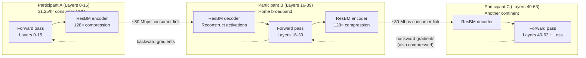
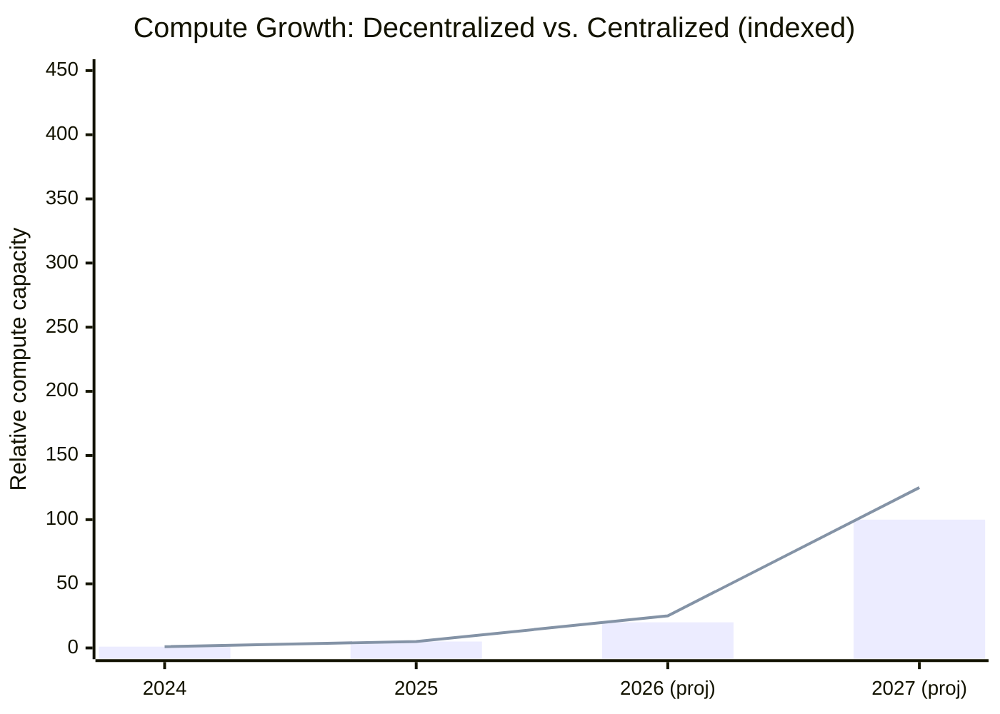

## The Bottleneck That Everyone Accepts

Training a frontier AI model has always meant writing a very large check. OpenAI's GPT-4 training run is estimated to have cost over $100 million. Meta built an entire 35,000-GPU cluster to train Llama 3. Google's TPU pods are among the most expensive computing infrastructure on the planet. The implicit assumption baked into every discussion of "who will lead in AI" is that only organizations with billions in capital and access to specialized hardware clusters can train the models that matter.

That assumption just cracked.

In March 2026, a permissionless network of 70+ independent contributors — anonymous participants coordinating only through economic incentives and protocol rules — completed the largest decentralized large language model pre-training run ever recorded. The result was **Covenant-72B**: a 72-billion-parameter model trained entirely over commodity GPUs and regular home internet connections, achieving a MMLU zero-shot score of 67.1 — surpassing Meta's Llama 2 70B and LLM360 K2. All weights are publicly available under the Apache license.

Then, on June 2, 2026, the underlying infrastructure — IOTA (Incentivised Orchestrated Training Architecture) — launched on mainnet. That makes this not a one-time experiment but a repeatable system anyone with a capable GPU can join.

---

## How Did 70 Strangers Train a Better Model Than a Billion-Dollar Lab?

The answer is pipeline parallelism — but with a twist that made it work over the open internet rather than a private data center network.

In a conventional data center, training a 70B+ model requires splitting it across many GPUs connected by ultra-high-speed networking (typically InfiniBand, running at hundreds of gigabits per second). The GPUs need to shuttle enormous amounts of intermediate computation — called activations — between each other hundreds of times per training step. This works brilliantly when all your hardware is in the same building. It completely falls apart when participants are spread across homes and offices in different countries, connected by consumer broadband links running at 100–500 Mbps.

The core insight behind both Covenant-72B and Macrocosmos's Orion-100B is a technique called **pipeline parallelism over low-bandwidth links** — treating the model as a pipeline of stages, where each participant handles a specific slice of the model's layers and passes activations forward to the next participant, and gradients backward to the previous one. The challenge is compression: how do you make those inter-node transmissions small enough to fit through a consumer internet connection without destroying the training signal?

The answer came from **ResBM (Residual Bottleneck Models)**, a compression method presented at the ICLR 2026 Protocol Learning Workshop in Rio. ResBM achieves up to **128× compression of activations** with no significant loss in convergence. The mechanism exploits a property of transformer networks: their activations, at any given layer boundary, live in a low-dimensional subspace. By training small bottleneck encoder-decoder networks at each stage boundary, you can compress the forward-pass activations and backward-pass gradients to a tiny fraction of their original size — cheap enough to send over home broadband — and then reconstruct them with almost no degradation.

The companion paper *Protocol Models: Scaling Decentralized Training with Communication-Efficient Model Parallelism* (arXiv 2506.01260) formalizes this further, demonstrating up to **100× communication efficiency improvements** — enough to make training billion-parameter models viable over connections as slow as 80 Mbps.

---

## The Network Behind It: IOTA

Running this across unreliable, anonymous hardware at internet scale requires more than clever compression. What keeps participants from cheating, dropping out at the wrong moment, or contributing garbage gradients?

This is what **IOTA (Incentivised Orchestrated Training Architecture)** solves. It is a data- and pipeline-parallel training algorithm built to operate on a network of heterogeneous, unreliable devices in an adversarial, trustless environment — the same constraints that peer-to-peer networks like BitTorrent or Ethereum had to solve, but applied to gradient computation.

The key properties of IOTA:

- **Heterogeneous hardware**: miners can join with different GPU classes (NVIDIA RTX 3090 up to A100 or B200), and the protocol assigns model stages appropriately.
- **Fault tolerance**: if a participant goes offline mid-run, the protocol reassigns that pipeline stage and continues. Completed stages return cached activations; only incomplete stages re-execute.
- **Economic incentives**: participants are rewarded in Bittensor's TAO token based on their contribution to training — verified by spot-checking gradient updates and measuring loss improvements. This replaces trust with cryptographic accountability.
- **Adversarial robustness**: the system is designed to detect and exclude miners submitting corrupted or mismatched activations, since doing so hurts the shared training run and gets them removed from the reward pool.

IOTA launched on Bittensor Subnet 9 (SN9) on June 2, 2026, following Macrocosmos's technical primer release. The primer described a system that had already proved itself at scale: between August 2025 and April 2026, the team ran over **700 controlled experiments** on their testbed and trained on nearly **15 trillion tokens** to validate the approach at the 100-billion-parameter level.

---

## Orion-100B: Proving It at the Hundred-Billion Scale

While Covenant-72B drew most of the public attention, Macrocosmos's own proof-of-concept — **Orion-100B** — pushed the scale further. It is, to date, the largest model trained via decentralized pipeline parallelism.

The entry cost to participate is **as low as $1.25 per hour** for a single consumer-grade GPU. A higher-end "Covenant-class" peer (8×B200 GPUs) costs around $50/hour at mid-2026 cloud rates. Compare this to the cost of provisioning a dedicated 1,000-GPU cluster at any major cloud provider, where reserved capacity for serious training runs starts at tens of thousands of dollars per day.

The practical implication: training at the 100B parameter scale is now within reach of funded startups, academic labs with GPU access, and small research groups — not just the handful of labs with nine-figure capital reserves.

---

## Jensen Huang Calls It "The Modern Folding@home"

The comparison that went viral came from an unlikely venue: the All-In Podcast, recorded live at NVIDIA's GPU Technology Conference in San Jose on March 18, 2026. Chamath Palihapitiya described Covenant-72B to Jensen Huang — 70 anonymous contributors, consumer GPUs, home internet, a 72B model trained completely without a data center. Huang's response: **"Our modern version of Folding at Home."**

The reference landed precisely. Folding@home, originally launched by Stanford in 2000, coordinated millions of volunteers' idle computer power to simulate protein folding — at its peak during COVID, it briefly became the most powerful distributed computing system on earth. The comparison was Huang's way of acknowledging that something structurally similar was happening in AI: idle GPU capacity, globally distributed, directed at a shared scientific problem.

The market reacted immediately. Bittensor's TAO token jumped 17% in a single session. By the end of Q1 2026, the network had attracted $620 million in institutional inflows, including approximately $420 million deployed by NVIDIA itself.

---

## Why This Changes the Power Dynamic

The significance of Covenant-72B and Orion-100B isn't just cost reduction. Three shifts are worth understanding:

**1. Sovereignty.** National governments, research institutions, and companies in regions with restricted access to US cloud providers can now participate in frontier-scale AI training without depending on Amazon, Google, or Microsoft infrastructure. The model is the product of a protocol, not a platform.

**2. Censorship resistance.** A training run that spans 70 jurisdictions across five continents has no single point of control. No regulator can unilaterally halt it by contacting a cloud provider's compliance team.

**3. Verification and openness.** Covenant-72B's weights are publicly released under the Apache license. The training methodology is documented in a March 2026 arXiv paper. The contrast with closed labs — where training data, methodology, and even model architecture are trade secrets — is stark.

The broader trend reinforces this: decentralized training compute is reportedly growing at roughly **20× per year**, compared to approximately 5× annual growth in centralized frontier training. If those rates hold, the distribution of where frontier AI gets trained is about to shift in ways that will take the industry years to fully absorb.

---

## What Comes Next

The IOTA mainnet launch is the starting line, not the finish line. Several near-term developments are worth watching:

- **Scale beyond 100B**: The Orion-100B run was a viability proof. The same infrastructure can, in principle, coordinate training at 200B or 400B parameter scale — the bottleneck is now coordination and incentive design, not compute.
- **Fine-tuning and RLHF**: Decentralized pretraining is solved at 100B. Decentralized reinforcement learning from human feedback (RLHF) is a harder problem — gradients from human preference data are noisier and harder to verify — but multiple teams are working on it.
- **Regulatory scrutiny**: A training run that can't be shut down is precisely the kind of system that frontier AI safety organizations are paying attention to. Expect this to be a flashpoint in ongoing debates about whether AI governance frameworks built around centralized providers are still fit for purpose.

For now, the most important fact is the simplest: a 72-billion-parameter AI model was trained by 70 strangers who never met, coordinating only through economic incentives and a protocol. It works. And the infrastructure that made it happen just launched on mainnet.

---

## Sources

- [Orion-100B: Distributed pretraining arrives at hundred-billion-parameter scale — Macrocosmos AI](https://macrocosmosai.substack.com/p/orion-100b-distributed-pretraining)
- [ResBM: Residual Bottleneck Models for Low-Bandwidth Pipeline Parallelism — arXiv 2604.11947](https://arxiv.org/abs/2604.11947)
- [Protocol Models: Scaling Decentralized Training with Communication-Efficient Model Parallelism — arXiv 2506.01260](https://arxiv.org/abs/2506.01260)
- [Templar Makes History With 72B Decentralized AI Training Run — TAO Media](https://www.tao.media/templar-makes-history-with-72b-decentralized-ai-training-run/)
- [Covenant-72B: How 70 Strangers Trained a Better AI Than Meta — Grey Area Labs](https://greyarealabs.co/2026/03/23/covenant-72b-decentralized-training/)
- [Jensen Huang Calls Bittensor "Modern Version of Folding@home" — SimplyTao](https://simplytao.ai/blog/jensen-huang-calls-bittensor-modern-version-of-foldinghome)
- [Bittensor Subnet Completes Largest Decentralized LLM Pre-training with Covenant-72B — KuCoin](https://www.kucoin.com/news/flash/bittensor-subnet-completes-largest-decentralized-llm-pre-training-with-covenant-72b)
- [Bittensor TAO Jumps 17% as NVIDIA CEO Praises Decentralized AI Training — CryptoTimes](https://www.cryptotimes.io/2026/03/20/bittensor-tao-jumps-17-as-nvidia-ceo-praises-decentralized-ai-training/)
- [Bittensor Emerges as Decentralized AI Powerhouse with $620M Institutional Inflows — CoinAlertNews](https://coinalertnews.com/news/2026/04/27/bittensor-ai-institutional-inflows-2026)
- [Subnet 9 IOTA — Macrocosmos Developer Guide](https://docs.macrocosmos.ai/subnets/subnet-9-iota)
- [Macrocosmos IOTA Mainnet Announcement — X (Twitter)](https://x.com/MacrocosmosAI/status/1928491993338167573)
