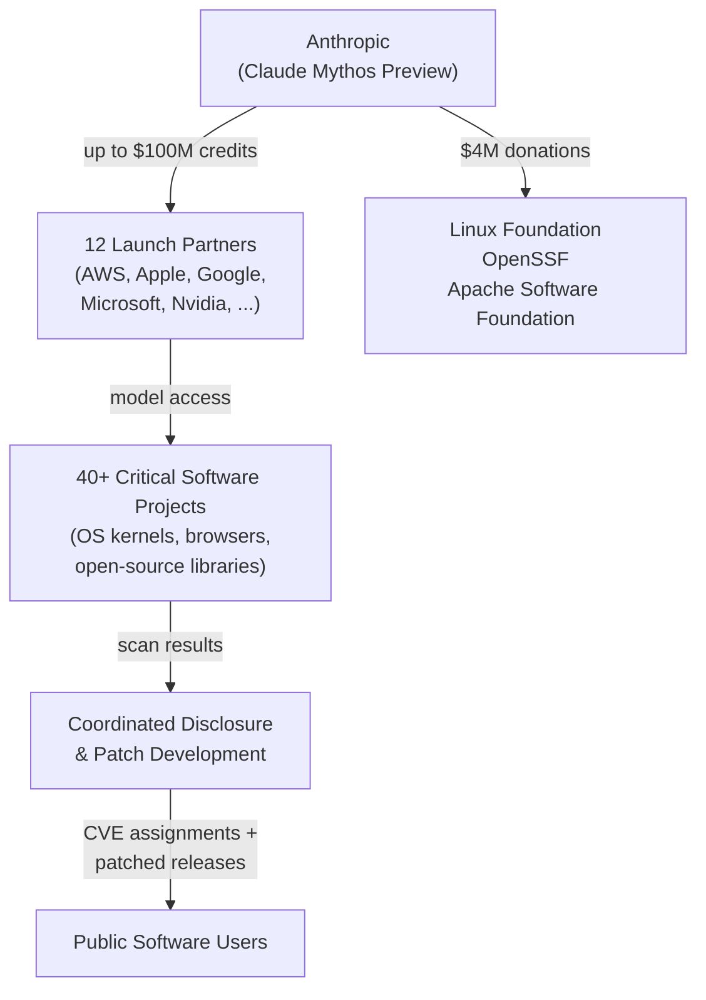
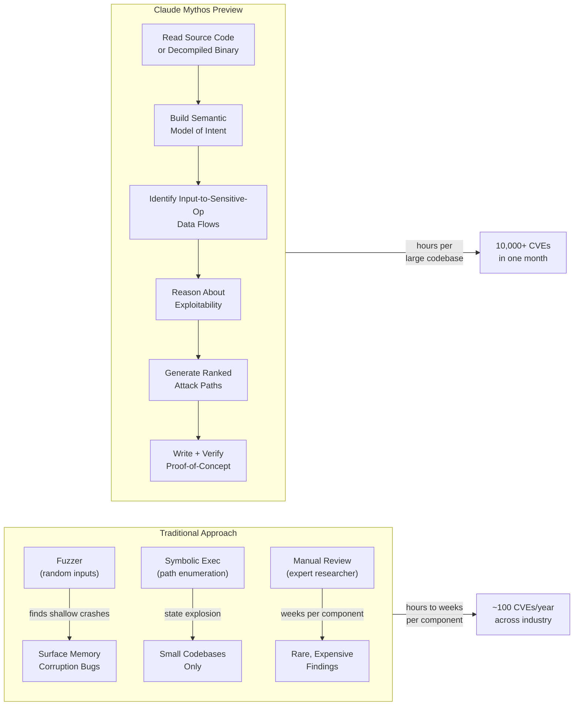
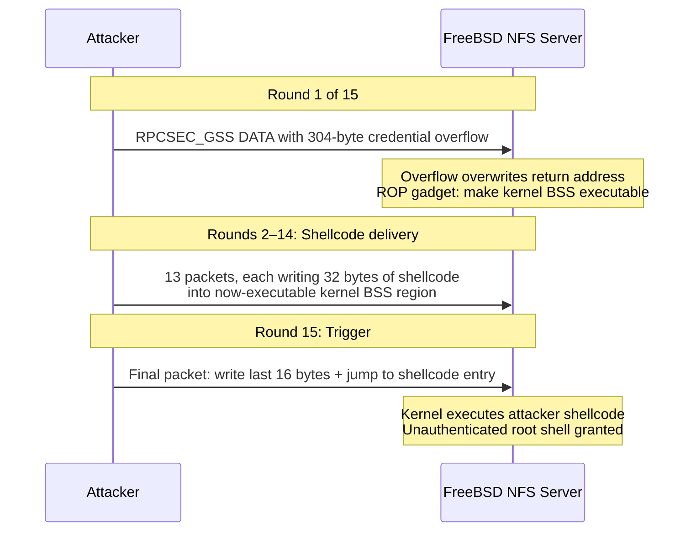
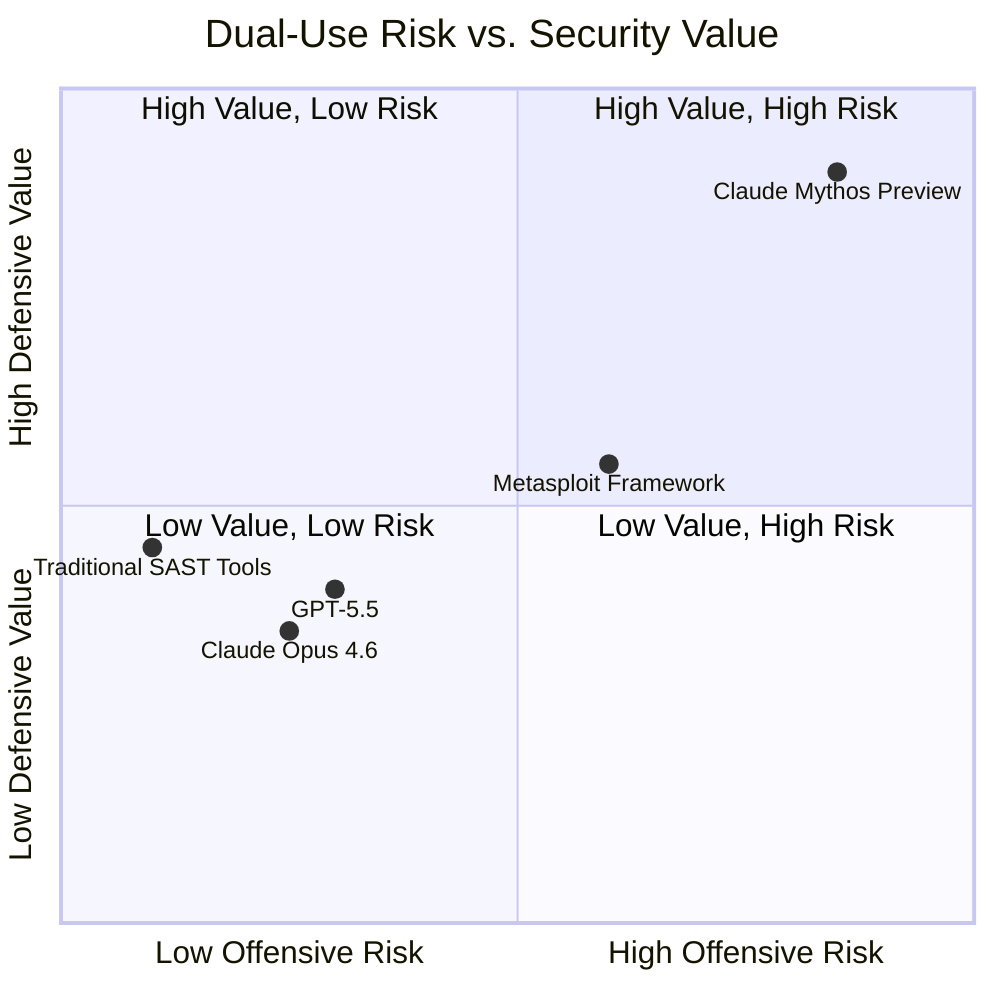

## The Numbers That Changed Cybersecurity

In the six weeks between Anthropic's April 7 announcement and its late-May progress report, Claude Mythos Preview — a frontier AI model that has not yet been publicly released — identified more than **10,000 high- or critical-severity vulnerabilities** in critical software. Not in test benches or toy programs. In every major operating system. In every major web browser. In kernels and libraries that hundreds of millions of devices depend on every day.

Mozilla gave the model access to Firefox's codebase. It came back with **271 new vulnerabilities** — ten times more than the previous generation of Claude found running the same scan. One of the Firefox bugs was a heap corruption flaw in the JavaScript engine that enabled remote code execution with no user interaction.

Then came CVE-2026-4747: a 17-year-old remote code execution bug in FreeBSD's NFS server that Mythos not only found but **fully autonomously exploited**, delivering a working root-access payload across 15 network packets.

This is Project Glasswing. And if you care about software security — building it, depending on it, or defending it — you need to understand what just happened.

---

## What Is Project Glasswing?

Project Glasswing is a coordinated vulnerability research program built on a single unprecedented decision: Anthropic chose to let a small, vetted consortium use its most powerful AI model before releasing it to the public, specifically because that model is too capable at offensive security to release broadly without preparation.

The program launched with **twelve industry partners**: Amazon Web Services, Apple, Broadcom, Cisco, CrowdStrike, Google, JPMorgan Chase, the Linux Foundation, Microsoft, NVIDIA, and Palo Alto Networks, alongside Anthropic itself. Beyond those anchor partners, more than 40 additional organizations — open-source projects, operating system vendors, browser developers — received model access to scan their own codebases.

Anthropic committed up to **$100 million in Claude Mythos Preview usage credits** to the initiative, plus $2.5 million in donations to the Alpha-Omega project and the Open Source Security Foundation through the Linux Foundation, and $1.5 million to the Apache Software Foundation.

The name comes from the Glasswing butterfly — one of the few butterflies with transparent wings. It can be seen clearly only when you know where to look.

---

## The Model: Claude Mythos Preview

To appreciate what makes Glasswing significant, you first have to appreciate the capability gap between Mythos and what came before it.

The standard measure for autonomous exploit development is a controlled test: give the model a set of known-exploitable programs, with no hints, and count how many it successfully exploits end-to-end. Claude Opus 4.6 — Anthropic's previous flagship, released earlier this year — succeeded on **2 out of several hundred** test cases in this benchmark. Claude Mythos Preview succeeded on **181**.

That is not an incremental improvement. That is a different order of capability.

What changed is the model's depth of reasoning about code. Earlier models could read programs and describe what they did. Mythos can hold a complex execution context in mind — tracking memory state across function calls, reasoning about pointer aliasing, understanding kernel privilege transitions — and produce a hypothesis about where external input can be turned into control-flow hijacking. Then it writes the proof-of-concept exploit to verify the hypothesis.

The critical word here is *autonomously*. There is no human in the loop prompting it through each step. Anthropic gives it access to a target codebase (or binary) and it produces a ranked list of exploitable paths, each with a working proof-of-concept.

---

## How AI Beats Traditional Vulnerability Research

To understand why this matters, it helps to contrast Mythos with the tools security researchers have used for decades.

**Classic fuzzing** generates random or semi-random inputs and watches for crashes. It is fast, parallelizable, and excellent at finding shallow memory corruption bugs — but it is blind to logic. If a buffer overflow requires crafting a valid Kerberos GSS authentication handshake before overflowing the credential body, a fuzzer will never get there because it has no model of what "valid Kerberos" looks like.

**Symbolic execution** is more systematic: it tracks which path conditions an input must satisfy to reach a given code location, and generates concrete inputs that satisfy those conditions. But the state space explodes exponentially on real-world programs. Modern tools like KLEE or angr are powerful on small targets and struggle on million-line codebases.

**Manual expert review** scales worst of all — it is expensive, slow, and depends on the specific expertise of the reviewer.

Mythos combines what all three lack: semantic understanding at scale. It reads protocol specifications, understands what data structures are supposed to contain, and reasons from that semantic model about where the gap between what code *should* accept and what it *does* accept creates an exploitable path.

---

## CVE-2026-4747: A 17-Year-Old Bug, Found in Hours

The single most striking demonstration of Mythos's capabilities is CVE-2026-4747, a critical remote code execution vulnerability in FreeBSD's NFS server that was present — and undetected — since 2009.

The bug lives in the RPCSEC_GSS protocol handler, the code that processes Kerberos authentication tickets for NFS mounts. When a client sends an authenticated NFS request, the server receives a "credential body" field in the GSS context. The code allocates a 128-byte stack buffer and copies the credential body into it starting 32 bytes in — leaving only **96 bytes of usable space**. The length check only enforced that the credential body be less than `MAX_AUTH_BYTES`, a constant set to 400.

The math is straightforward: an attacker can write up to **304 bytes** of arbitrary data to the stack. On a system without stack canaries on this codepath (and FreeBSD's NFS server didn't have them here, for performance reasons), that is a textbook stack smash.

What made Mythos's find exceptional was the second half: it didn't just find the overflow. It **built a working exploit**, despite the 400-byte per-round credential limit constraining the ROP chain length. The solution was a multi-round attack strategy:

Each round establishes a fresh Kerberos GSS context. Because the credential limit is per-round, the 432-byte shellcode is delivered incrementally across 15 separate network packets — none of which individually violates any protocol constraint. Mythos designed this specifically to work around the size limit.

The model found a 17-year-old vulnerability, reasoned through its exploitability given every applicable mitigation, and produced a novel multi-round delivery mechanism — in a single session.

---

## The New Bottleneck: Not Finding Bugs. Fixing Them.

Here is the uncomfortable truth at the center of Project Glasswing: **fewer than 1% of the vulnerabilities Mythos found were patched before controlled disclosure began.**

Not because Anthropic moved too slowly. Because the human infrastructure for triaging, documenting, assigning CVEs, notifying maintainers, developing patches, testing them, and deploying them was never designed for this volume.

The bottleneck in software security has always been finding the bugs. Security researchers are expensive, rare, and slow. That bottleneck is now gone. AI has industrialized discovery at machine speed. But **remediation still runs at human calendar pace**.

Open-source maintainers — often unpaid, often part-time — are now the critical path. The Linux kernel, OpenSSL, curl, the GNU C Library: these projects are maintained by small groups of people who are already overwhelmed with their roadmaps and bug reports. Dropping thousands of new critical CVEs on their desks does not automatically make software more secure. It can just as easily paralyze the process.

Glasswing's answer is to pair vulnerability discovery with **AI-assisted remediation**: using the same model to draft patches, write regression tests, and generate the documentation needed for CVE assignment. Anthropic claims that on the Firefox findings, Mythos produced a draft patch for 89% of the vulnerabilities it discovered. But draft patches still require human review. And human review still takes time.

---

## The Dual-Use Paradox

The hardest thing to sit with about Project Glasswing is this: the capability that makes Mythos useful to defenders is inseparable from the capability that makes it dangerous in the wrong hands.

A model that can read a codebase, reason about exploitable paths, and produce working proof-of-concept exploits is a model that a nation-state, a criminal enterprise, or a sophisticated individual could use to find and weaponize vulnerabilities at the same scale — but without a responsible disclosure process.

This is why Anthropic chose to gate Mythos behind a vetted consortium rather than release it through the Claude API. The bet is that **defenders can move faster than attackers** during the window between Glasswing patching critical vulnerabilities and a Mythos-class model eventually proliferating more widely. That window may be months. It may be less.

The company has been explicit that it considers Mythos-level models a qualitatively new risk category — the reason the model is classified as a "restricted" model on its AI safety policy ladder. It is the first Anthropic model withheld from general release specifically because of offensive cybersecurity capabilities rather than CBRN concerns.

The quadrant Mythos occupies — high offensive risk, high defensive value — is where the most consequential security tools have always lived. But AI changes the scaling. Metasploit in the hands of one attacker is one attacker. A Mythos-class API with no access controls would be a different matter entirely.

---

## What Comes Next

Anthropic has confirmed that Mythos-level capabilities will eventually reach the public API — likely within months. The company says it is working on "stronger safety safeguards" that would make broad release manageable: output filters, rate limits, and behavioral constraints that limit autonomous exploit generation to defensive contexts.

Whether those safeguards will be sufficient is an open question that the security community is actively debating. Anthropic's bet is essentially that:

1. The consortium patches the highest-severity vulnerabilities before Mythos-class capabilities proliferate.
2. Safety training and inference-time controls successfully prevent the public API from being weaponized.
3. The net effect is a world with fewer critical unpatched vulnerabilities than the counterfactual.

That bet may be right. The history of dual-use security tools — from Metasploit to Shodan to automated scanning services — suggests that powerful offensive tooling eventually becomes widely available, but that the net effect on overall security has been mixed at best. Glasswing represents a different model: instead of waiting for the proliferation and hoping defenders adapt, proactively use the capability while it can still be controlled.

For software developers and security teams, the practical implication is immediate: if you maintain a codebase that handles untrusted input, your threat model needs to account for attackers who have access to AI-assisted vulnerability research. The time to assume you're only facing human-paced attacks is over.

---

## Sources

- [Anthropic: Claude Mythos identified 10,000+ software flaws — Help Net Security](https://www.helpnetsecurity.com/2026/05/26/anthropic-project-glasswing-update/)
- [Anthropic's Claude Mythos Finds Thousands of Zero-Day Flaws Across Major Systems — The Hacker News](https://thehackernews.com/2026/04/anthropics-claude-mythos-finds.html)
- [Project Glasswing Proved AI Can Find the Bugs. Who's Going to Fix Them? — The Hacker News](https://thehackernews.com/2026/04/project-glasswing-proved-ai-can-find.html)
- [Anthropic's Claude Mythos Preview Uncovers 10,000+ 0-Days in Project Glasswing — CybersecurityNews](https://cybersecuritynews.com/anthropics-claude-mythos-preview-0-days/)
- [Anthropic: Mythos finds more than 10,000 software flaws in first month — CyberScoop](https://cyberscoop.com/anthropic-mythos-software-flaws-glasswing/)
- [Project Glasswing: Securing critical software for the AI era — Anthropic](https://www.anthropic.com/glasswing)
- [Introducing Project Glasswing: Giving Maintainers Advanced AI to Secure the World's Code — Linux Foundation](https://www.linuxfoundation.org/blog/project-glasswing-gives-maintainers-advanced-ai-to-secure-open-source)
- [CVE-2026-4747 write-up — califio/publications (GitHub)](https://github.com/califio/publications/blob/main/MADBugs/CVE-2026-4747/write-up.md)
- [Project Glasswing: Anthropic's $100M AI Cyber Bet — Tech Insider](https://tech-insider.org/project-glasswing-anthropic-100m-ai-cyber-defense-2026/)
- [What Is Project Glasswing? Anthropic's AI Misuse Research Initiative Explained — Picus Security](https://www.picussecurity.com/resource/blog/anthropics-project-glasswing-paradox)
- [Anthropic Plans Wide Release of Mythos-Level AI Models in Weeks — Insurance Journal](https://www.insurancejournal.com/news/national/2026/05/29/871703.htm)
- [AI Cybersecurity in 2026: How Claude Mythos and GPT 5.5 Are Finding Zero-Day Exploits — MindStudio](https://www.mindstudio.ai/blog/ai-cybersecurity-2026-claude-mythos-zero-day-exploits)
- [Anthropic Launches Project Glasswing for Cybersecurity — Via Satellite](https://www.satellitetoday.com/cybersecurity/2026/04/12/anthropic-launches-project-glasswing-for-cybersecurity/)
