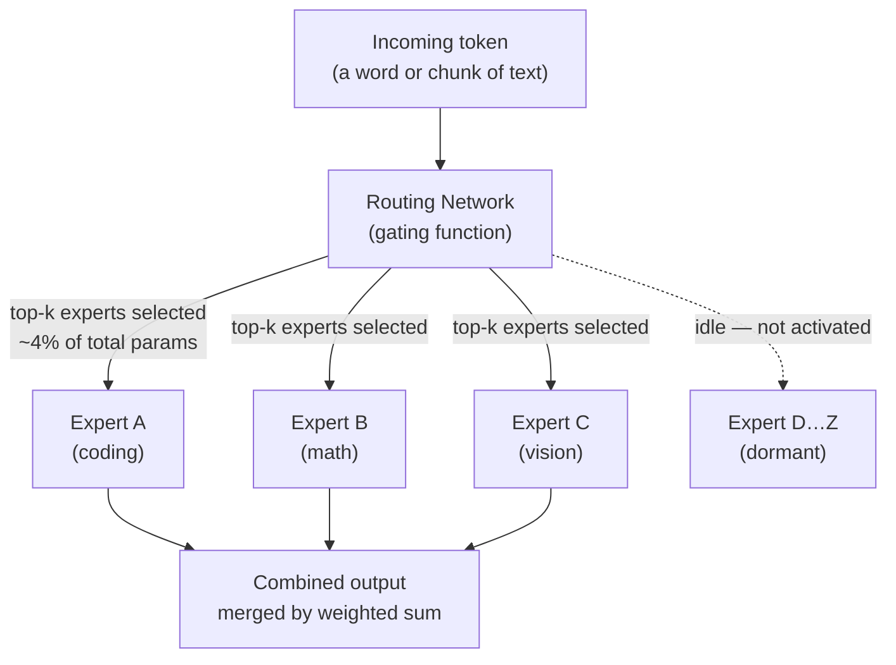
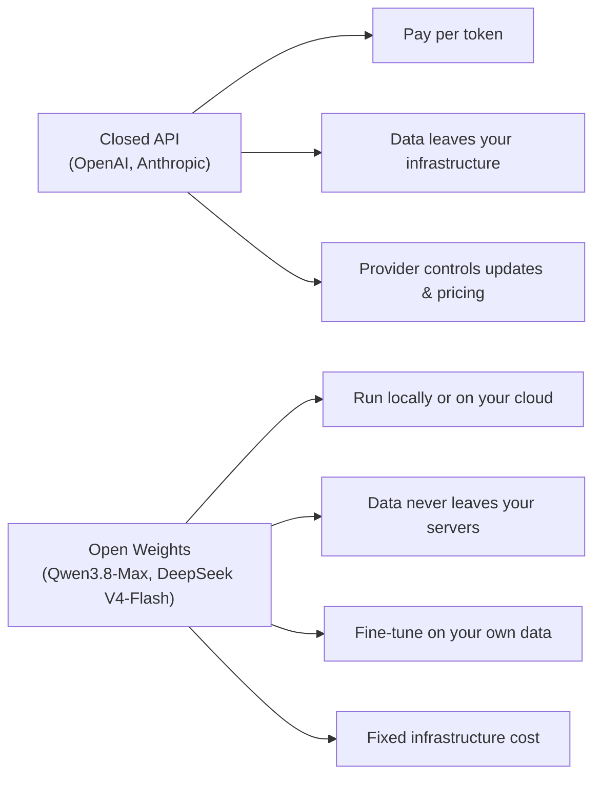

## The Efficient Giant

There is a common assumption in AI development: bigger models cost more to run, so frontier performance is inherently expensive. Alibaba's new Qwen3.8-Max is a direct challenge to that assumption.

Released on August 3, 2026, Qwen3.8-Max carries **2.4 trillion total parameters** — one of the largest language models ever built. But on any given request, it activates only **95 billion of them**, roughly 4% of the total. The rest sit loaded in memory, waiting. The result is a model with vast accumulated knowledge that responds at the speed and cost of a model nearly an order of magnitude smaller.

And in a move that has rattled Silicon Valley, Alibaba announced it will release the model's weights publicly — making one of the world's most capable AI systems free to download, fine-tune, and run.

---

## How Mixture-of-Experts Makes This Possible

To understand why 2.4 trillion parameters doesn't mean 2.4 trillion parameters worth of compute, you need to understand the **mixture-of-experts (MoE)** architecture.

In a standard "dense" neural network, every single parameter is involved in generating every single output. Ask GPT to write a haiku and it runs through all its parameters. Ask it to solve a calculus problem and it runs through all of them again. This is powerful but wasteful — a poetry specialist and a calculus specialist would both be better than one generalist being used for both jobs.

MoE architecture solves this by splitting the model into hundreds of specialized **expert sub-networks**. A lightweight **routing network** looks at each incoming piece of text and decides which experts are most relevant, then sends that token only to those experts. The others stay idle.

For Qwen3.8-Max, this means activating 95 billion parameters per token while keeping 2.3 trillion parameters of additional specialized capacity on standby — available for future tokens but consuming no compute right now. The practical effect: the model thinks like a 2.4-trillion-parameter system but bills like a 95-billion-parameter one.

This is the same architectural trick used by DeepSeek V4-Flash (released just two days earlier, July 31) and underpins most of the most cost-efficient frontier models of 2026. The difference is scale: Qwen3.8-Max is currently the **largest openly announced MoE model** by total parameter count.

---

## What It Can See and Understand

Qwen3.8-Max is fully multimodal, accepting text, images, and video as input. Its context window supports up to **1 million tokens** — enough to fit roughly 750,000 words, or about 2,500 pages of a novel, in a single prompt.

Alibaba claims the model can:

- Analyze **more than 200 pages of text** in one request
- Process approximately **100 hours of video footage** in a single session
- Convert **2D architectural floor plans** into 3D visualizations
- Reconstruct **software applications from screenshots**
- Generate **interactive educational animations** from plain-text descriptions

The vision capabilities are not cosmetic additions. On OSWorld-Verified — a benchmark that tests whether a model can actually interact with a real desktop operating system by clicking buttons, navigating menus, and executing tasks — Qwen3.8-Max scored **86.1**, edging past Claude Fable 5 (~85.0%) and GPT-5.6 Sol (~83.2%). This is a demanding, agentic benchmark. Passing it requires observing a screen, planning multi-step actions, and executing them correctly — not just generating plausible text.

---

## Benchmark Performance: Where It Wins and Where It Trails

Alibaba published a broad set of benchmark results. The honest read is that performance is category-dependent — Qwen3.8-Max leads the field in some areas and trails in others.

**Where it leads or matches frontrunners:**

| Benchmark | Score | What It Measures |
|---|---|---|
| OSWorld-Verified | 86.1 | Desktop agentic computer use |
| OmniDocBench 1.5 | 92.1 | Document understanding & extraction |
| PaperBench | 93.0 | Research paper comprehension |
| Video-MME (w/ subtitles) | 81.8 | Long video understanding |
| Terminal-Bench 2.1 | 86.6 | Terminal-based coding agents |

**Where it trails:**

Core software-engineering evals — particularly those involving deep, uninterrupted reasoning over real codebases — favor Anthropic's Fable 5 and Claude Opus 5. Qwen3.8-Max scores 67.7 on SWE-bench Pro, a meaningful result, but behind the leaders. General-purpose reasoning benchmarks also favor the US frontier labs.

The pattern that emerges: **Qwen3.8-Max is an excellent multimodal agent for document intelligence, video, and OS interaction; it is a strong but not dominant coding model.** For teams building on document analysis, long-form video, or GUI automation pipelines, it may be the best available. For teams doing pure software engineering, Anthropic and OpenAI still lead.

---

## The Open-Source Move

The most consequential thing about Qwen3.8-Max may not be its benchmark scores — it is the announcement that Alibaba will release the model's **weights as open source**.

When a company releases model weights, it means anyone can download the full model, run it on their own hardware, fine-tune it on proprietary data, and build products without paying API costs or accepting terms of service. This is what Meta did with Llama, what DeepSeek did with V4-Flash, and what Alibaba is now doing with one of the largest models ever built.

As of August 3, 2026, the weights were not yet downloadable — Alibaba promised they would appear on Hugging Face and ModelScope "the following week." The competitor Kimi K3 (2.8 trillion parameters, from Moonshot AI) already released its open weights on July 27, giving Kimi an early lead in community adoption. But Alibaba's track record with Qwen releases suggests the open-source drop will follow quickly.

This matters because open weights change the economics of AI deployment entirely:

For enterprises in regulated industries — finance, healthcare, legal — the data sovereignty argument alone makes open weights compelling regardless of benchmark position.

---

## Reading the Competitive Moment

Qwen3.8-Max arrived five days after DeepSeek V4-Flash (284 billion total parameters, MIT licensed, July 31) and three weeks after Kimi K3 (2.8 trillion parameters, also open weights, July 27). In the same period, OpenAI cut the price of GPT-5.6 Luna by 80% and Anthropic released Claude Opus 5 at half the price of Fable 5.

This is not a coincidence. The frontier AI market in mid-2026 is experiencing simultaneous **capability competition and price compression** — a combination that is historically rare and extremely beneficial for developers and end users.

Alibaba's specific strategy is legible from the outside: trade the last increment of capability on the hardest reasoning tasks for openness, multilingual breadth (Qwen has traditionally been strong across 100+ languages), and pricing an order of magnitude below closed competitors. The Qwen family has become, by most measures, the most widely used open-weight model globally — more downstream fine-tunes use Qwen as a base than any other Chinese model.

The US–China framing in press coverage often obscures what is actually a technical story. Qwen3.8-Max exists because MoE architecture has made it possible to build at this scale efficiently; because the open-source community has built the tooling to run, quantize, and fine-tune models of this size; and because Alibaba has been consistently willing to give that work away.

Whether that strategy serves Alibaba's long-term competitive position is a business question. For engineers building AI products, the answer is simpler: a 2.4-trillion-parameter multimodal model that runs on your own hardware will be available for free within days of this writing.

---

## How to Access It Today

The model is currently available as a **managed API** through:

- **Alibaba Cloud Model Studio** (QwenCloud): $2 per million input tokens, $6 per million output tokens
- **OpenRouter**: as `qwen/qwen3.8-max` via the Qwen API endpoint

Once the open weights drop on Hugging Face and ModelScope (expected week of August 10, 2026), you'll be able to run it locally using frameworks like vLLM or TensorRT-LLM, though you'll need significant hardware — this is a 2.4-trillion-parameter model, even if only 95 billion parameters are active at once.

---

## Why It Matters

The story of Qwen3.8-Max is really the story of what the MoE architectural shift has made structurally possible. A model with the knowledge capacity of 2.4 trillion parameters, running at the effective compute cost of 95 billion, available for free download — that sentence would have been science fiction three years ago.

The practical upshot: if your workload involves documents, video, desktop automation, or multilingual tasks, the best available open-source model as of August 2026 may be Alibaba's. And if its weights perform as advertised when they drop, the cost to find out is zero.

---

## Sources

- [Alibaba Qwen Releases Qwen3.8-Max: A 2.4 Trillion Parameter MoE Model — MarkTechPost](https://www.marktechpost.com/2026/08/03/alibaba-qwen-releases-qwen3-8-max/)
- [Alibaba debuts Qwen3.8-Max model with 2.4T parameters — SiliconAngle](https://siliconangle.com/2026/08/03/alibaba-debuts-qwen3-8-max-model-2-4t-parameters/)
- [Alibaba unveils open-source AI model Qwen3.8-Max — TechBriefly](https://techbriefly.com/2026/08/03/qwen3-8-max-open-source-ai-model/)
- [Alibaba Unveils Open-source Qwen3.8-Max AI Model — Dataconomy](https://dataconomy.com/2026/08/03/qwen3-8-max-ai-model/)
- [Qwen3.8-Max arrives with a bold claim: it outperforms GPT-5.6 Sol Max and Fable 5 on agentic computer use — VentureBeat](https://venturebeat.com/technology/qwen3-8-max-arrives-with-a-bold-claim-it-outperforms-gpt-5-6-sol-max-and-fable-5-on-agentic-computer-use)
- [Alibaba unveils 2.4-trillion-parameter Qwen3.8-Max as DeepSeek's new AI model undercuts Anthropic by 100X — Tech Startups](https://techstartups.com/2026/08/03/alibaba-unveils-2-4-trillion-parameter-qwen3-8-max-as-deepseeks-new-ai-model-undercuts-anthropic-by-100x/)
- [Qwen3.8-Max: China's Biggest AI Model — Technology.org](https://www.technology.org/2026/08/03/alibaba-qwen38-max-24-trillion-parameters/)
- [Qwen 3.8 Max Ships: 2.4T MoE, 1M Context, $2/$6 per MTok, Open Weights Next Week — Developers Digest](https://www.developersdigest.tech/blog/qwen-3-8-max-release-2026)
- [Qwen 3.8 Max vs Kimi K3: Specs, Benchmarks, and Which One You Can Actually Use — Yotta Labs](https://www.yottalabs.ai/post/qwen-3-8-vs-kimi-k3-benchmarks-comparison-2026)
- [Alibaba's Qwen AI: Strategy, Models, Cloud & Open Weights — The AI Rankings](https://theairankings.com/alibaba/)
