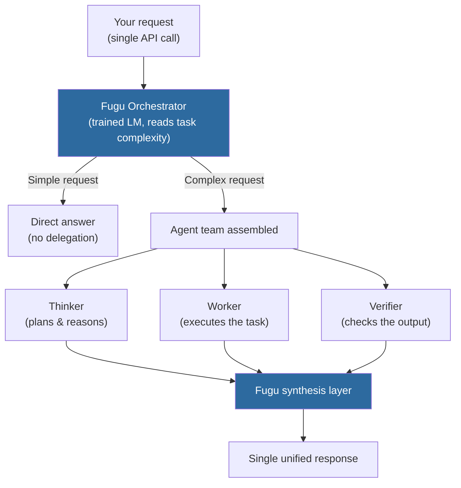
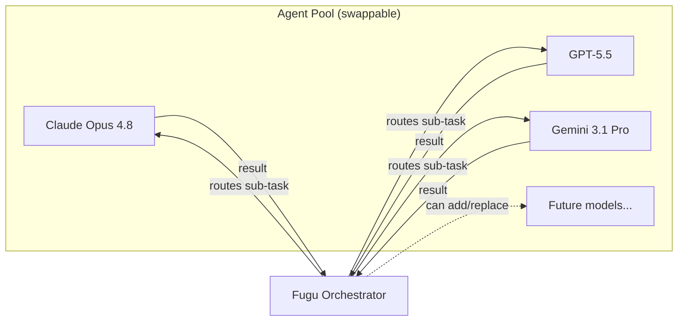

## The Standard Play, and the Different Bet

For the past several years, the playbook for building a state-of-the-art AI has been straightforward: gather more data, build a bigger model, spend more compute on training. The frontier moves, and the labs with the most resources tend to sit at the top.

Sakana AI is making a different bet.

The Tokyo-based lab, co-founded in 2023 by David Ha and Llion Jones — both former Google Brain researchers, with Jones as a co-author of the original Transformer paper — has built its reputation on **nature-inspired AI**: evolutionary model merging, biology-driven architectures, research that treats AI like an ecosystem rather than a single massive machine. On June 22, 2026, Sakana released its most direct challenge to the scaling orthodoxy yet: **Sakana Fugu**.

Fugu is not a bigger model. It is an orchestration model — a system whose primary job is to understand your task, break it apart, and route the pieces across a pool of existing frontier LLMs. From the outside, it looks and feels like a single model. On the inside, it may be coordinating several of the world's best models at once, assigning each a role, and synthesizing their answers into one coherent response.

---

## One API, Many Models Inside

The deceptively simple pitch: you call one endpoint, you get one answer. What happens in between is up to Fugu.

When you send a request, Fugu's orchestrator reads it and decides how complex the problem is. For simple questions, it may answer directly. For harder ones, it assembles a small team — typically between one and three specialist agents drawn from a **swappable pool** of publicly accessible frontier models, including Claude Opus 4.8, GPT-5.5, and Gemini 3.1 Pro.

Each agent in the pool gets a specific role. Fugu assigns a **Thinker** to plan and reason through the problem structure, a **Worker** to actually execute the task, and a **Verifier** to check and challenge the result before anything is returned to you. Fugu then synthesizes the agents' outputs into one polished answer.

The orchestrator itself is compatible with the OpenAI API format, so any codebase that already calls GPT-5.5 can switch to Fugu by changing a single endpoint string. Both Fugu and Fugu Ultra support a **1-million-token context window**, structured outputs, function calling, multiple reasoning effort levels, and image input.

---

## The Research Underneath It

Fugu is not a custom-built multi-agent framework in the usual sense — you don't write routing logic, you don't configure which model handles what. Fugu **learns to do that routing itself**, and the learning comes from two ICLR 2026 papers that Sakana published earlier this year.

**TRINITY** is a lightweight coordinator, roughly 0.6 billion parameters, evolved using CMA-ES (an evolutionary optimization algorithm) rather than trained end-to-end with gradient descent. It takes a query and a pool of much larger worker models and decides — based on the structure of the problem — how to assign Thinker, Worker, and Verifier responsibilities. Despite its small size, TRINITY acts as the brain; the frontier models are its hands.

**The Conductor** takes a complementary approach: it is a 7-billion-parameter model trained with reinforcement learning to discover **natural-language coordination strategies** on its own. Instead of a human writing "route math problems to Model A and code reviews to Model B," the Conductor figures out that pattern by trying different delegation strategies and learning from what works. Crucially, the Conductor can call itself recursively — using its own reasoning process as a meta-level agent — to scale computation during inference on particularly hard problems.

Together the two papers point at the same insight: orchestration is a learnable skill. A small model that knows *how to coordinate* large models can outperform any single large model working alone.

---

## Two Tiers: Fugu and Fugu Ultra

Sakana shipped the model family in two variants, designed for different latency/quality tradeoffs:

| | Fugu | Fugu Ultra |
|---|---|---|
| **Best for** | Interactive tasks, chatbots, coding assistants | Research, multi-step analysis, cybersecurity |
| **Agents coordinated** | 1–2 | 2–3 (deeper specialist pool) |
| **Context window** | 1M tokens | 1M tokens |
| **Input pricing** | $2/M tokens | $5/M tokens |
| **Output pricing** | $8/M tokens | $30/M output |
| **Cached input** | $0.20/M | $0.50/M |

Fugu Ultra targets the workloads where quality matters more than speed: AI research assistance, large-scale patent analysis, academic paper reproduction, cybersecurity threat investigation. It routes across a deeper specialist pool and runs more verification passes before returning an answer.

---

## The Benchmark Case (and the Fine Print)

Sakana's launch numbers are striking. On the metrics that matter to developers, Fugu Ultra lands above every publicly accessible frontier model:

| Model | SWE-Bench Pro | LiveCodeBench | Terminal Bench 2.1 | Humanity's Last Exam |
|---|---|---|---|---|
| **Fugu Ultra** | **73.7%** | **93.2** | **82.1** | 50.0 |
| Claude Opus 4.8 | 69.2% | — | — | — |
| GPT-5.5 | 58.6% | 85.3 | 78.2 | — |
| Gemini 3.1 Pro | 54.2% | — | — | — |
| Claude Fable 5 | ~80% | 89.8 | — | **53.3** |

SWE-Bench Pro tests the ability to resolve real, unmodified GitHub issues in production repositories — a rigorous bar for software engineering capability. Fugu Ultra's 73.7% puts it ahead of Opus 4.8 (which itself beat GPT-5.5 and Gemini 3.1 Pro by a wide margin). On LiveCodeBench, both Fugu variants beat Fable 5.

But three caveats are worth understanding:

**All numbers are Sakana-reported.** The baselines use provider-disclosed scores, the SWE-Bench Pro evaluation used the mini-swe-agent scaffolding, and no independent lab has reproduced these figures as of this writing.

**Scoring an orchestration system is not the same as scoring a model.** Fugu's high performance can reflect great routing as much as great reasoning. The Verifier pass adds an extra quality layer that a single model inference doesn't get. That's a real advantage in practice — but it's a systems advantage, not a raw model capability advantage.

**Real-world latency varies.** Within 24 hours of launch, independent developers reported wait times of up to 30 minutes on some Fugu Ultra requests. Complex multi-step tasks require multiple serial API calls to several providers, and peak-hour demand can compound that. The routing decisions are also proprietary — you cannot know in advance which pool models will be selected for a given request, or exactly what it will cost.

---

## Why Now: Export Controls and the Swappable Pool

The timing of Fugu's launch carries context that matters.

On June 12, 2026 — ten days before Fugu launched — the US government applied export controls to Anthropic's highest-tier models, Claude Fable 5 and Mythos Preview, abruptly cutting off access for users outside the US. Those controls were lifted on July 1, but the two-week window was a live demonstration of something the AI industry had only theorized: a world where access to the best models is politically gated.

Fugu's design is structurally resistant to that risk. Because its agent pool is **swappable**, Sakana can update it when a model becomes unavailable or when a better one appears, without changing the API contract. If Fable 5 disappears again, Fugu reroutes. If a new open-weight model outperforms the incumbents on a specific task type, it can be added to the pool.

Sakana has been explicit that it is targeting **Japanese enterprises and government agencies** concerned about exposure to US export policies — a very real consideration in the post-June 12 environment. The pitch is not just performance; it's supply chain resilience.

---

## What This Changes (and What It Doesn't)

The standard mental model for AI model evaluation is: **one model, one benchmark score, one price per token**. Fugu complicates all three.

On the positive side, Fugu shows that you can deliver frontier-level capability without training a frontier-scale model. The Conductor and TRINITY papers demonstrate that a small, learned orchestrator can direct large models more efficiently than a human-designed workflow — and that this advantage scales with task complexity. That's a genuinely new lever.

But Fugu also introduces new failure modes. A multi-step orchestration is harder to debug than a single inference. Opaque routing means you can't easily understand *why* a result is wrong. Cost predictability suffers when the number of agent calls isn't fixed. And latency on the hardest tasks is high — sometimes uncomfortably so.

For developers, the most honest framing is probably this: **Fugu is an excellent choice for tasks where you want higher quality than any single model provides and you're not sensitive to inference time**. For interactive, latency-sensitive workflows, the standard Fugu tier or a single frontier model is likely the right call.

---

## Sakana's Broader Thesis

Fugu fits a pattern that Sakana has been building since 2023. The lab's earlier work — Evolutionary Model Merge, the AI Scientist — all share the same underlying conviction: **you don't always need a bigger model; you need smarter ways to combine models that already exist**.

Where most frontier labs compete on who can train the largest next model, Sakana is competing on coordination. Fugu is the most commercially direct expression of that bet so far — a product, not just a paper, built on the idea that the orchestrator is the new foundation model.

Whether that turns out to be a permanent architectural advance or a clever bridge while training costs continue to fall is an open question. But the fact that a Tokyo lab without a massive compute cluster is sitting just outside the top three on SWE-Bench Pro using only models it didn't train is, at minimum, worth paying attention to.

---

## Sources

- [Sakana Fugu — Multi-agent System as A Model (Sakana AI)](https://sakana.ai/fugu/)
- [Sakana Fugu: One Model to Command Them All — Sakana AI Blog](https://sakana.ai/fugu-release/)
- [Sakana Fugu Technical Report — arXiv 2606.21228](https://arxiv.org/abs/2606.21228)
- [Sakana AI Launches Sakana Fugu — MarkTechPost](https://www.marktechpost.com/2026/06/22/sakana-ai-launches-sakana-fugu-an-orchestration-model-that-routes-tasks-across-a-swappable-pool-of-frontier-llms/)
- [No Claude Fable 5? No problem — VentureBeat](https://venturebeat.com/orchestration/no-claude-fable-5-no-problem-sakana-achieves-frontier-performance-with-new-fugu-multi-model-auto-synthesis-system)
- [AI Orchestrator Sakana Fugu Claims Fable 5 Parity: Real-World Tests Reveal 30-Minute Waits — TechTimes](https://www.techtimes.com/articles/318968/20260624/ai-orchestrator-sakana-fugu-claims-fable-5-parity-real-world-tests-reveal-30-minute-waits.htm)
- [Asian AI startups launch Mythos-like models as Anthropic's export ban drags on — TechCrunch](https://techcrunch.com/2026/06/27/asian-ai-startups-launch-mythos-like-models-as-anthropics-export-ban-drags-on/)
- [One Model to Rule Them All? Inside Sakana AI's New Fugu — Buttondown / ICP Dev](https://buttondown.com/icp-dev/archive/one-model-to-rule-them-all-inside-sakana-ais-new/)
- [SWE-bench Pro Leaderboard 2026 — BenchLM.ai](https://benchlm.ai/benchmarks/swePro)
- [Sakana Fugu: Features, Benchmarks, and How It Works — DataCamp](https://www.datacamp.com/blog/sakana-fugu)
