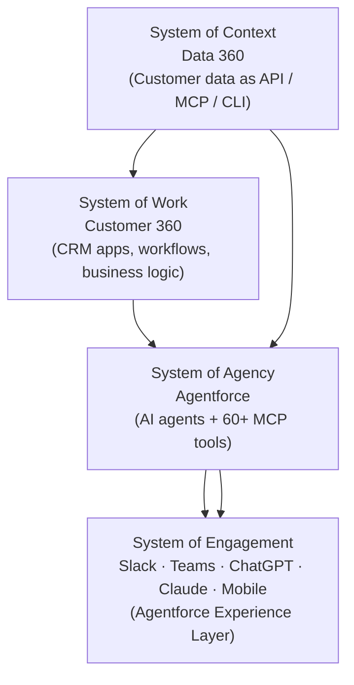
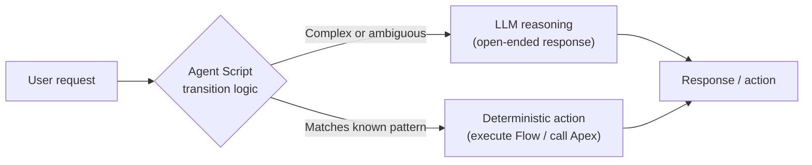
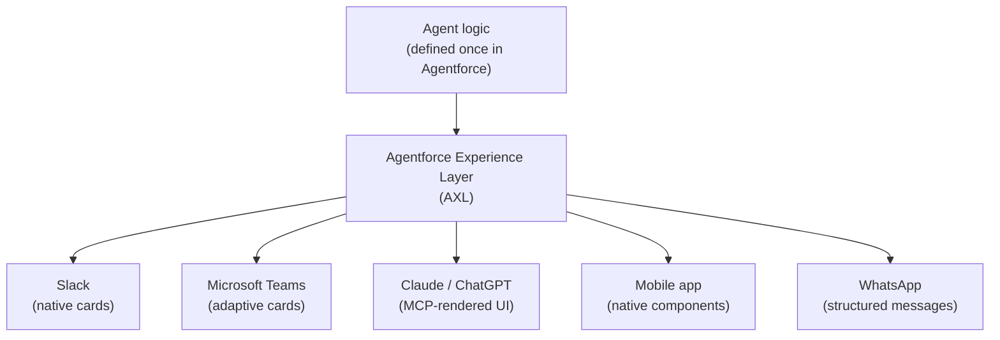

## The GUI Was Never the Point

When Salesforce launched in 1999, it made one thing radical: moving CRM off a CD-ROM and into a browser. The browser was the platform. For twenty-five years, "logging into Salesforce" meant opening a tab, clicking through screens, and navigating a UI that tried very hard to show you everything you might need.

That era is ending.

At TrailblazerDX 2026 in San Francisco, Salesforce announced **Headless 360** — a fundamental restructuring of how its platform is accessed. The idea is simple to state but vast in implication: every capability Salesforce offers, from CRM data and workflow automation to compliance guardrails and AI agents, is now accessible as an API, an MCP (Model Context Protocol) tool, or a CLI command. No browser required. No login screen. Just a programmatic interface that an AI agent — or a developer's script — can call directly.

This is not a product release in the usual sense. It's a change in the company's theory of who its primary user is.

## What "Headless" Actually Means

In web development, "headless" has meant something specific for years: a back-end system that serves data via API, decoupled from any particular front-end rendering. Headless CMSes like Contentful do this for content. Headless commerce platforms like Shopify's Storefront API do it for ecommerce. You still have a UI — you just build it yourself, on top of clean APIs.

Salesforce Headless 360 takes that pattern to its logical extreme for an enterprise platform. The "head" being removed isn't just the UI layer — it's the assumption that a human operating a mouse and keyboard is on the other end.

The new audience is agents. AI systems that can call an API, interpret the response, decide what to do next, and call another API — in milliseconds, without ever opening a tab.

## The Four-Layer Architecture

To understand Headless 360, it helps to see how Salesforce has reorganized its platform conceptually. What was once a sprawling collection of clouds and products now maps to four layers, each fully programmable:

**System of Context** is where your data lives — customer records, activity history, knowledge articles. Headless 360 exposes this via Data 360 as callable tools, so an AI agent can pull account context without anyone navigating to a record page.

**System of Work** is the operational layer: the approval chains, business rules, pricing logic, and case escalation workflows your teams have built over years. Headless 360 makes these callable too, so an agent can trigger a discount approval or create a service case through the same code path a human would click through.

**System of Agency** is Agentforce itself — and this is where most of the new tooling lives. More than sixty new MCP tools ship with Headless 360, covering data access, flow execution, metadata queries, and deployment operations. These tools plug directly into AI coding assistants like Claude Code, Cursor, GitHub Copilot, and Windsurf, giving them live access to your org.

**System of Engagement** is the surface layer — where results get presented. This is handled by the new **Agentforce Experience Layer (AXL)**, which we'll get to shortly.

## MCP: The Connector That Makes It Work

If you haven't encountered MCP yet, it's worth a brief detour. The Model Context Protocol is an open standard — originally from Anthropic, now donated to the Linux Foundation — that lets AI assistants connect to external data sources and tools without custom integration code for each one. Think of it as a USB standard for AI tools: you write one server that speaks MCP, and any MCP-compatible client can talk to it.

Salesforce's MCP server (`@salesforce/mcp`) ships with the Salesforce DX toolchain and exposes sixty-plus tools across key platform categories. What's significant about the Headless 360 announcement is that these aren't narrow, cherry-picked tools. They cover the breadth of the platform: querying Salesforce data, running flows, reading and writing metadata, managing deployments, executing Apex.

The practical effect: a developer using Claude Code can describe what they want to do in Salesforce — "find all open cases for accounts in the healthcare industry that haven't been updated in ten days" — and their AI assistant can translate that into a SOQL query, execute it via MCP, and return the results, all without leaving the editor. The AI coding assistant becomes a direct interface to the live org.

Salesforce also shipped thirty pre-configured coding skills alongside the MCP tools — reusable patterns for common development tasks (scaffolding a new Agentforce agent, creating a Flow, deploying metadata) that the AI assistant already knows how to execute.

## Agent Script: Teaching AI When to Think (and When Not To)

One of the most interesting technical pieces in the Headless 360 release is **Agent Script** — a domain-specific language for defining AI agents — which Salesforce has made open source.

The core problem Agent Script addresses is a subtle one. Large language models are good at reasoning through ambiguous situations. But enterprise software is full of cases where you don't want an agent to reason — you want it to follow a deterministic rule. Regulatory requirements, pricing guardrails, PII handling, escalation thresholds. These aren't situations where "figure it out" is acceptable.

Agent Script lets developers define exactly where an agent uses LLM reasoning and where it follows hard-coded logic:

The language covers topics (the high-level things an agent can help with), actions (the specific steps it takes), variables, guardrails, and state transitions — all in strongly-typed, structured files that coding agents can read and write natively.

One detail worth noting: Agent Script is designed as a base language with platform-specific "dialects," similar to how SQL has a common core with Oracle, Postgres, and MySQL extensions layered on top. The Salesforce dialect maps to Agentforce's specific constructs, but the core language is vendor-neutral.

The full specification, grammar, parser, and compiler are on GitHub at `github.com/salesforce/agentscript`.

## The Experience Layer: One Agent, Every Surface

Here is where Headless 360 gets genuinely novel. The **Agentforce Experience Layer (AXL)** solves a problem that becomes obvious the moment you start deploying agents in production: the same agent needs to surface its output differently depending on where the user is.

A customer service agent handling a flight rebooking should present differently in a Slack message, a WhatsApp thread, a mobile app, a Teams notification, and a third-party AI assistant. The underlying logic is identical. The rendering is completely different.

AXL separates these concerns. Developers define what the agent *does* — the schema, the decision tiles, the workflow steps, the approval cards — once. AXL handles rendering that content natively for each surface: Slack, Microsoft Teams, ChatGPT, Claude, Gemini, mobile, WhatsApp, and any MCP-compatible client.

The implication for developers: you build the agent logic once, and AXL takes care of the rendering contract for each surface. You don't write separate delivery code for every channel.

## Agentforce Vibes 2.0: The AI-First Dev Environment

The developer tooling story comes together in **Agentforce Vibes 2.0**, Salesforce's AI-powered development environment. Vibes 2.0 is built around multi-model support — the default is Claude Sonnet 4.5, but you can switch to GPT-5 or Salesforce's own models depending on the task — and it understands your specific org through the Salesforce Unified Catalog, which indexes your org's metadata.

Since the original Agentforce Vibes launched at Dreamforce, monthly usage has grown 22x, with 100 million lines of generated code accepted by developers. Vibes 2.0 also supports code generation across multiple frameworks — React, Lightning Web Components, and Apex — within a single context window, which matters when you're building agents that touch multiple layers of the stack.

A companion feature called **Agentforce Labs Quickstart** removes the biggest friction point in Salesforce development: org provisioning. Developers can connect to the Agentforce platform from Claude Code, Codex, or Vibes directly, start experimenting with real Salesforce data via MCP, and only provision a full org later when they're ready to deploy.

## The Bigger Picture: Software Is Becoming Infrastructure

It's worth stepping back from the Salesforce specifics to ask what Headless 360 represents at a higher level.

Enterprise software has always been primarily a UI business. You sold a system of record plus a user interface for accessing it. The UI was part of the value proposition. Users needed it to do their jobs.

Generative AI changes that calculus. When an agent can navigate an API as fluently as a human navigates a UI — faster, without fatigue, twenty-four hours a day — the UI becomes optional overhead for most workflows. What matters is the underlying data model, the business logic, and the governance controls. The rendering is a commodity.

Headless 360 is Salesforce's response to that shift. It's not abandoning the UI (the browser interface still exists and will be used by humans for a long time). It's acknowledging that the primary interface for high-volume, repetitive enterprise workflows is increasingly going to be an AI agent — and optimizing the platform for that use case.

With 2.4 billion agentic work units processed through Agentforce and Slack in its last reported quarter, and 29,000 Agentforce deals closed (up 50% quarter-over-quarter), the demand is clearly real. Headless 360 is the architectural response: make the platform as accessible to agents as it is to humans, and build the tooling so developers can define how agents behave with the same precision as they define how UIs behave.

For engineers building on Salesforce, this is the most significant infrastructure shift since the move to Lightning. For everyone else watching enterprise software, it's a preview of what "software as infrastructure for AI" looks like when it ships in production.

---

## Sources

- [Introducing Salesforce Headless 360. No Browser Required.](https://www.salesforce.com/news/stories/salesforce-headless-360-announcement/) — Official Salesforce announcement
- [Salesforce Headless 360 and Agentforce Vibes 2.0 Revealed at TDX 2026](https://www.salesforceben.com/salesforce-headless-360-and-agentforce-vibes-2-0-revealed-at-tdx-2026/) — Salesforce Ben deep-dive
- [Salesforce debuts Headless 360 agentic platform](https://www.theregister.com/2026/04/15/salesforce_headless_360/) — The Register
- [Salesforce launches Headless 360 to turn its entire platform into infrastructure for AI agents](https://venturebeat.com/ai/salesforce-launches-headless-360-to-turn-its-entire-platform-into-infrastructure-for-ai-agents) — VentureBeat
- [TDX 2026: Salesforce depicts SaaS as an agentic evolution](https://www.computerweekly.com/news/366641628/TDX-2026-Salesforce-depicts-SaaS-as-in-agentic-evolution) — Computer Weekly
- [TDX 2026 Reporter's Notebook: Salesforce Goes Headless](https://salesforcedevops.net/index.php/2026/04/15/tdx-2026-reporters-notebook-salesforce-goes-headless-and-widens-the-builder-gap/) — SalesforceDevops.net
- [New in Salesforce Developer Edition: Agentforce Vibes IDE, Claude 4.5, MCP](https://developer.salesforce.com/blogs/2026/04/new-developer-edition-agentforce-vibes-claude-mcp) — Salesforce Developer Blog
- [TDX 2026 Roundup: Agentforce Edition](https://www.salesforce.com/blog/tdx-2026-roundup-agentforce-edition/?bc=OTH) — Salesforce Blog
- [Salesforce Headless 360: The Agentic Shift](https://cloudgaia.com/en/salesforce-tdx-2026-headless-360-agentforce-vibes/) — Cloudgaia
- [SalesforceAIResearch/agentforce-adlc — Agent Development Lifecycle on GitHub](https://github.com/SalesforceAIResearch/agentforce-adlc) — GitHub
