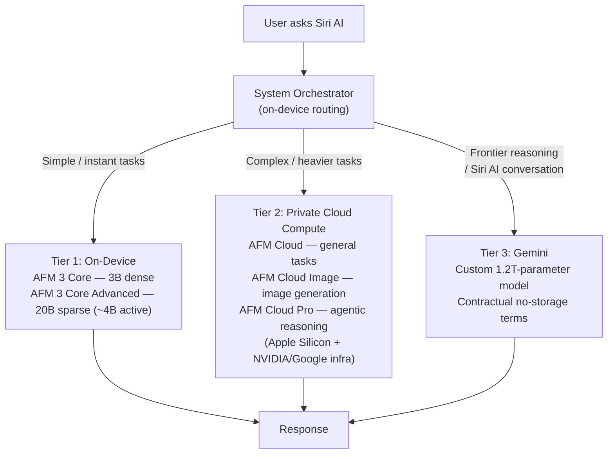
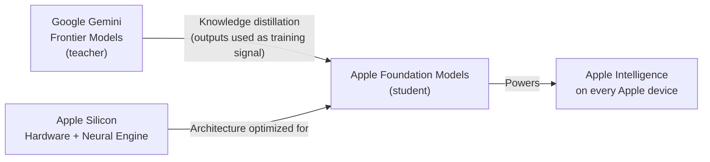

## The Moment Siri Finally Grew Up

For most of its fifteen-year life, Siri was Apple's most visible product disappointment: smart enough to set a timer, reliably embarrassing when asked to do anything more. At WWDC 2026 on June 8–9, Apple replaced it.

The new assistant is called **Siri AI**, and it is not an incremental update. In demos at Apple Park, it planned a World Cup watch party — complete with dish recommendations for both competing nations. It scanned a week-old iMessage for a dinner suggestion and turned it into a restaurant booking. It identified a sea arch from a photo visible on screen, pulled up navigation, and added beach-parking tips to a Note — all in a single conversational thread, without the user switching apps.

Behind that experience is the biggest architectural overhaul Apple has quietly executed in years: a five-model AI stack, a new cloud tier built on NVIDIA GPUs hosted inside Google's infrastructure, and a $1-billion-a-year deal with the company it competes with most directly in smartphones. This post walks through everything Apple announced and what it actually means.

---

## Four Pillars, One Orchestrator

Before getting to the model stack, it helps to understand what Apple is trying to accomplish at the product level.

Siri AI is built around four capabilities Apple calls its "pillars":

- **Personal context** — Siri searches your photos, notes, messages, mail, and calendar to craft answers specific to you
- **App actions** — Siri can perform tasks inside third-party apps on your behalf, not just Apple's own apps
- **On-screen awareness** — the assistant understands what is currently displayed on your screen and can act on it
- **World knowledge** — real-time web access for questions that go beyond what is stored locally

Coordinating these four things is a new **system orchestrator** that runs on-device. On every request, it decides what combination of local compute, private cloud, and web lookup it needs — then routes accordingly, invisibly, in under a second.

---

## The Three-Tier Inference Stack

This is where the engineering story gets interesting. Apple now routes AI requests through three distinct compute environments, chosen automatically based on task complexity, latency requirements, and privacy sensitivity.

**Tier 1 — on-device.** Apple ships two models here. *AFM 3 Core* is a 3B dense model that acts as the traffic cop: it classifies your request and decides whether it can be answered locally or needs escalating. *AFM 3 Core Advanced* is a 20B sparse mixture-of-experts model that activates only around 4B parameters per inference step — large enough to handle nuanced requests, efficient enough to fit on an iPhone 16's Neural Engine without draining the battery.

**Tier 2 — Private Cloud Compute.** When the on-device model isn't sufficient, the request travels to Apple's private cloud infrastructure, now running on a combination of Apple Silicon servers and NVIDIA GPUs hosted inside Google's cloud. Three specialized models live here: *AFM Cloud* handles general tasks, *AFM Cloud Image* handles generative photo editing, and *AFM Cloud Pro* handles the kind of multi-step agentic reasoning visible in the Siri AI demos. Apple's existing PCC privacy guarantees apply across the board: no data persistence, no access by Apple employees, cryptographic attestation of every server node before any data is sent.

**Tier 3 — Gemini.** For the hardest conversational tasks — the ones requiring frontier-class language understanding — Siri AI routes to a custom model based on Google Gemini. Apple pays Google roughly **$1 billion per year** for a specially adapted 1.2-trillion-parameter version of the model. Crucially, this arrangement is governed by contractual terms that prohibit Google from using requests to train its own models. The data does not flow through any Google consumer product.

---

## Apple Foundation Models: Built by Apple, Informed by Gemini

The most technically nuanced part of WWDC 2026 was Apple's careful language around where its models come from.

The five Apple Foundation Models (AFM 3 Core, AFM 3 Core Advanced, AFM Cloud, AFM Cloud Image, AFM Cloud Pro) are genuinely Apple's own. They were built from scratch on Apple Silicon, trained on Apple's proprietary data pipelines using reinforcement learning from human feedback.

But Apple used outputs from Google Gemini frontier models as training signal — a technique called **knowledge distillation**, where a smaller "student" model learns to mimic the behavior patterns of a larger "teacher" model. Apple senior VP Craig Federighi confirmed: the models were "refined using outputs from Gemini frontier models."

This is meaningfully different from "Gemini is inside Siri." A student who learned to write by studying a master's essays doesn't have any of that master's sentences in their head — they absorbed reasoning patterns and style. Apple's models are not Gemini. They are better than they would have been without Gemini.

---

## Core AI: The New Developer-Facing Layer

Apple shipped two significant developer tools alongside the product announcements.

**Core AI** is a new Swift framework that replaces Core ML for generative AI workloads. The split is intentional: Core ML continues to handle traditional machine learning tasks — image classification, object detection, smaller custom models. Core AI is purpose-built for transformer-based generative workloads: LLMs, diffusion models, large vision encoders.

It exposes a clean Swift API that manages model loading, memory allocation across CPU, GPU, and Neural Engine, and ahead-of-time compilation through Xcode. A new Core AI model repository gives developers ready-to-run checkpoints for popular open architectures — Qwen, Mistral, SAM3, and others — pre-optimized for Apple Silicon. The framework targets iOS 20, macOS 17, iPadOS 20, and visionOS 4, with public release alongside the fall 2026 OS updates.

The **Foundation Models framework** — the very code that powers Apple Intelligence on-device — is being open-sourced later this summer. Once published, the framework's Language Model protocol allows third-party providers, including Claude and Gemini, to register as alternative model backends inside apps. Developers can build apps that let users choose their inference engine while the app itself remains model-agnostic.

One pragmatic incentive: apps with fewer than **2 million downloads get free access** to Apple Foundation Models via Private Cloud Compute. That removes the most common reason small developers avoided cloud AI — the per-token billing.

---

## Privacy as Architecture, Not Just Marketing

Apple's Craig Federighi said at the keynote: "We believe privacy in AI is non-negotiable." That phrasing is brand language, but the engineering backing it is unusual in the industry.

Most AI assistants route requests through a data center run by a company with strong incentives to log, analyze, and improve models on your data. Apple's Private Cloud Compute was designed from the outset to prevent this:

| Property | How it's enforced |
|---|---|
| No data persistence | PCC nodes are stateless; nothing is written after the response |
| No Apple employee access | Architecturally impossible, not just policy |
| Cryptographic attestation | Your device verifies the server is running unmodified Apple software before sending |
| Hardware isolation | Execution on Apple Silicon with hardware-enforced memory boundaries |
| Gemini no-storage | Contractual terms prohibit Google from retaining or training on requests |

For users, the system is designed to be invisible: you ask Siri AI a question, the right tier handles it, you get an answer. The routing never surfaces. The guarantee is that no matter which tier processes your request, it is treated as if it never happened afterward.

---

## What Changes for Users in iOS 27

All of this architecture produces concrete features shipping in iOS 27 this fall:

- **Siri AI app**: a standalone app that preserves conversation history across sessions, available on iPhone, iPad, and Mac
- **Visual Intelligence in Camera**: point your camera at anything and ask questions; the live viewfinder becomes a prompt
- **Safari Intelligence**: automatic tab grouping by topic (shopping, work, travel); page monitoring that notifies you when a specified condition changes on a watched URL
- **Image Reframe**: AI adjustment of photo perspective, as if you repositioned the camera in the original scene
- **Image Extend**: generatively expand an image's canvas to fill a different aspect ratio
- **Enhanced Cleanup**: remove distractions from photos with higher-fidelity generative infill
- **Cross-app context in conversation**: chain multiple app actions in a single thread — find a concert, enter a ticket lottery, set a reminder, and play the artist's latest song without switching apps

---

## Why This Is a Bigger Shift Than It Looks

Google has Gemini Live. Microsoft has Copilot. Meta has Meta AI. But Apple's position is structurally distinct: it ships both the hardware and the operating system to roughly 2.35 billion active devices worldwide.

Every Siri AI capability runs on hardware Apple designed, in an OS Apple controls, with a privacy architecture Apple owns end-to-end. No cloud AI company has that degree of vertical integration. Google is building AI to run on other people's hardware. Apple is building AI that runs best — and most privately — on its own.

The open-sourcing of the Foundation Models framework and the free Private Cloud Compute tier for small developers are designed to bootstrap a third-party ecosystem around that hardware advantage. If the best AI-native apps run on Apple Silicon because Apple makes it easy and economical to build them there, the hardware moat deepens with every release cycle.

The company that spent a decade being publicly embarrassed by Siri just revealed it had been quietly assembling the most privacy-preserving, vertically integrated AI stack in the consumer technology industry. Whether the feature execution matches the architectural ambition will be clear when iOS 27 ships this fall.

---

## Sources

- [Apple unveils next generation of Apple Intelligence, Siri AI, and more — Apple Newsroom](https://www.apple.com/newsroom/2026/06/apple-unveils-next-generation-of-apple-intelligence-siri-ai-and-more/)
- [WWDC 2026: Everything announced on Siri AI, iOS 27, Apple Intelligence, and more — TechCrunch](https://techcrunch.com/2026/06/09/wwdc-2026-everything-announced-on-siri-ai-os-27-apple-intelligence-and-more/)
- [Apple Reveals New AI Architecture Built Around Google Gemini Models — MacRumors](https://www.macrumors.com/2026/06/08/apple-reveals-new-ai-architecture/)
- [Apple's new foundation models don't contain a drop of Gemini — AppleInsider](https://appleinsider.com/articles/26/06/08/apples-new-foundation-models-dont-contain-a-drop-of-gemini-as-we-said-they-wouldnt/)
- [Meet Core AI — WWDC26 — Apple Developer](https://developer.apple.com/videos/play/wwdc2026/324/)
- [Integrate on-device AI models into your app using Core AI — WWDC26 — Apple Developer](https://developer.apple.com/videos/play/wwdc2026/326/)
- [WWDC 2026: Apple unveils Siri AI, Gemini-powered Apple Intelligence — Business Standard](https://www.business-standard.com/amp/technology/tech-news/wwdc-2026-apple-unveils-siri-ai-gemini-powered-apple-intelligence-more-126060900042_1.html)
- [Apple moves private cloud compute to Google Cloud AI infrastructure — DigiTimes](https://www.digitimes.com/news/a20260610PD210/apple-google-cloud-cloud-wwdc-siri.html)
- [WWDC 2026 AI Developer Recap: Everything Apple Announced for Developers — AIMadeTools](https://www.aimadetools.com/blog/wwdc-2026-ai-developer-recap/)
- [Apple Foundation Models + Private Cloud Compute: How It Works — andrew.ooo](https://andrew.ooo/answers/apple-foundation-models-vs-private-cloud-compute-explained-june-2026/)
