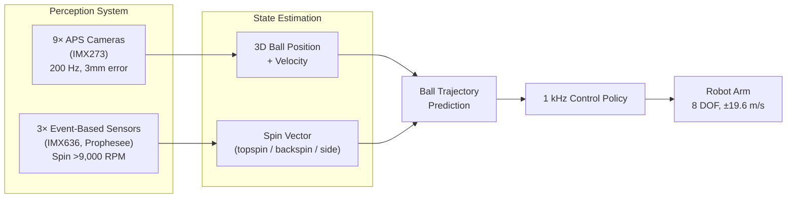
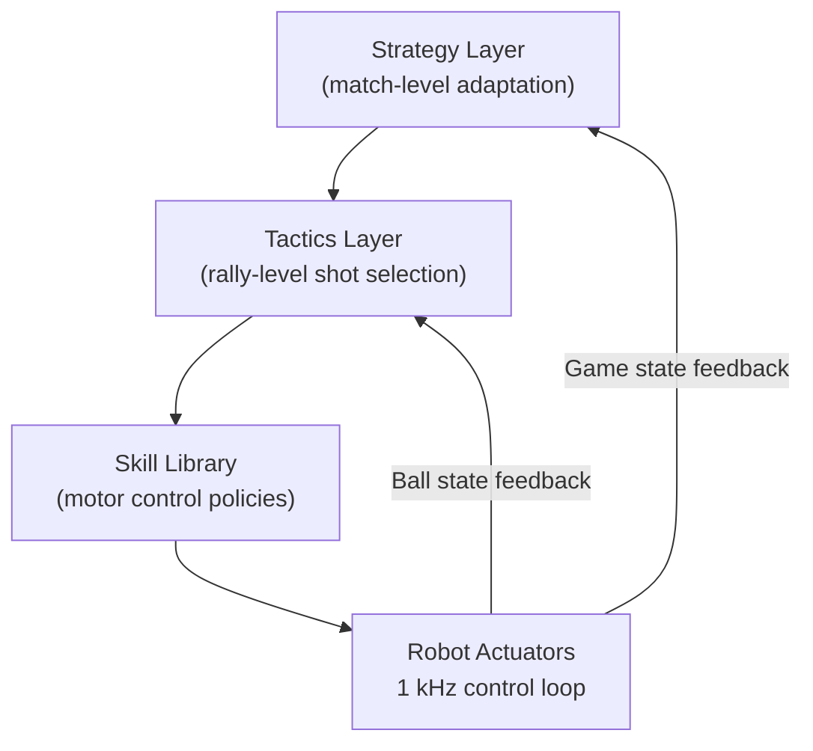

## The Ball Is Already in the Air

A table tennis ball travels at up to 70 kilometres per hour off a professional's paddle. It spins at more than 9,000 revolutions per minute — fast enough that the naked eye can't read the seam. From the moment the opponent strikes, a player has roughly 250 milliseconds to decide where to stand, how to grip the paddle, what angle to swing, and how much force to apply.

That window is not enough time for a camera to take a single conventional video frame, process it, and send a command to a motor. It's barely enough time for nerve impulses to travel from your eyes to your hand.

And yet in March 2026, a robot named **Ace** — built by Sony AI in collaboration with industrial robotics maker THK — defeated every professional table tennis opponent it faced. At least once.

The result, published on the cover of *Nature* on April 23, 2026, marks the first time a fully autonomous robot has achieved expert-level performance in a real-time physical sport against human professionals. The paper is titled *"Outplaying Elite Table Tennis Players with an Autonomous Robot."*

---

## A Progression, Not a Miracle

Ace didn't arrive at professional-calibre play overnight. The research team ran three rounds of competitive matches over about a year, each against a fresh set of opponents to avoid players gaming their familiarity with the robot.

| Round | Opponents | Result |
|---|---|---|
| **April 2025** | 5 elite amateurs, 2 professionals | Won 3/5 elite matches; lost both pro matches |
| **December 2025** | 2 elite amateurs, 2 professionals | Won both elite matches, 1 professional match |
| **March 2026** | 3 professionals | Won at least one match against **all three** |

"Elite" here means players with over a decade of serious training and around 20 hours of weekly practice. The professionals (including players in Japan's professional table tennis league) are substantially better. The progression from losing all professional matches in April 2025 to beating every professional opponent at least once by March 2026 captures the pace of improvement the team achieved — and the gap that still remains for full dominance.

---

## Why Table Tennis Is the Perfect Benchmark

Before getting into the how, it's worth asking: why table tennis?

The reason most AI has historically been tested in games — chess, Go, Atari — is that digital environments are perfectly observable, perfectly repeatable, and don't require a physical body. A language model can reason about text. A vision model can classify images. But in the real physical world, the environment is noisy, continuous, and unforgiving. Decisions must happen in milliseconds. Errors accumulate physically.

Table tennis captures almost everything that makes physical intelligence hard:

- **Ball velocity** that exceeds the reaction limit of conventional cameras
- **Spin** that's invisible to standard vision systems but completely changes the physics
- **An adversary** adapting to your play in real time
- **No scripted environment** — every rally is different

Games like chess are fully discrete: positions, moves, outcomes are all enumerable. Table tennis is continuous in space, time, and physical dynamics. Solving it requires perception, prediction, motor control, and game strategy to work together in a closed loop — simultaneously. That's the same bundle of capabilities a robot needs to assemble circuit boards in a factory at speed, or pick fragile fruit at a farm, or assist a surgeon with precision instruments.

---

## How Ace Sees the World

The first problem is perception. Standard cameras record discrete frames — typically at 30 to 240 frames per second. At the speeds a professional table tennis player can generate, a ball moving at 19.6 m/s travels roughly 8 centimetres between frames at 240 fps. That's too coarse to predict where a spinning ball will land.

Ace uses two different sensing modalities working in tandem.

**For 3D ball position:** nine conventional APS (Active Pixel Sensor) cameras using Sony IMX273 sensors are arranged around the court, running continuously. Together they triangulate the ball's position in three-dimensional space at **200 Hz**, achieving **3.0 mm positional error** and **10.2 ms average latency**.

**For spin:** three event-based vision sensors (EVS) using Sony IMX636 sensors — co-developed with the French sensor specialist Prophesee — are mounted on pan-and-tilt gaze control systems that actively track the ball. Unlike a standard camera, an event-based sensor only fires when individual pixels detect a change in brightness. It generates no frame; instead it produces a continuous stream of (x, y, timestamp, polarity) events at sub-millisecond resolution. This gives Ace the ability to detect spin rates **exceeding 9,000 RPM** — spin that would simply be invisible to any conventional camera at any practical frame rate.

---

## The Brain: Three Layers of Reinforcement Learning

Ace's decision-making is organised into three layers, each operating at a different timescale.

**Skill** is the lowest layer: raw motor control. A skill is a neural policy that maps the robot's current sensor state to joint torques — translating a desired shot type into the exact sequence of movements needed to execute it. The robot maintains a library of distinct skills: one for returning topspin shots, one for backspin, one for targeting each corner, one for playing aggressively, and one for playing defensively.

**Tactics** sits one level up. During a rally, the tactics layer evaluates the incoming ball state and selects which skill to invoke — choosing placement, pace, and spin type in response to what the opponent has sent.

**Strategy** operates at the match level, tracking the broader pattern of play, adjusting tactical dispositions based on what's working, and exploiting patterns in an opponent's weaknesses over the course of a game.

Each layer was trained using **deep reinforcement learning** — the same broad family of techniques that produced the superhuman chess and Go players of the previous decade, but applied here to continuous physical action rather than discrete board moves.

---

## Training Without Getting Hit in the Face

Physical robots can't train by trial-and-error the way a software agent can in a video game. You can't run a thousand parallel robots, smashing into walls at high speed, to learn what works. The cost — in time, hardware wear, and safety — is prohibitive.

Sony's solution was a simulation-first approach called **Sim2Real**: train the entire policy inside a physics-accurate simulation of a table tennis table, then deploy it to the real robot without any real-world fine-tuning at all.

Building that simulation took roughly five years. The core challenge is that simulation physics need to be accurate enough that the behaviours a policy learns in sim actually transfer to the real world. Early versions of the simulation were too forgiving of errors at high velocity — specifically, the model underestimated aerodynamic drag on a ball travelling at 19.6 m/s with 450 rad/s of spin. The policy that came out of that simulation was systematically overshooting the table on fast, heavy-spin returns.

The fix required rebuilding the physics model for high-speed ball dynamics from the ground up. Only once the drag coefficients matched real-world measurements at professional-play speeds did the trained policies transfer reliably.

One further training trick proved critical: an **asymmetric actor-critic** architecture (also called a "privileged critic"). During simulation training, one component of the learning system — the critic — had access to perfect ground-truth information about the ball's exact position, velocity, and spin at every moment. The policy itself (the actor) was given only realistic, noisy sensor readings, exactly as it would receive during a real match. The critic's privileged knowledge accelerated learning dramatically; the actor's noisy-sensor perspective ensured what was learned would actually work outside simulation.

---

## From Ping-Pong Table to Factory Floor

Table tennis is an unusual choice for a research vehicle if the only goal is sporting achievement. Sony AI's stated aim is much broader: to develop physical intelligence that can operate reliably in dynamic, unscripted real-world environments.

The techniques Ace demonstrates are a direct template for several unsolved industrial problems:

**High-speed visual inspection** in manufacturing lines requires detecting surface defects — micro-cracks, foreign particles — at conveyor speeds that conventional cameras miss. Ace's event-based sensors, which detect changes at sub-millisecond precision, are exactly the right architecture for this.

**Reactive grasping** in warehouse picking robots struggles when objects are irregular, spinning, or moving. Ace's hierarchical RL approach — a library of motor primitives selected in real time by a higher-level policy — maps directly onto adaptive grasping: select the right grip policy for this particular object in this particular orientation.

**Surgical assistance** requires millisecond-level precision in response to unpredictable tissue movement. The privileged-critic training technique enables policies that respond to real sensor noise rather than clean simulated data — which is exactly the gap that has made medical robotics notoriously difficult to generalise.

Sony AI's paper notes directly: *"the success of this benchmark suggests that similar techniques apply to other areas featuring fast, real-time control and human interaction, including manufacturing and service robotics."*

---

## What Still Needs to Happen

Ace is not a world champion. Over the full set of March 2026 matches, Ace won at least one game per professional — but not every game. Elite professionals still win when they adapt and push into Ace's gaps (particularly on highly varied serve spin and unusual angles).

Table tennis also presents the robot with a constrained environment: the table is a fixed size, the ball is standardised, and the opponent comes to the robot rather than the robot navigating to the task. Real-world industrial and medical settings are considerably less structured.

What Project Ace does demonstrate — conclusively, in front of live opponents and now in a Nature paper — is that hierarchical reinforcement learning, event-based perception, and Sim2Real transfer can produce physical AI that matches human expert performance in a demanding real-time motor task. That combination has never been demonstrated at this level before.

The harder match, as one analysis put it, starts now.

---

## Sources

- [Sony AI Announces Breakthrough Research in Real-World AI and Robotics — Sony AI](https://ai.sony/news/sony-ai-announces-breakthrough-research-in-real-world-artificial-intelligence-and-robotics)
- [Outplaying Elite Table Tennis Players with an Autonomous Robot — Nature (April 23, 2026)](https://www.nature.com/articles/s41586-026-10338-5)
- [Inside Project Ace — Sony AI Blog](https://ai.sony/blog/inside-project-ace-discover-the-robot-athlete-that-competes-with-professional-table-tennis-players)
- [Project Ace Supplementary Material & Videos — Sony Research GitHub](https://sonyresearch.github.io/ace_public/)
- [Sony AI's Research Paper Published in Nature — Sony Semiconductor Solutions Press Release](https://www.sony-semicon.com/en/info/2026/2026042301.html)
- [Scientists Built a Robot That Can Beat Elite Human Players at Table Tennis — ScienceAlert](https://www.sciencealert.com/scientists-built-a-robot-that-can-beat-elite-human-players-at-table-tennis)
- [Sony AI's Ace Robot Beats Elite Table Tennis Players — EE Times](https://www.eetimes.com/game-set-bot-sony-ais-ace-serves-up-a-defeat-to-table-tennis-pros/)
- [Sony Project Ace Sim-to-Real Training: The Physics Model Failure — Medium / Creedtec.Online](https://medium.com/@creed_1732/sony-project-aces-sim-to-real-robot-training-the-physics-model-failure-that-nearly-derailed-the-cba441580620)
- [Sony Ace Robot Beats Pro Table Tennis Players — AI Automation Global](https://aiautomationglobal.com/blog/sony-ace-table-tennis-robot-physical-ai-nature-2026)
- [Sony Ace and the Rise of Physical Intelligence — Poniak Times](https://www.poniaktimes.com/sony-ai-ace-physical-intelligence/)
