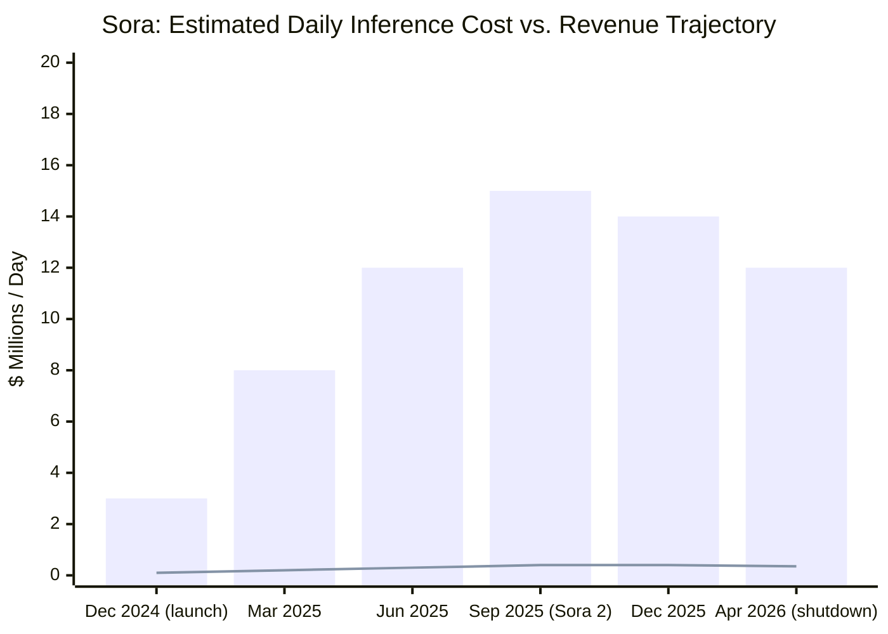
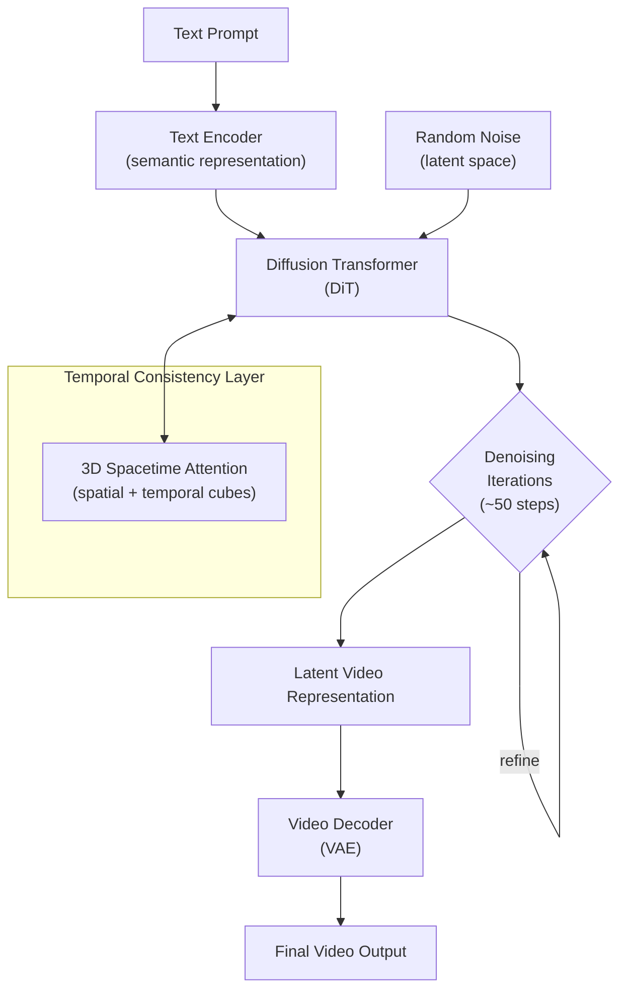
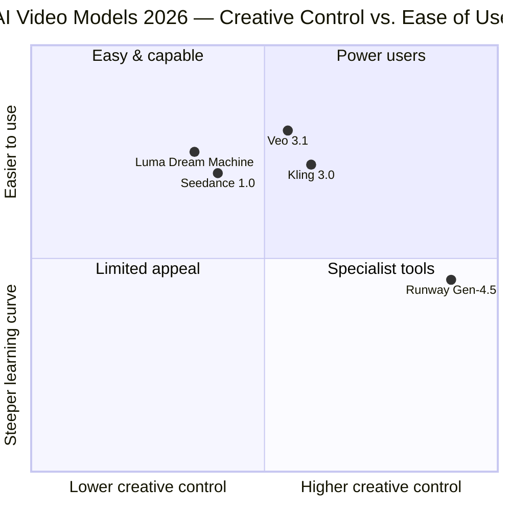

## The Moment That Changed Video Forever — and Then Didn't Last

On February 15, 2024, OpenAI dropped a demo that made the internet stop scrolling. It showed two people walking through snow-dusted Tokyo streets, a woolly mammoth moving through a blizzard, and origami sea creatures drifting in water. None of it was real. All of it looked real. The model was called Sora.

Reactions ranged from "this changes filmmaking forever" to "this is the end of stock footage." Sora was compared to a "GPT-1 moment" for video — the first time a model seemed to understand that objects have weight, that light bends, that a camera can track through a scene. It was doing things that, just months before, had seemed years away.

Sixteen months later, on April 26, 2026, OpenAI shut it down.

Understanding why — and what's thriving in its place — tells you something important about the economics, technology, and competitive dynamics of AI video generation in 2026.

---

## From Demo to Product: The Gap That Proved Fatal

Sora launched publicly on December 9, 2024 — roughly ten months after its preview — as a standalone product for ChatGPT Plus and Pro subscribers. It generated up to 20 seconds of 1080p video from text prompts, and it could remix or extend existing clips.

By any reasonable standard, the technology worked. Users created short films, music video concepts, product demos, and architectural walkthroughs. Directors experimented with it for pre-visualization. There was genuine excitement.

The problem was not the technology. It was the math.

Generating video requires roughly two orders of magnitude more compute than generating a comparably impressive piece of text. Where a powerful language model might process a query for a few cents in compute cost, a high-quality video generation request can cost dollars per clip — before any margin is added. Sora reportedly burned through an estimated **$15 million per day in inference costs** at its peak. Against that, its lifetime revenue was estimated at around **$2.1 million total**.

That is not a business. That is a demonstration project that ran out of institutional patience.

*Estimated figures based on reported cost analyses. Revenue line reflects subscription revenue attributed to Sora, not total OpenAI revenue.*

Declining engagement compounded the cost problem. By early 2026, monthly active users had fallen from a launch-day peak of roughly 1 million to under 500,000. The initial wave of curious users had experimented, shared their outputs, and then stopped returning regularly. Most found that the tool worked best for occasional creative exploration — not the kind of daily-driver use that sustains a subscription product.

At the same time, a deal that might have changed the calculus fell apart. Disney had reportedly explored a **$1 billion investment and character licensing arrangement** with OpenAI in late 2025 — one that would have created a genuine enterprise use case for Sora in content production. The deal was never formally signed. Disney was reportedly informed of Sora's shutdown less than an hour before the public announcement.

---

## How Video Generation Actually Works

To understand why video is so expensive to generate — and why some competitors are doing it more efficiently — it helps to understand the underlying technology.

Text-to-video models like Sora are built on a **Diffusion Transformer (DiT)** architecture. Think of it in two steps:

1. **Noise to signal.** The model starts with pure random noise — static — and progressively removes that noise over dozens of iterative steps, guided by a text prompt, until coherent pixels emerge.

2. **Time as a third dimension.** Unlike image generation, video models must be consistent not just across pixels but across *frames*. Sora's key insight was to treat video as a 3D object: slice it into small "spacetime cubes" across both spatial dimensions and time, then have the transformer attend across all of them simultaneously.

This temporal attention is what produces the physics intuition that made Sora's demos so striking — objects that move plausibly, scenes that track coherently. It's also what makes generation so compute-intensive: the attention matrix for even a 10-second clip runs into the hundreds of millions of parameters worth of computation per frame.

The models competing in 2026 have not escaped this fundamental architecture. But they've gotten dramatically more efficient at it — and they've made different bets about what features matter to paying users.

---

## Three Survivors, Three Different Bets

### Google Veo 3.1: The All-Rounder

Google's Veo 3.1, released in January 2026, made one bet that turned out to be right: **audio is not optional**.

Every earlier video generation system — Sora included — produced silent video. Users who wanted audio had to add it in post-production. Veo 3.1 generates synchronized 48kHz audio in a single pass alongside the video: ambient sound, musical underscore, dialogue. For a product demo or a short film segment, that means you generate a finished asset, not a rough visual that still requires a sound edit.

Add native 4K resolution at up to 60fps, native 9:16 vertical format for mobile, and a "Scene Extension" mode that chains segments into sequences exceeding 60 seconds, and Veo 3.1 became the benchmark for breadth. According to Pixflow's May 2026 evaluation, it followed complex prompts correctly 87% of the time — the highest prompt-adherence score across tested models.

It's available bundled into Google AI Pro at $7.99/month, which is pricing that reflects infrastructure advantages no other player can fully match.

### Kling 3.0: The Creator's Model

Kling 3.0 from Kuaishou (launched February 4, 2026) went deep on the problem that frustrates creators most: **consistency across shots**.

Single-clip AI video is useful for mood boards. But professional video tells stories across multiple cuts — and keeping a character's face, clothing, and voice consistent from shot to shot is technically hard. Kling 3.0's multi-shot storyboard mode lets a single generation contain up to six camera cuts, with spatial continuity maintained throughout: same character, same location, coherent motion across the sequence.

Its multilingual lip-sync supports five languages with accent control — American, British, and Indian English; Cantonese, Mandarin variants, and Sichuanese Chinese; Japanese, Korean, and Spanish — and coordinates the audio across the full multi-shot timeline.

Pricing starts at $6.99/month, making it the most accessible option for individual creators.

### Runway Gen-4.5: The Professional's Tool

Runway Gen-4.5 (released late 2025) occupies the high end: **granular creative control** for users who know what they want and need to get there precisely.

Motion path control lets you draw the exact trajectory a camera or object follows. Reference-driven character consistency lets you pin a face or design across multiple generations. The model currently holds the highest Elo score on the Artificial Analysis Text-to-Video Benchmark — **1,247 points**, ahead of Google Veo 3 (1,226) and Sora 2 Pro (1,206, now retired) in blind head-to-head evaluations.

Runway pitches explicitly to post-production professionals, with pricing from $12 to $95/month for the full editing toolchain. It's not the cheapest route, but it's the one that gives experienced video editors the most control.

---

## What the Sora Shutdown Actually Means

The easy read is that Sora failed. The more accurate read is that **AI video generation matured faster than the business model did**.

The technology worked. OpenAI's diffusion transformer architecture was genuinely novel and genuinely capable. But the costs of running it at scale, in 2024–2026 hardware and software conditions, made it impossible to price the product in a way that both attracted mainstream users and generated margin. Text generation has the opposite problem: it's now so cheap that monetizing it requires volume. Video generation has been too expensive — the cost floor too high, the use cases too niche, the engagement too episodic.

The companies that are succeeding in the space have generally done one of three things:

1. **Vertical integration**: Google can afford Veo 3.1 partly because the infrastructure running it is the same infrastructure running every other Google AI product. Marginal cost of a video generation is different when the hardware was already deployed.

2. **Focused use cases**: Kling 3.0's multi-shot storyboard mode is not general-purpose. It's built for a specific kind of creator. Runway's toolchain is built for a specific kind of professional. Narrow, sticky use cases justify subscription revenue in a way that "generate cool clips occasionally" does not.

3. **Efficiency-first architecture**: The hardware and model efficiency story has continued to improve. Models generating 4K video in 2026 do it with significantly less compute than the models generating 1080p video in 2024. The cost curve is moving, just not fast enough for Sora.

---

## The Broader Lesson

Sora's arc from demo to discontinuation in roughly 26 months is a compressed version of a pattern playing out across generative AI: the impressive demo is not the hard part. The hard part is finding the unit economics and the recurring use case that sustain a product.

For AI video specifically, the technology has clearly crossed a quality threshold where outputs are genuinely useful. The question — still being worked out by Veo 3.1, Kling 3.0, Runway, and others — is where in the production workflow it fits, and who pays how much for it.

OpenAI is not done with video. The Sora API runs until September 2026, and the company's developer platform has deeper pockets and more leverage than a standalone consumer product. But the Sora chapter is closed. What replaces it will look less like a skunkworks experiment and more like a line item in an enterprise customer's production budget.

The future of AI video is not a single product that does everything. It's a set of specialized tools — audio-native generation, multi-shot consistency, precision creative control — that slot into workflows that already exist and make them faster.

That's a less cinematic story than "AI replaces Hollywood." It's also the story that actually happened.

---

## Sources

- [OpenAI Sora Discontinuation: What the End of a Platform Means for Enterprise AI Strategy — Futurum Group](https://futurumgroup.com/insights/openai-sora-discontinuation-what-the-end-of-a-platform-means-for-enterprise-ai-strategy/)
- [Why OpenAI Killed Sora: The $15 Million Per Day Disaster — Miraflow](https://miraflow.ai/blog/why-openai-shut-down-sora-2026)
- [Sora Shutdown: Why Disney Killed Its $150M AI Deal — Tech Insider](https://tech-insider.org/openai-sora-shutdown-disney-deal-ai-video-2026/)
- [Sora shutdown reveals costly limits of AI video generation and creative use — TechXplore](https://techxplore.com/news/2026-04-sora-shutdown-reveals-limits-ai.html)
- [Sora's downfall signals broader problems with AI's creative utility — The Conversation](https://theconversation.com/soras-downfall-signals-broader-problems-with-ais-creative-utility-280013)
- [OpenAI Sora Shutdown: $15M/Day Costs, $2.1M Revenue — The Full Story — Medium / GenAI](https://medium.com/@shubhamnv2/openai-sora-shutdown-15m-day-costs-2-1m-revenue-the-full-story-088380118243)
- [Introducing Runway Gen-4.5 — Runway Research](https://runwayml.com/research/introducing-runway-gen-4.5)
- [Runway Gen-4.5 Sets New Benchmark for AI Video Quality — Times of AI](https://www.timesofai.com/news/runway-unveils-gen-4-5-its-most-powerful-ai-video-model-yet/)
- [Runway's Gen-4.5 edges past Google and OpenAI in text-to-video benchmark — The Decoder](https://the-decoder.com/runways-gen-4-5-edges-past-google-and-openai-in-text-to-video-benchmark/)
- [Kling AI Launches 3.0 Model — Kuaishou Technology (Investor Relations)](https://ir.kuaishou.com/news-releases/news-release-details/kling-ai-launches-30-model-ushering-era-where-everyone-can-be/)
- [Veo 3.1 Lite and a new Veo upscaling capability on Vertex AI — Google Cloud Blog](https://cloud.google.com/blog/products/ai-machine-learning/veo-3-1-lite-and-a-new-veo-upscaling-capability-on-vertex-ai)
- [Google Launches Veo 3.1: 4K Video and Native Dialogue Redefine the Creator Economy — FinancialContent](https://www.financialcontent.com/article/tokenring-2026-2-5-google-launches-veo-31-4k-video-and-native-dialogue-redefine-the-creator-economy)
- [Video diffusion generation: comprehensive review and open problems — Springer / Artificial Intelligence Review](https://link.springer.com/article/10.1007/s10462-025-11331-6)
- [How do AI models generate videos? — MIT Technology Review](https://www.technologyreview.com/2025/09/12/1123562/how-do-ai-models-generate-videos/)
- [AI Video Generation 2026: Sora 2 vs Veo 3.1 vs Kling 3.0 Compared — Lushbinary](https://lushbinary.com/blog/ai-video-generation-sora-veo-kling-seedance-comparison/)
