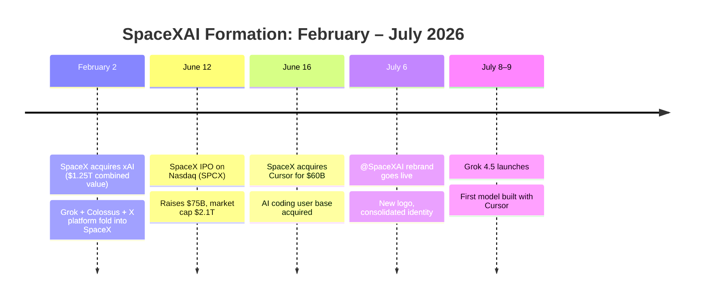
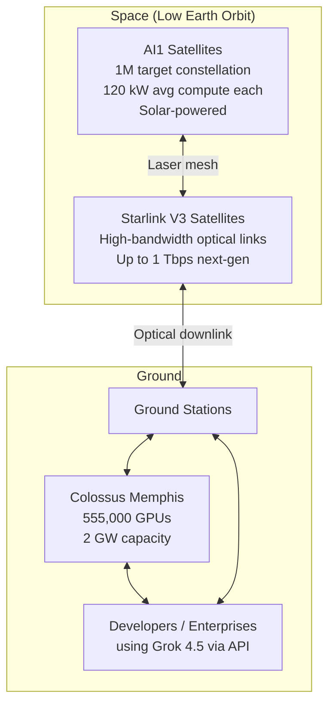

## A New Logo Arrives

On July 6, 2026, the @SpaceXAI handle went live on X. A new logo — part rocket fin, part neural network node — quietly replaced the old xAI wordmark. For most people, it looked like a routine rebrand. What it actually marked was the completion of a five-month corporate transformation that created one of the strangest and most vertically integrated companies in the history of technology.

To understand what SpaceXAI is and why it matters for AI, you need to go back to February.

---

## The Merger: February 2, 2026

On Super Bowl Sunday 2026, SpaceX announced it had acquired xAI — Elon Musk's AI company — in an all-stock deal. The combined entity was valued at **$1.25 trillion**: $1 trillion for SpaceX and $250 billion for xAI. CNBC called it the largest private corporate merger in history.

The deal structure was simple: each xAI shareholder received **0.1433 shares of SpaceX** for every xAI share they held. xAI ceased to exist as an independent company. Its assets — the Grok large language model, the Colossus supercomputer in Memphis, and a controlling stake in the X social media platform — all transferred to SpaceX.

Tesla was notably absent. Earlier reports had floated a three-way combination of SpaceX, xAI, and Tesla, but merging a public company into a then-private entity raised governance complications that killed the idea. Tesla did have approximately $2 billion previously invested in xAI, and that position converted into an indirect stake in the merged company — giving Tesla shareholders a small slice of SpaceX without requiring a formal merger.

The strategic rationale Musk gave publicly was direct: **orbital data centers**. He had been describing the concept for months — a constellation of solar-powered compute satellites in low Earth orbit that would run AI workloads with essentially unlimited clean energy. Building it required the AI company, the rocket company, and the satellite infrastructure to share the same balance sheet. Hence the merger.

---

## What xAI Brought to the Table

At the time of the merger, xAI was burning cash at a rate that concerned investors. It had raised a $6 billion Series C in 2024 and a subsequent $10 billion round in 2025, yet Grok had not closed the gap on GPT-4o or Claude 3.5 in public perception. The Colossus supercomputer, however, was genuinely impressive infrastructure.

**Colossus** is a former Electrolux appliance factory on 217 acres in South Memphis, Tennessee, converted into what became the world's largest single-site AI training installation. By early 2026 it contained **555,000 NVIDIA GPUs**, running at 2 gigawatts of total capacity — a level of concentrated compute that had no precedent. SpaceX had purchased the facility and expanded it aggressively, spending approximately $18 billion on GPU procurement across three building acquisitions.

For context: training frontier models at scale requires the kind of sustained, dense compute that Colossus represents. Owning that infrastructure outright, rather than renting it from cloud providers, is a meaningful structural advantage in AI development. It also generated recurring revenue: even Anthropic signed a deal to use Colossus 1 compute, paying SpaceX to train on its own rival's hardware.

---

## The IPO and the Cursor Acquisition

With xAI folded in and the orbital data center plan announced to investors, SpaceX filed for its long-anticipated IPO.

On **June 12, 2026**, SpaceX listed on the Nasdaq under the ticker **SPCX**. The company priced shares at $135, opened at $150, and closed Day 1 at $160.95 — a 19% gain. SpaceX raised **$75 billion** in what became the largest IPO on record. Market cap on that first trading day: roughly **$2.1 trillion**, briefly making it the sixth most valuable U.S.-listed company.

Four days later, on June 16, SpaceX announced it would acquire **Cursor** — the AI coding assistant built by startup Anysphere — for **$60 billion in stock**. Cursor had crossed $1 billion in annualized revenue and had built an unusually loyal developer following. The deal was expected to close in Q3 2026.

The strategic logic: Grok had not made a dent in the AI coding market. GitHub Copilot, Cursor itself, and Claude in VS Code had the developer mindshare. Acquiring Cursor gave SpaceXAI both the user base and the product sophistication to compete directly.

The sequence — IPO then immediately deploy IPO proceeds for a $60B acquisition — showed that the public offering was not just about liquidity. It was about giving SpaceX the currency to move fast at scale.

---

## The Rebrand: From xAI to SpaceXAI

The @SpaceXAI brand activation on July 6, 2026, completed the visual consolidation. The new entity is no longer "SpaceX with an AI division" — it is SpaceXAI: a company whose core thesis is that the infrastructure for AI (compute, energy, bandwidth) and the infrastructure for space (rockets, satellites, orbital operations) belong together.

---

## Grok 4.5: The First Product of the New Era

On July 8, 2026, SpaceXAI released **Grok 4.5** — the first model built in collaboration with the Cursor team. It is designed primarily for three professional domains: **software engineering, legal analysis, and financial research**.

The pricing is deliberately aggressive: **$2 per million input tokens and $6 per million output tokens**. A premium faster variant costs $4 input / $18 output. Compare that to Anthropic's Claude Opus 4.8 at $5/$25 — Grok 4.5 is roughly 3–4× cheaper at the base tier.

Elon Musk positioned it as "Opus-class, but faster and more token-efficient." Independent assessments placed Grok 4.5 closer to Opus 4.7 than 4.8 on general reasoning benchmarks, though its performance on large-codebase tasks — where the Cursor integration shows — came in notably stronger.

Grok 4.5 is available in:
- The Grok Build API
- Cursor, across all subscription tiers
- The SpaceXAI developer console

European availability is delayed due to regulatory review, expected around mid-July 2026.

---

## The Orbital Data Center Bet

The longest-arc part of the SpaceXAI thesis is the one that sounds most like science fiction: **AI compute satellites in low Earth orbit**.

In January 2026, SpaceX filed with the FCC to operate a constellation of up to **one million solar-powered satellite data centers**. The filing projected that the buildout would ultimately generate **100 gigawatts of AI compute capacity from space**.

The first generation satellite — called **AI1** — was revealed in a video posted to X in June 2026. Specs:

| Specification | Value |
|---|---|
| Wingspan (deployed) | 70 meters (wider than a Boeing 747) |
| Height (deployed) | 20 meters |
| Average compute | 120 kW |
| Peak compute | 150 kW |
| Bus technology | Starlink V3 (reused) |
| Connectivity | Inter-satellite optical links + Starlink laser mesh |

Prototype AI1 units are targeting launch in **early 2027**, with a goal of 1 GW of orbital AI compute by late 2027. Longer-term targets — 10 GW, then 100 GW — have no committed timelines attached to them.

The physics argument for space-based compute is real: satellites in low Earth orbit receive unfiltered solar energy roughly 1.4 kW per square meter, with no day/night cycle if you orbit correctly, no cooling overhead from ambient air, and no terrestrial grid constraints. The counter-argument is equally real: latency across the link, the cost per kilogram to orbit, and radiation hardening requirements all make this far more expensive than a ground data center — at least for now.

Astronomers have already raised concerns. SpaceNews reported that orbital data centers would add significant sources of radio and optical interference to the sky — a complaint that mirrors long-running objections to Starlink's impact on astronomical observation. Whether regulators treat AI satellites differently than communications satellites remains an open question.

---

## What This Means for the AI Industry

SpaceXAI represents a genuinely new kind of AI competitor, different from OpenAI, Anthropic, Google DeepMind, or Meta AI in a structural way. Those companies rent compute. SpaceXAI is building its own.

The competitive implications fall into three areas:

**Cost structure.** Owning Colossus and eventually orbital compute means SpaceXAI's marginal cost of training and serving models could diverge substantially from competitors who pay cloud GPU rates. Grok 4.5's pricing at $2/$6 per million tokens is a preview of where this leads — if you own the compute, you can price aggressively without burning margin on rented infrastructure.

**Data flywheel.** xAI's merger included the X platform, which gives SpaceXAI access to real-time human conversation at a scale that no other AI lab has. Whether Grok is trained on X data in ways that violate user expectations has been a recurring controversy, but from a capability-building perspective, the data advantage is real.

**Vertical integration as a moat.** Amazon built AWS and then made it the backbone of modern software. SpaceXAI's bet is that whoever owns the compute layer for AI — whether on the ground or in orbit — captures the same kind of structural advantage. Whether that's true depends on how much AI compute costs matter as models commoditize and inference efficiency improves.

The merger also closed off a particular kind of risk for SpaceXAI: the risk of being a dependent. When your AI models run on compute you own, launched by rockets you build, connected by satellites you operate, no single vendor relationship can become existential. That kind of independence is unusual in the AI industry, and at $2.1 trillion in market cap, investors have made clear they think it's worth something.

---

## The Immediate Open Questions

Several things remain genuinely unclear about the SpaceXAI trajectory:

- **Cursor close date**: The $60B acquisition is expected Q3 2026, but antitrust review could extend the timeline. A coding assistant with $1B ARR and a dominant developer position will get scrutiny.
- **European regulatory status**: Grok 4.5 is not yet available in the EU. SpaceXAI has a pattern of EU regulatory friction going back to xAI's launch.
- **Tesla's position**: The SpaceX-Tesla merger discussion did not die with the February deal. Musk has been asked about it repeatedly. Tesla shareholders still want clarity on whether their investment in xAI (now SpaceXAI) creates a path to a future combination.
- **Orbital data center feasibility**: The AI1 program is real — FCC filings, a disclosed satellite design, and a 2027 launch window — but going from 1 prototype to 1 million satellites is a distance that has never been closed by any program in history.

For now, what's certain is that the AI competitive landscape now includes a company that builds rockets, runs the world's largest single-site GPU cluster, owns one of the world's largest social networks, is absorbing a leading AI coding tool, and is planning to put compute into space. That's a new kind of actor, and the industry will be adjusting to it for years.

---

## Sources

- [Musk's xAI, SpaceX combo is the biggest merger of all time, valued at $1.25 trillion — CNBC](https://www.cnbc.com/2026/02/03/musk-xai-spacex-biggest-merger-ever.html)
- [SpaceX IPO takeaways: SPCX closes at $161, jumping 19% after record debut — CNBC](https://www.cnbc.com/2026/06/12/spacex-ipo-spcx-live-updates.html)
- [SpaceX raising $75 billion in record-setting IPO as Nasdaq debut awaits — CNBC](https://www.cnbc.com/2026/06/11/spacex-raises-75-billion-in-record-setting-ipo-ahead-of-nasdaq-debut.html)
- [SpaceX to acquire Cursor for $60B in stock, days after blockbuster IPO — TechCrunch](https://techcrunch.com/2026/06/16/spacex-to-acquire-cursor-for-60b-in-stock-days-after-blockbuster-ipo/)
- [SpaceXAI Rebrand Signals the End of xAI as Elon Musk Reshapes His AI Company — iTechPost](https://www.itechpost.com/articles/236594/20260707/spacexai-rebrand-signals-end-xai-elon-musk-reshapes-his-ai-company.htm)
- [SpaceXAI, Cursor Launch Grok 4.5 AI Model for Finance, Legal Applications — Bloomberg](https://www.bloomberg.com/news/articles/2026-07-08/spacexai-cursor-unveil-grok-ai-model-for-legal-finance-tasks)
- [SpaceX files for million satellite orbital AI data center megaconstellation — Data Center Dynamics](https://www.datacenterdynamics.com/en/news/spacex-files-for-million-satellite-orbital-ai-data-center-megaconstellation/)
- [SpaceX IPO: Musk's firm set to launch first orbital data center AI1 satellites in 2027 — Data Center Dynamics](https://www.datacenterdynamics.com/en/news/spacex-ipo-musks-firm-set-to-launch-first-orbital-data-center-ai1-satellites-in-2027-will-put-compute-on-starlink-craft/)
- [xAI Colossus Hits 2 GW: 555,000 GPUs, $18B, Largest AI Site — Introl Blog](https://introl.com/blog/xai-colossus-2-gigawatt-expansion-555k-gpus-january-2026)
- [Elon Musk's first-gen orbital data center craft spans wider than a Boeing 747 — Tom's Hardware](https://www.tomshardware.com/tech-industry/spacex-details-its-ai1-compute-satellite)
- [SpaceXAI launches Grok 4.5, its first model built with Cursor — The Next Web](https://thenextweb.com/news/spacexai-grok-4-5-cursor-opus-class-coding-model)
- [Astronomers fear orbital data centers will interfere with observations — SpaceNews](https://spacenews.com/astronomers-fear-orbital-data-centers-will-interfere-with-observations/)
