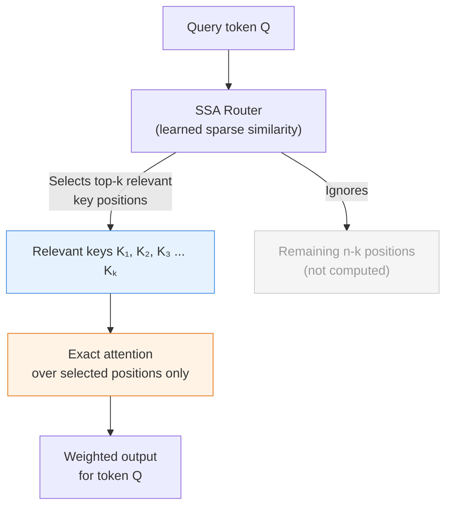
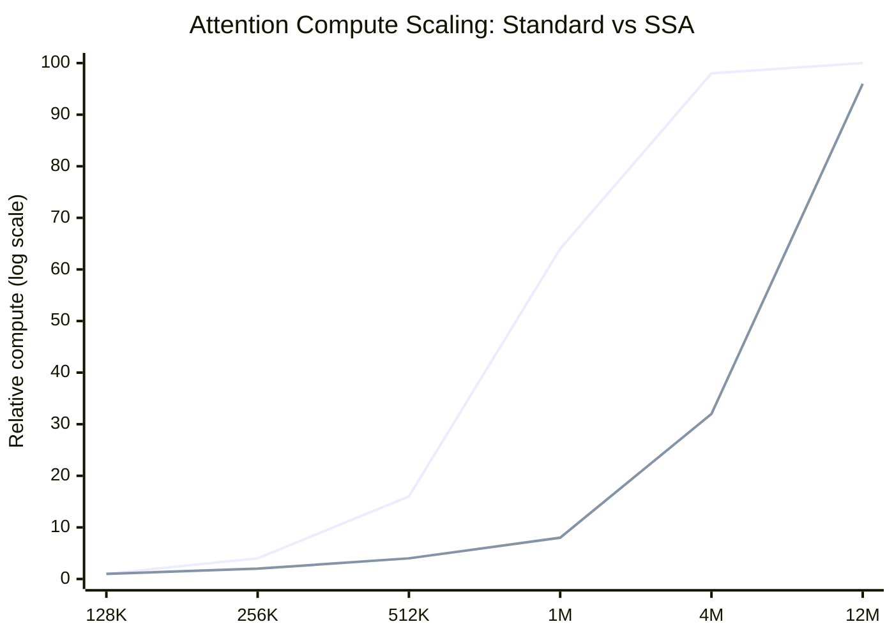

## The Tax Every AI Model Pays

Every time you send a long prompt to a modern LLM, there is a cost buried inside that you never see on the invoice: the *quadratic attention tax*.

Standard transformer models — the architecture underlying GPT, Claude, Gemini, and virtually every other frontier AI system — use a mechanism called self-attention to let every token in a sequence communicate with every other token. That power is what makes these models so capable. But it comes with a brutal scaling law: **the compute required grows as the square of the sequence length**.

Double your context window, and attention compute quadruples. Go from 128K tokens to 1 million, and attention compute grows by more than fifty times. At 12 million tokens, a single attention pass would require *trillions* of operations that are simply unreachable on available hardware.

This is not a hardware problem. It is a math problem, baked into the core of every transformer ever trained.

On May 5, 2026, a company called Subquadratic claimed to have solved it.

---

## What Is SubQ?

SubQ is the flagship model from Subquadratic, a Miami-based AI startup founded by **Justin Dangel** (CEO) and **Alex Whedon** (CTO, formerly Head of Generative AI at Meta). The company launched out of stealth with a **$29 million seed round**, backed by Justin Mateen (Tinder co-founder), Javier Villamizar (ex-SoftBank Vision Fund), and early investors from Anthropic, OpenAI, Stripe, and Brex.

SubQ 1M-Preview is the production API model, with a **1 million token context window** — roughly equivalent to ten novels, or a large software codebase. A research configuration pushes that to **12 million tokens**, a scale that has no precedent among publicly available commercial models.

The architecture behind both configurations is called **Subquadratic Sparse Attention (SSA)** — a mechanism that the company claims scales linearly with context length, not quadratically.

---

## Why the Quadratic Wall Matters

To appreciate why SSA is architecturally significant, it helps to understand why every prior solution has been a workaround rather than a fix.

The fundamental operation in transformer attention is: for every token in the sequence, compute how much it should attend to every other token. If you have *n* tokens, that is *n × n* comparisons. At *n = 128,000* (the context window of most 2025 frontier models), that is already 16 billion comparisons per attention layer.

**FlashAttention** — the dominant optimization used by virtually every production model — makes this tractable by reorganizing how the computation is loaded between GPU memory tiers. It dramatically reduces memory bandwidth requirements. But it does not change the *algorithmic* complexity. The compute is still O(n²); it just runs faster in practice.

Prior attempts to escape the quadratic constraint entirely include:

- **Sliding-window attention** (Longformer, BigBird): each token only attends to its nearest neighbors. Fast, but loses global context.
- **Linear attention** (Performer, Cosformer): approximates the attention matrix with kernels. Fast, but sacrifices accuracy.
- **Recurrent architectures** (Mamba, RWKV, Hyena): replace attention with state-space models or linear recurrences. Scale linearly, but have consistently underperformed transformer attention at frontier scale on reasoning and retrieval benchmarks.

The pattern is consistent: architectures that escape O(n²) have traded quality for cost. None of them displaced the transformer at scale.

SubQ's claim is that SSA breaks that tradeoff.

---

## How SSA Works: Selecting What Actually Matters

The core insight behind Subquadratic Sparse Attention is that **most token pairs don't matter**. In a million-token document, a given sentence in the middle rarely needs to attend to a random sentence 800,000 tokens away. Dense attention computes that relationship anyway, paying full cost for information that contributes nothing.

SSA takes a different approach: **content-dependent token selection**.

For each query token, SSA:
1. Computes a **sparse similarity score** against keys in the sequence, using a lightweight learned function.
2. Selects the **top-k most relevant positions** — those that actually carry signal for this query — based on meaning, not position.
3. Computes **exact, full-precision attention** only over that small subset.

The critical detail is that the selection is *content-dependent*, not positional. A fixed sliding window always looks at the nearest 512 tokens, whether those tokens are relevant or not. SSA looks wherever the current query's meaning directs it — dynamically, per token, per layer.

The result: attention compute that scales **linearly**, O(n), instead of O(n²).

At 12 million tokens, Subquadratic claims this reduces attention compute by approximately **1,000×** compared to standard FlashAttention. At 1 million tokens — the production context window — SubQ runs roughly **52× faster** than FlashAttention in attention compute alone.

---

## What the Benchmarks Show

Subquadratic published three benchmarks at launch.

| Benchmark | SubQ 1M-Preview | Comparison |
|-----------|----------------|------------|
| RULER 128K (needle-in-haystack) | **95.0%** | Claude Opus 4.6: 94.8% |
| MRCR v2 at 1M tokens | **65.9%** | GPT-5.5: 74.0% |
| SWE-Bench Verified (coding) | **81.8%** | Claude Opus 4.6: 80.8% |

On needle-in-a-haystack retrieval at 128K tokens, SubQ is essentially at parity with the best frontier models. On SWE-Bench coding, it outperforms Claude Opus 4.6. On the hardest long-context retrieval test — MRCR v2 at 1 million tokens — it trails GPT-5.5 by about 8 points, but holds a score that would have been considered impressive a year ago.

At 12 million tokens, SubQ's internal needle-in-a-haystack score is **92.1%** — a data point that has no comparison since no other commercial model has a 12M context window.

On cost, SubQ prices its API at approximately **one-fifth** the per-token cost of Claude Opus or GPT-5.5. For long-context workloads specifically, the RULER benchmark shows SubQ achieving 95.0% accuracy at **$8 of compute**, against roughly **$2,600** for Claude Opus to reach 94.8% on the same benchmark — a ~300× cost reduction for comparable retrieval quality.

---

## The Skepticism Is Warranted

The AI research community has received SubQ's launch with a mix of interest and skepticism. Several concerns have been raised.

**Narrow benchmark selection.** The three published benchmarks — RULER, MRCR, and SWE-Bench — are precisely the tasks SubQ is optimized for: long-context retrieval and software engineering. There is no published data on general reasoning, mathematics, multilingual performance, or short-input quality.

**The research-to-production gap.** SubQ's internal research score on MRCR v2 is 83%, but the third-party-verified production API scores 65.9% — a 17-point drop that the company has not fully explained. This suggests significant performance degradation when the model is deployed outside optimal conditions.

**No independent reproduction.** Each benchmark model was run only once, due to high inference costs. No external research team has independently reproduced SubQ's numbers.

**Weights are closed.** Unlike Gemma 4 or Llama 4, SubQ's weights are not released. The full technical report is listed as "coming soon."

**Historical precedent.** Every prior subquadratic architecture — Mamba, RWKV, Hyena, DeepSeek Sparse Attention — has consistently underperformed dense transformers at frontier scale, particularly on reasoning tasks. SubQ has not yet published evidence on the tasks where prior alternatives failed.

None of this proves SubQ's claims are false. It means the extraordinary claim — that SSA achieves frontier-quality reasoning at linear cost — requires extraordinary evidence that has not yet arrived.

---

## Why It Matters Even Before That Evidence Arrives

Whether or not SubQ's full technical claims survive independent scrutiny, the launch matters for several reasons.

**The problem is real.** The quadratic cost of attention is a genuine limiting factor in AI development. Today, running a 1-million-token context window through a frontier model for a single request costs tens of dollars. Legal firms, pharmaceutical companies, and software teams dealing with codebases that span millions of lines genuinely cannot afford this at scale. Any credible linear-scaling architecture is worth serious investigation.

**The approach is principled.** Content-dependent sparse attention is not a new idea — BigBird and Longformer used learned sparsity patterns — but SSA's claim of doing it *at frontier scale* without quality regression, if true, would represent a meaningful advance. The community has been trying to crack this problem for years.

**The race is now public.** Google, Anthropic, and OpenAI are all working on efficiency improvements, but their roadmaps are opaque. A startup publicly staking its existence on a linear-scaling claim puts competitive pressure on the entire field to either validate or refute the approach.

The honest read is that SubQ has done something unusual: it has built a frontier-competitive model (by the narrow evidence available), achieved linear attention scaling in a production system, and priced it aggressively enough to be commercially interesting — all while being transparent that its full case for the technology rests on a technical report that hasn't shipped yet.

That combination of genuine potential and genuine uncertainty is, frankly, a reasonable description of where AI architecture research has always lived.

The next few months — the independent benchmarks, the technical paper, the community reproductions — will determine whether SubQ is a breakthrough or a well-marketed bet. Either outcome will tell us something important about where the quadratic wall actually stands.

---

## Sources

- [Introducing SubQ: The First Fully Subquadratic LLM — Subquadratic](https://subq.ai/introducing-subq)
- [How SSA Makes Long Context Practical — Subquadratic](https://subq.ai/how-ssa-makes-long-context-practical)
- [Subquadratic launches with $29M to bring 12M-token context windows to AI — SiliconAngle](https://siliconangle.com/2026/05/05/subquadratic-launches-29m-bring-12m-token-context-windows-ai/)
- [Miami startup Subquadratic claims 1,000x AI efficiency gain; researchers demand independent proof — VentureBeat](https://venturebeat.com/technology/miami-startup-subquadratic-claims-1-000x-ai-efficiency-gain-with-subq-model-researchers-demand-independent-proof)
- [SubQ AI Explained: How Good Is the 12M Context Window LLM? — DataCamp](https://www.datacamp.com/blog/subq-ai-explained)
- [SubQ Explained: The First 12M-Token Subquadratic LLM — CoderSera](https://codersera.com/blog/subq-12m-token-subquadratic-llm-2026/)
- [SubQ: The 12 Million Token Context LLM — Zen van Riel](https://zenvanriel.com/ai-engineer-blog/subq-subquadratic-llm-12-million-token-context-guide/)
- [Subquadratic Raises $29M to Launch SubQ — AlphaMatch](https://www.alphamatch.ai/blog/subquadratic-subq-29m-12m-token-context-2026)
