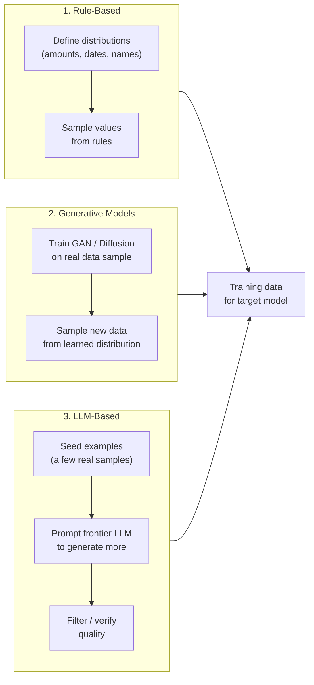
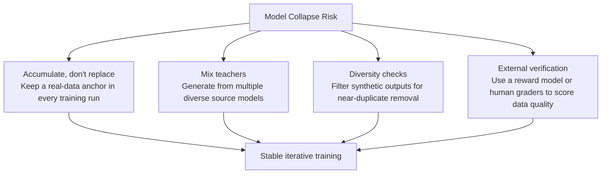

## The Wall No One Talks About Enough

Ask an AI researcher what the biggest constraint on model quality is in 2026 and you might expect them to say compute, or architecture choices, or alignment. Increasingly, the answer is **data**.

The machine learning field has spent a decade treating the open internet as an essentially infinite training set. Web crawls, public books, academic papers, GitHub repositories — all of it got fed into models at ever larger scales. Scaling laws said more data plus more compute equals a better model, and for a long time that held true.

The problem is that the best, most densely informative human-generated text on the internet has effectively been consumed. Researchers estimate the usable high-quality web corpus saturated somewhere around 2024–2025. You can scrape more, but the marginal quality of each additional token decreases. The easy fuel has been burned.

Three forces are accelerating the crisis simultaneously:

- **The data wall.** The supply of novel, high-signal human-generated text is finite and increasingly depleted. Models trained on the same documents as their predecessors don't learn much that's new.
- **Copyright and legal pressure.** Ongoing litigation from authors, publishers, and news organizations has made training on web-scraped text legally risky in several jurisdictions. What was a grey area in 2022 is active litigation in 2026.
- **Privacy regulation.** The most valuable domain-specific data — patient records, financial transactions, legal documents — sits locked behind HIPAA, GDPR, CCPA, and a growing patchwork of state laws. You cannot train on it directly.

The field's answer to all three problems is the same: **generate the training data yourself**.

---

## ICML 2026 Made It Official

The International Conference on Machine Learning ran July 6–11, 2026, at the COEX Convention Center in Seoul — and the numbers alone signal how fast the field is growing. This year's conference received **24,371 valid paper submissions**, up from 12,107 in 2025. That's a doubling in a single year.

Among those submissions, one theme dominated the hallways, workshops, and poster sessions more than any other: **synthetic data generation (SDG)**. Researchers described it as an "explosive spike" of interest — papers exploring how models can be trained on data generated by other models, how to maintain diversity across multiple generations of synthetic data, and how to verify that the synthetic data is actually teaching what the researcher intends.

The conference's outstanding paper awards also told a story. Both top prizes went to research on **diffusion models** — a class of generative model that has found new relevance not just in image and video generation but in text and reasoning. The winning papers were:

- *The Flexibility Trap: Rethinking the Value of Arbitrary Order in Diffusion Language Models* (Tsinghua University)
- *High-Precision Sampling for Diffusion Models and Log-Concave Distributions* (MIT and Yale)

Diffusion models are themselves a major tool in the synthetic data toolkit, and their sweep of the awards reinforced that generative modeling for data — not just for end users — is now a first-class research problem.

NVIDIA's contribution underscored the industrial scale of the shift. **145 papers at ICML 2026 cited NVIDIA Nemotron** — a family of open models, open datasets, and training recipes — as the foundation for new research. Nemotron-CC-v2.1, one of the datasets in the family, contains 2.5 trillion English tokens derived from Common Crawl. NVIDIA has released 10 trillion tokens of open training data in total, along with 15 curated datasets spanning instruction-following, reasoning, coding, and evaluation tasks.

---

## What Synthetic Data Actually Is

"Synthetic data" covers a spectrum of approaches. At the simplest end: a script that generates realistic-looking bank transactions by sampling from statistical distributions. At the most sophisticated end: a frontier language model writing entire textbooks, reasoning traces, or agentic task trajectories that no human ever authored. Three main techniques sit along this spectrum:

**Rule-based generation** is cheap and predictable. You specify the statistical shape of the data you want — transaction amounts drawn from a certain distribution, dates within a range, merchants from a fixed vocabulary — and a script produces as many rows as you need. It's brittle against edge cases and produces data that can feel hollow, but it scales instantly and requires no model.

**Generative models** (GANs, diffusion, tabular VAEs) learn the joint distribution of a real dataset and can then sample new points from it. Diffusion models dominate for images and structured continuous data in 2026; CTGAN and TabDDPM are common choices for tabular data. The limitation is that these models can only reproduce what they were trained to approximate — they don't extrapolate to genuinely novel concepts.

**LLM-based generation** is where the interesting 2026 research lives. You give a frontier model a handful of seed examples, a system prompt describing the desired task, and ask it to generate thousands more instances. Chain-of-Thought variants (CoT Self-Instruct) have the model reason through each generation step, producing more accurate and complex outputs than naïve prompting. Evol-Instruct iteratively rewrites simpler examples into harder ones, moving the difficulty distribution upward. The resulting data can cover scenarios that never appeared in any human-written corpus.

---

## The Model Collapse Problem

Train a model on synthetic data. Now train the *next* model on the output of the first. Repeat. What happens?

The answer, confirmed by multiple peer-reviewed studies, is **model collapse**: a degenerative spiral in which each generation of training concentrates the model's probability mass on more and more common outputs while rare but important outputs fade away. The tails of the distribution — unusual phrasings, minority dialects, uncommon but correct mathematical approaches — disappear first. Later generations forget they ever existed.

The intuition is simple. A generative model doesn't reproduce the true distribution; it approximates it. Errors in that approximation, when used as training data, teach the next model to treat the approximation as ground truth. Each generation amplifies the drift. After enough iterations, the model produces text that is grammatically perfect but peculiarly homogenous — endlessly competent, never surprising.

The 2026 research consensus on how to avoid this converges on four strategies:

The most important finding, from a widely cited 2024/2025 study, is the **accumulate vs. replace distinction**. If you discard real data and replace it entirely with synthetic data each training round, collapse is nearly inevitable across model families — VAEs, LLMs, Gaussian mixture models all show it. If instead you *add* synthetic data to a non-shrinking real-data anchor, the anchor preserves the true distribution and collapse becomes avoidable even across dozens of iterations.

The second mitigation is mixing generation sources. A collapse risk arises when the synthetic data reflects one model's blind spots. Using two or three different frontier models to generate data, or using one model at different temperatures and sampling configurations, introduces enough variance to prevent the feedback loop from tightening.

---

## Agentic Data Scientists: The Next Frontier

The most conceptually ambitious work at ICML 2026 went beyond "prompt a model to write examples." Researchers are now building **agentic pipelines** where AI systems act as data scientists: choosing what data to generate, varying its difficulty, running self-evaluation, and iteratively refining their own generation strategy.

The *Autodata* paper (arxiv 2606.25996, June 2026) is a representative example. Rather than having a human write a generation prompt, Autodata deploys an agent that reasons about what training data the target model most needs, generates candidates, evaluates them against rubrics, and proposes revisions — closing the loop without human involvement at each step.

A related thread is **self-improvement via synthetic curricula**. In this setup, a model identifies its own weakest domains — measured by low-confidence outputs or failed evaluations — and then generates additional training data targeted at precisely those gaps. Think of it as a student who writes their own practice problems in the areas where they keep failing exams.

The practical 2026 workflows that matter for fine-tuning teams span several flavors: Self-Instruct and Evol-Instruct for supervised fine-tuning, Constitutional AI for safety alignment data, DPO preference pairs generated by an LLM judge, function-calling traces for agent training, and distillation-based reasoning traces for smaller models that need to learn from a larger teacher.

---

## Beyond Research: Why This Matters for Real Applications

The shift to synthetic data is not only an academic research question. Three applied domains are being transformed:

**Domain-specific AI** — healthcare, legal, finance — has long struggled with the locked-data problem. A hospital can't share patient records with a model vendor. But it *can* use a privacy-preserving synthetic generator trained on those records to produce HIPAA-compliant synthetic patient data, then use that synthetic data to fine-tune a diagnostic model. The model learns the statistical structure of the real population without ever seeing real patients. Early results in radiology and clinical notes suggest that models fine-tuned on high-quality synthetic patient data can match models fine-tuned on real records when the real records are limited in number.

**Industrial AI** — robotics, manufacturing inspection, autonomous driving — has an even more acute data problem: rare failure modes and dangerous edge cases are exactly the scenarios you most need to train on, and exactly the scenarios that almost never appear in real-world logs. Synthetic simulation environments generate thousands of crash scenarios, equipment failures, and adversarial conditions that would take years to collect in the real world.

**Underrepresented languages and dialects** are a structural beneficiary. The web has a strong English (and secondarily Chinese, Spanish) bias. Generating synthetic data in low-resource languages — using a multilingual frontier model as the source — can give a fine-tuned model functional capability in a language for which essentially no training data otherwise exists.

The market agrees the shift is real. The global synthetic data market was valued at roughly **$0.77 billion in 2026** and is projected to grow to **$7.22 billion by 2033**, with industrial AI adoption and privacy regulation as the two main drivers. Gartner forecasts that synthetic data will make up around **75% of all data used in AI projects by 2026** — a figure that, if accurate, means the majority of model training is already running on data that didn't exist a year ago.

---

## The Open Questions

The explosive growth of synthetic data research at ICML 2026 is not a sign that the problem is solved. It's a sign that the problem is *recognized* and being worked on urgently.

The hard open questions are:

**Can fully synthetic pretraining work at frontier scale?** Almost every experiment demonstrating safe iterative synthetic training has been done with a real-data anchor. Whether a model can be taken from random initialization to frontier capability using only synthetic data — with no human-authored text in the loop — remains unproven and theoretically controversial.

**Quality vs. quantity.** The consensus is shifting from "generate as much data as possible" to "generate the right data." An ICML 2026 position paper titled *"How Much Can Language Models Remember?"* raised the question of whether scale can substitute for diversity. The early answer: no — ten million low-diversity synthetic samples teach less than one million high-diversity ones.

**Who controls the teacher?** If synthetic data is generated by frontier models, the capabilities of those frontier models set an effective ceiling on what the resulting fine-tuned model can learn. A student trained on a teacher's notes can approach but not exceed the teacher's own understanding. Breaking that ceiling requires either a genuinely novel data source or a method for models to discover knowledge not present in their teachers — a problem that connects directly to scientific discovery and reasoning research.

What ICML 2026 made clear is that the field has accepted the premise: synthetic data generation is not a workaround or a compromise — it is becoming the primary mode of AI training. The researchers who understand how to generate high-quality, diverse, collapse-resistant synthetic data will have an outsized influence on what the next generation of models can and cannot do.

---

## Sources

- [ICML 2026 Wraps in Seoul: Diffusion Models Dominate, Record 24,000+ Submissions Signal AI Research Surge — FAQ.com.tw](https://faq.com.tw/en/ai-ml/2026-07-10-icml-2026-seoul-diffusion-models-agentic-ai-en/)
- [How Open Models Are Driving AI Research — NVIDIA Blog](https://blogs.nvidia.com/blog/open-models-icml-2026/)
- [ICML 2026 Awards: Diffusion Models Win Top Honors, A3C Gets Test of Time — AI Front Page](https://aifront-page.com/icml-2026-awards-outstanding-papers/)
- [Announcing the ICML 2026 Awards — ICML Blog](https://blog.icml.cc/2026/07/05/announcing-the-icml-2026-awards/)
- [Synthetic Data Guide 2026: Methods + Tools — Future AGI](https://futureagi.com/blog/synthetic-data-guide/)
- [Why 2026 Is the Year Synthetic Data Becomes Non-Negotiable — Towards AI](https://pub.towardsai.net/why-2026-is-the-year-synthetic-data-becomes-non-negotiable-b5a2a84d1b1b)
- [Autodata: An agentic data scientist to create high quality synthetic data — arXiv 2606.25996](https://arxiv.org/abs/2606.25996)
- [Avoiding Model Collapse in Synthetic Data Training — AI Competence](https://aicompetence.org/avoiding-model-collapse-in-synthetic-data-training/)
- [Escaping Model Collapse via Synthetic Data Verification — arXiv 2510.16657](https://arxiv.org/abs/2510.16657)
- [Synthetic Data for LLM Fine-Tuning in 2026: Methods & Stack — Future AGI](https://futureagi.com/blog/synthetic-data-fine-tuning-llms/)
- [Vector Researchers Advance Generative AI at ICML 2026 — Vector Institute](https://vectorinstitute.ai/vector-researchers-icml-2026-accepted-papers/)
- [The Synthetic Mirror — Synthetic Data at the Age of Agentic AI — arXiv 2506.13818](https://arxiv.org/abs/2506.13818)
