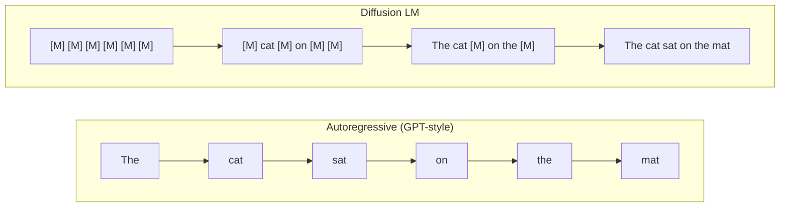
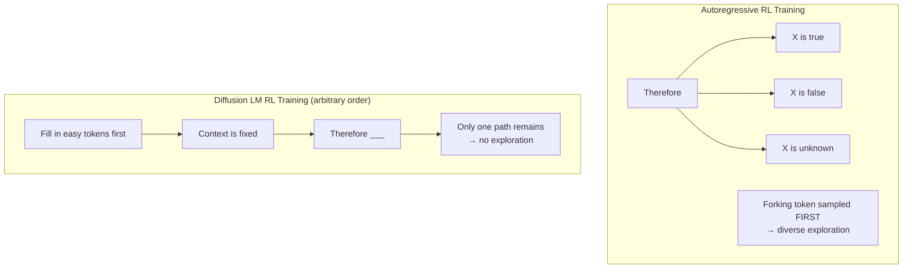
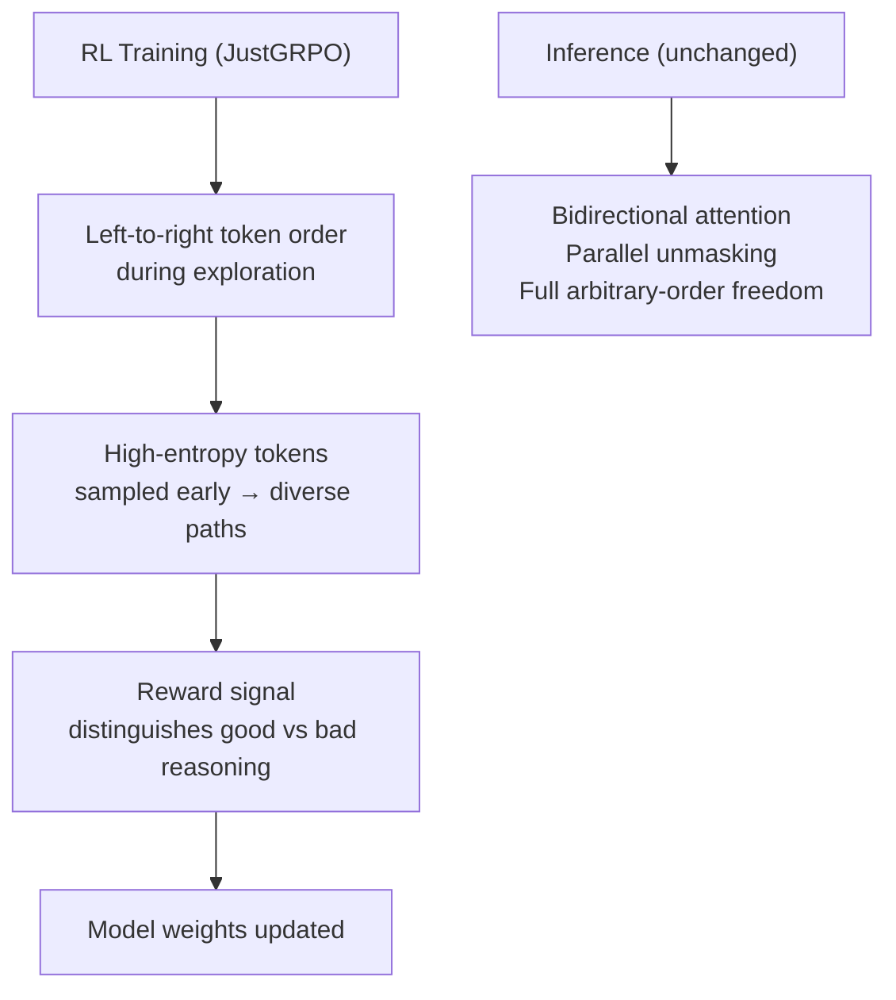

## One Finding, One Conference, One Sentence

At the International Conference on Machine Learning (ICML) 2026, held in Seoul from July 6–11, a paper from Tsinghua University walked away with the Outstanding Paper Award by making a claim that cut against the prevailing wisdom of the field:

**The more freedom a diffusion language model has to choose the order it generates tokens, the worse it reasons.**

That summary is deliberately blunt. The nuance matters — and we'll get to it. But the result is striking enough that it dominated hallway conversations at a conference with a record 24,371 paper submissions, nearly double the 12,107 submitted just a year earlier.

---

## First, What Is a Diffusion Language Model?

Every mainstream language model you've used — GPT, Claude, Gemini, Grok — works the same way at its core: it reads all the text so far and predicts the single most likely next word. Then it appends that word and predicts the next one. This is called **autoregressive generation**, and it works left-to-right, one token at a time.

Diffusion language models work differently. Instead of predicting the next token, they start with a sequence of masked-out tokens (imagine every word replaced with `[MASK]`) and iteratively unmask them — filling in the blanks, refining the whole sequence through multiple passes. Because there's no left-to-right constraint, the model can fill in a word in the middle of a sentence before filling in the word at the start.

The advantages of diffusion are real:

- **Bidirectional context.** Each unmasking step sees the entire (partially filled) sequence — not just the left side. A word chosen early can be reconsidered once later words give it more context.
- **Parallel generation.** Multiple tokens can be filled in simultaneously, which can be faster at inference time than sequential prediction.
- **Self-correction.** Because the process is iterative, the model can revise tokens that look wrong once more context is available.
- **Controlled generation.** It's easier to impose constraints (like "this sequence must contain the phrase X") on a diffusion process than on an autoregressive one.

By early 2026, models like LLaDA (8B parameters, competitive with LLaMA 3 8B), LLaDA 2.0 (scaled to 100B parameters), and Dream 7B had demonstrated that diffusion language models were no longer just academic curiosities — they were closing the gap with the autoregressive frontier.

---

## The Arbitrary-Order Superpower (That Became a Liability)

The flexibility to fill in tokens in any order was widely treated as one of diffusion LMs' biggest selling points. Confidence-based decoding, for instance, lets the model fill in the tokens it's most confident about first, and save uncertain ones for later — once surrounding context has been established. This feels intuitively better than autoregressive models, which are forced to commit to every word in left-to-right sequence, even when a particular word is uncertain.

But a key question hadn't been carefully answered: **what happens when you try to make these models smarter through reinforcement learning?**

RL has been the engine behind some of the most dramatic reasoning improvements in language models over the past two years. DeepSeek-R1, for instance, used Group Relative Policy Optimization (GRPO) — a technique that samples many responses to a question, scores them, and nudges the model toward the approaches that worked best. The result was a model that learned to reason step-by-step without being explicitly told to. Similar techniques powered the "thinking" modes in Claude and GPT.

When researchers tried to apply RL to diffusion language models, the results were disappointingly flat. The models weren't improving at reasoning the way autoregressive models did. The Tsinghua paper — "The Flexibility Trap: Rethinking the Value of Arbitrary Order in Diffusion Language Models" — is the investigation of why.

---

## The Trap, Explained

The paper identifies a specific failure mechanism they call **entropy degradation through token bypassing**.

Here's the intuition. In any reasoning chain — a math problem, a logical argument, a code debugging session — there are certain words that carry enormous logical weight. Words like *"Therefore"*, *"Since"*, *"But"*, *"However"*, *"If"* — these are the **forking tokens** of a reasoning sequence. They signal a pivot in logic, a conditional branch, a causal link. Commit to "Therefore X" and you've made a claim; commit to "However X" and you've made the opposite move.

These tokens are **high entropy** — they're the choices where the model is most uncertain, and where different choices lead to very different outcomes. They are, in other words, the most important tokens for exploration during RL training. A model that samples these tokens diversely will explore many different reasoning paths and learn which ones lead to correct answers.

The freedom of arbitrary-order generation turns out to work against this. When a diffusion LM is free to fill in tokens in any order, it preferentially fills in the low-entropy tokens first — the ones it's most confident about. The high-entropy forking tokens get left for later, at which point the surrounding context has already been established and the "choice" at the forking token is no longer really a choice. The reasoning path is already determined.

The practical consequence: diffusion LMs trained with RL collapse into a narrow set of solutions. They don't explore the reasoning space the way autoregressive models do. The flexibility that makes them interesting at inference is actively harmful during training.

---

## The Fix: JustGRPO

The fix the paper proposes is almost comically minimal. Its name is a signal: **JustGRPO**. As the GitHub repository bluntly states: "No combinatorial trajectories. No ELBO approximations. No diffusion-specific adaptations. Just GRPO."

The intervention is: **during RL training only, force the model to generate tokens in standard left-to-right order.**

That's it. Left-to-right ordering at training time means forking tokens are sampled first, exploration is diverse, and the RL reward signal can effectively distinguish which reasoning paths led to correct answers. The model's underlying architecture — its bidirectional attention, its ability to generate in parallel — is completely untouched. At inference time, everything works exactly as before.

The core insight is a separation of concerns: the **exploration phase of RL training** has different requirements than **inference**. During training, you need diverse paths through reasoning space. During inference, you want fast, parallel, context-aware generation. These aren't in conflict — they just call for different generation orders at different times.

The implementation fits in roughly 60 lines of Python. It also works with LoRA (parameter-efficient fine-tuning), achieving comparable performance to full model updates at a fraction of the compute cost.

---

## The Numbers

On standard reasoning benchmarks, JustGRPO outperforms every existing diffusion-specific RL approach:

| Benchmark | ESPO (prior best) | GDPO (prior) | JustGRPO |
|---|---|---|---|
| **GSM8K** (math word problems) | 82.3% | 82.8% | **89.1%** |
| **MATH-500** (competition math) | 39.0% | 39.6% | **45.1%** |
| **HumanEval** (Python coding) | — | — | **49.4%** |
| **MBPP** (Python coding) | — | — | **52.4%** |

The jump from ~82% to 89.1% on GSM8K is meaningful — that's crossing the threshold from "promising" to "competitive with autoregressive models trained with similar methods." And notably, this is achieved without modifying anything about the model's inference behavior.

---

## Why the Field Is Paying Attention

The Flexibility Trap didn't win at ICML 2026 because it proposed a complicated new architecture. It won because it reframed a long-standing assumption with rigorous evidence and provided a clean, minimal fix.

For researchers, this matters because it clears a blocker. The combination of "reasoning via RL" and "efficient parallel inference via diffusion" now looks achievable in a single model. You don't have to choose between a model that thinks well and a model that generates quickly.

For practitioners, it suggests that the diffusion LM models already in development at ByteDance (Seed Diffusion), IBM (Soft-Masked Diffusion), and several academic labs can be made substantially smarter without architectural surgery — just a modified training loop.

For the broader AI community, the result is a reminder that **architectural freedom and training-time structure are different things**. A model that can do anything doesn't necessarily learn best when allowed to do anything. Useful constraints during training can unlock capabilities that unconstrained training misses entirely.

It's also a clean scientific result in a field that sometimes favors impressive benchmarks over careful investigation. The paper asks: *why doesn't this thing work?* — finds a specific, falsifiable answer — and tests the answer with a minimal intervention. That kind of analysis is what separates a contribution that ages well from one that gets buried under the next wave of model releases.

---

## The ICML 2026 Context

The Flexibility Trap was one of two Outstanding Paper Awards at ICML 2026 in Seoul — both went to diffusion-adjacent research, a signal that diffusion models for language are attracting serious theoretical attention, not just engineering momentum. The conference itself broke submission records: 24,371 papers submitted, up from 12,107 in 2025. That doubling in a single year reflects how fast the field is moving, and how much primary research is still to be done on architectures that are already being deployed at scale.

The second Outstanding Paper Award went to "High-Accuracy Sampling for Diffusion Models and Log-Concave Distributions" from MIT and Yale — improving the mathematical foundations of diffusion sampling more broadly. That the committee gave both top awards to diffusion research was not a coincidence.

---

## Sources

- [The Flexibility Trap: Rethinking the Value of Arbitrary Order in Diffusion Language Models (arXiv:2601.15165)](https://arxiv.org/abs/2601.15165)
- [JustGRPO GitHub repository — LeapLabTHU/JustGRPO](https://github.com/LeapLabTHU/JustGRPO)
- [Announcing the ICML 2026 Awards — ICML Blog](https://blog.icml.cc/2026/07/05/announcing-the-icml-2026-awards/)
- [ICML Oral presentation: The Flexibility Trap — ICML.cc](https://icml.cc/virtual/2026/oral/71086)
- [ICML 2026 Awards: Diffusion Models Win Top Honors — AI Front Page](https://aifront-page.com/icml-2026-awards-outstanding-papers/)
- [ICML 2026 Wraps in Seoul: Diffusion Models Dominate — FAQ.com.tw](https://faq.com.tw/en/ai-ml/2026-07-10-icml-2026-seoul-diffusion-models-agentic-ai-en/)
- [Simple and Effective Masked Diffusion Language Models (MDLM, NeurIPS 2024) — GitHub](https://github.com/kuleshov-group/mdlm)
- [Beyond Next-Token Prediction: A Performance Characterization of Diffusion versus Autoregressive Language Models (arXiv:2510.04146)](https://arxiv.org/abs/2510.04146)
- [DeepSeek-R1: Incentivizing Reasoning Capability in LLMs via Reinforcement Learning (arXiv:2501.12948)](https://arxiv.org/pdf/2501.12948)
- [A Survey on Diffusion Language Models — VILA-Lab/Awesome-DLMs](https://github.com/VILA-Lab/Awesome-DLMs)
