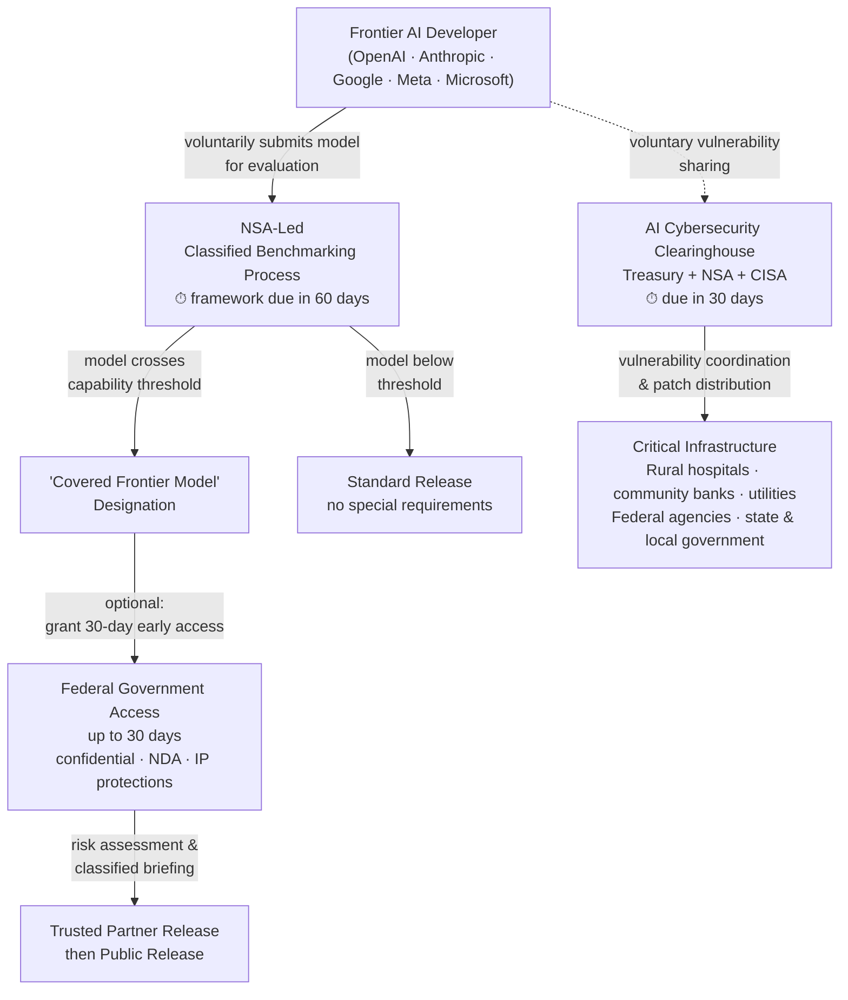

## A New Player at the AI Safety Table

For years, the debate over how governments should handle the most powerful AI systems divided along a clean philosophical line. Europe leaned toward mandatory regulation — treating high-risk AI systems the way it treats medical devices or aircraft. The United States preferred voluntary guidelines, industry self-governance, and letting competition set the pace.

President Trump's executive order, signed June 2, 2026 and formally titled "Promoting Advanced Artificial Intelligence Innovation and Security," sits firmly in the American tradition. It is explicitly not mandatory, not a licensing regime, and not a preclearance requirement. The order says so plainly.

But it also introduces something genuinely new to U.S. AI policy: a classified government process for deciding which AI models are powerful enough to require special handling — with the NSA at the center of that decision, and a 30-day pre-release access window attached for any model that makes the list.

---

## The Problem the Order Is Trying to Solve

To understand why this matters, consider a specific concern that has grown louder in Washington over the past two years: frontier AI models — the largest, most capable systems from companies like OpenAI, Anthropic, Google, and Meta — are powerful enough to meaningfully assist with large-scale cyberattacks.

This is not a theoretical worry. A sufficiently capable model can identify software vulnerabilities that humans would miss, draft exploit code, automate reconnaissance, and accelerate attacks at scale. The same capabilities that make frontier AI useful to defenders — auditing code, scanning infrastructure, finding bugs — can be turned against those same systems if adversaries access them first.

The June 2 EO is aimed squarely at this tension. Its goal is to give the federal government early visibility into which models cross a capability threshold that makes them nationally significant, access to those models before they ship broadly, and the ability to use AI defensively to harden U.S. infrastructure before adversaries can weaponize it offensively.

---

## Three Pillars of the Order

### 1. The AI Cybersecurity Clearinghouse

Within 30 days of the order, the Secretary of the Treasury — working with the NSA and CISA — must establish an **AI Cybersecurity Clearinghouse**. Think of it as a fusion center: a shared operation where government and industry voluntarily coordinate vulnerability scanning, validate newly discovered software flaws, and prioritize patching.

The clearinghouse is voluntary. Companies can choose to share information about vulnerabilities their AI tools discover; the clearinghouse will help coordinate fixes. The explicit beneficiaries include rural hospitals, community banks, and local utilities — infrastructure that is chronically under-resourced for cybersecurity but disproportionately targeted in ransomware and state-sponsored attacks.

One structural detail worth noting: Treasury leads this effort, not CISA. Historically, CISA (the Cybersecurity and Infrastructure Security Agency) has been the central agency for civilian federal cybersecurity. By giving Treasury the formal lead — with CISA and NSA in supporting roles — the order signals that the administration views AI-enhanced cyber threats as having financial stability implications alongside traditional national security ones.

### 2. The Classified Benchmarking Process

This is the most technically consequential provision. Within 60 days, NSA, Treasury, and CISA must develop and maintain a **classified benchmarking process** to assess the offensive cyber capabilities of AI models. When a model crosses a classified capability threshold, it receives a formal designation: **"covered frontier model."**

The NSA director is the primary decision-maker here. NSA's mission encompasses intelligence collection and the country's own offensive cyber operations — it is the agency that runs U.S. hacking capabilities. Putting NSA in charge of deciding which AI models are powerful enough to require government oversight reflects a specific framing: this is a national security question first, and a technology governance question second.

What the classified capability threshold might look like is, by design, not public. The order specifies that the benchmarking process will assess "advanced cyber capabilities." Plausible criteria could include: Can the model autonomously identify and exploit zero-day vulnerabilities? Can it materially accelerate a nation-state-level cyberattack? Can it generate functional offensive malware without human guidance?

### 3. The 30-Day Pre-Release Window

Once a model is designated a covered frontier model, developers may — voluntarily — provide the government with access to the model for up to 30 days before releasing it to other trusted partners. During this window, the government can run its own evaluations, identify risks, and brief the developer on its findings.

The order is explicit that this window cannot become a mandatory licensing or preclearance requirement. Developers don't have to participate. But, as discussed below, the practical reality of opting out is far less comfortable than it sounds.

---

---

## "Voluntary" — In Name, Anyway

The word "voluntary" appears repeatedly in the order and in the White House's own fact sheet. No licensing. No preclearance. No mandatory submission. The administration made a deliberate choice not to replicate European-style pre-approval requirements.

But there is a gap between the letter of the order and its likely practical effect.

Legal analysts at Crowell & Moring observed that while the framework "is expressly voluntary and disclaims any mandatory licensing or preclearance requirement, participation may prove closer to de facto mandatory in practice given the risks of national security scrutiny." Here is the underlying logic: if a company declines to participate in the pre-release window and its model is later used in a major cyberattack, the reputational and political consequences would be severe — and plausibly regulatory. Conversely, if a model goes through the process and receives government clearance, that becomes a form of implicit validation for enterprise customers.

There is also a structural softener in the timeline. The 30-day window applies before release to "trusted partners," not before public release. Frontier models typically reach enterprise customers, government contractors, and research partners well before any general availability announcement. A developer that builds a 30-day government access window into this existing private phase of its release process adds no visible delay to public availability while still satisfying the framework's intent.

The practical result: a regime that is voluntary in principle but almost impossible to decline without cost.

---

## Why the NSA's New Role Matters

Every previous U.S. government AI framework — the Biden EO 14110, the voluntary commitments AI companies signed with the White House in 2023 and 2024, NIST's AI Risk Management Framework — centered civil agencies. NIST set standards. CISA coordinated security guidance. The FTC watched for consumer harms.

The Trump EO changes that by making NSA the primary decision-maker on which AI models cross the capability threshold that triggers the framework. This has real implications for how oversight works.

NSA operates in the classified world. Its benchmarking process will be opaque by design. Developers will know whether their model has been designated a covered frontier model, but the benchmarks, scoring criteria, evaluation methodology, and thresholds themselves will not be public. This creates accountability questions that the order does not fully answer: Who oversees NSA's judgment calls on designations? What process exists if a developer believes a designation is incorrect? How will Congress conduct oversight of a classified AI evaluation process?

At the same time, it reflects a genuine strategic reality: the government agencies with the clearest view of how AI capabilities map onto real offensive cyber threats are, by definition, the ones with classified knowledge of those threats. NIST can publish public evaluation frameworks; it cannot assess a model against classified threat intelligence about what adversaries are currently capable of and what capabilities would give them a decisive advantage.

---

## What AI Developers Should Do Now

The two key deadlines are immediate:

- **By early July 2026 (30 days from June 2):** The AI Cybersecurity Clearinghouse must be formed.
- **By early August 2026 (60 days from June 2):** The classified benchmarking process must be operational.

For frontier AI developers, the next 60 days are a planning window. Concrete actions to consider:

**Map your release pipeline.** If you plan to release a new frontier model in Q3 or Q4 2026, build in a potential 30-day pre-release window for government access. The overlap with enterprise beta programs can be managed so the public timeline is unaffected.

**Engage proactively.** Companies that initiate contact before a formal designation have more influence over the evaluation process than those that wait to be summoned. The order instructs developers and the government to "collaborate" on the framework — early movers shape what that means in practice.

**Watch CISA's Binding Operational Directives.** CISA was directed to release operational guidance expanding AI-enabled defensive tools across federal agencies. These directives directly affect federal technology vendors and contractors, and typically carry mandatory compliance requirements for entities in scope.

---

## The U.S.-EU Gap — and How It May Narrow

The EU AI Act's high-risk obligations take full effect on August 2, 2026 — just over a month away. The contrast with the Trump EO is stark: the EU requires conformity assessments, technical documentation, human oversight, and prior approval for some categories of deployment. The U.S. EO is voluntary, innovation-forward, and relies on a classified intelligence-community process for its most consequential decisions.

But the practical gap may be smaller than the philosophical divide suggests.

Any company releasing frontier AI globally has to comply with EU requirements regardless of what the U.S. government does. Building a pre-release government access period into a product's release pipeline is significantly easier for companies already running structured enterprise beta programs and third-party safety evaluations — which the major frontier labs already do. The incremental cost of adding a U.S. government participant to an existing evaluation process is lower than it might appear.

The net outcome may be that frontier AI developers find themselves navigating two parallel oversight regimes simultaneously: one public and mandatory in Brussels, one confidential and nominally optional in Washington. Companies capable of managing both will have a meaningful competitive advantage over those that treat either process as optional friction to be minimized.

---

## Sources

- [Promoting Advanced Artificial Intelligence Innovation and Security — The White House](https://www.whitehouse.gov/presidential-actions/2026/06/promoting-advanced-artificial-intelligence-innovation-and-security/)
- [Fact Sheet: President Trump Promotes Advanced AI Innovation and Security — The White House](https://www.whitehouse.gov/fact-sheets/2026/06/fact-sheet-president-donald-j-trump-promotes-advanced-artificial-intelligence-innovation-and-security/)
- [Presidential Documents, Federal Register Vol. 91, No. 108 — GovInfo](https://www.govinfo.gov/content/pkg/FR-2026-06-05/pdf/2026-11415.pdf)
- [New AI Executive Order Calls for Frontier Model Security, Early Government Access and AI-Enabled Cyber Defense — Skadden Arps](https://www.skadden.com/insights/publications/2026/06/new-ai-executive-order)
- [Executive Order Creates Voluntary Regulatory Regime of Frontier AI Models — Crowell & Moring](https://www.crowell.com/en/insights/client-alerts/executive-order-creates-voluntary-regulatory-regime-of-frontier-ai-models)
- [Assessing Trump's Executive Order on AI Oversight — Council on Foreign Relations](https://www.cfr.org/articles/assessing-trumps-executive-order-on-ai-oversight)
- [AI Executive Order Sets Stage for New Cybersecurity Directives — Federal News Network](https://federalnewsnetwork.com/cybersecurity/2026/06/ai-executive-order-sets-stage-for-new-cybersecurity-directives/)
- [White House Executive Order Signals Federal Focus on Frontier AI Cybersecurity — Pillsbury Law](https://www.pillsburylaw.com/en/news-and-insights/eo-frontier-ai-cybersecurity.html)
- [Assessing the Trump Administration's Executive Order on AI and Cybersecurity — Cato Institute](https://www.cato.org/blog/assessing-trump-administration-executive-order-AI-cybersecurity)
- [White House Releases Executive Order on Advanced AI Innovation and Security — Inside Privacy](https://www.insideprivacy.com/artificial-intelligence/white-house-releases-executive-order-on-advanced-ai-innovation-and-security/)
