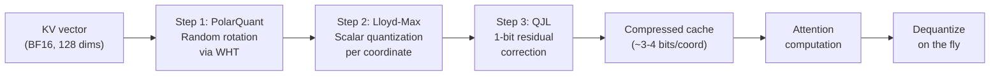
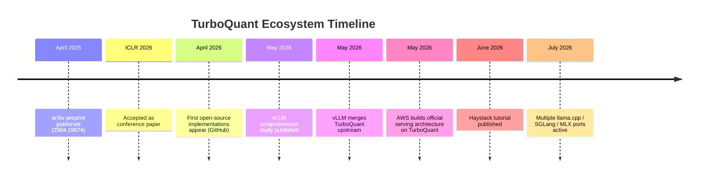

## The Hidden Bottleneck Nobody Talks About

When people debate the cost of running large language models, the conversation usually goes straight to parameter count: GPT-4 has a trillion parameters, Llama 3 has 70 billion, and so on. The assumption is that smaller = cheaper. But there's a second cost that grows much faster with real-world usage — and it has nothing to do with parameter count.

It's called the **KV cache**, and for many production deployments it quietly consumes more GPU memory than the model itself.

TurboQuant, accepted at ICLR 2026 by a team at Google Research and Google DeepMind, is the most technically rigorous answer to this problem published to date. It compresses the KV cache by up to 6x using a provably near-optimal quantization scheme — and it works without any training, fine-tuning, or calibration data. Since publication it has been merged into vLLM, adopted by AWS, and spawned a wave of open-source implementations across llama.cpp, SGLang, and MLX.

---

## What Is the KV Cache?

To understand TurboQuant, you need to understand what the KV cache does and why it balloons.

When a transformer processes text, each attention layer computes three quantities for every token it has seen so far: a **query** (Q), a **key** (K), and a **value** (V). The query represents the current token asking "what should I pay attention to?", while the keys and values are summaries of everything that came before, stored so the model can reference them without recomputing.

The trick is that you only need to compute K and V once per token. From then on, you **cache** those tensors and reuse them for every subsequent generation step. That's the key-value cache — and it's what makes auto-regressive generation fast.

The problem is scale. Here's what the KV cache looks like for a large model at long context:

- **Qwen2.5-32B** with an **8,000-token context**: approximately 23 GB of KV cache in full precision (BF16)
- **40,960-token context** on the same model: the KV cache can exceed 115 GB — three times what the model weights themselves require

For a team running a shared API endpoint where many users send long documents for analysis, the KV cache isn't just an annoyance. It's the constraint that determines how many simultaneous users you can serve, how long their context can be, and whether you need to start a second cluster.

---

## The Compression Intuition

Before getting into TurboQuant specifically, it helps to understand why compressing a KV cache is hard.

The straightforward approach is to round each floating-point number to fewer bits — say, from 16 bits (BF16) to 8 bits (INT8) or 4 bits (INT4). This is called **scalar quantization**, and it works reasonably well for model weights because the distribution of weights is fairly well-behaved.

KV cache vectors are different. They're generated at runtime from the model's attention projections, and they tend to have **outliers** — a small number of coordinates with very large magnitudes. Naive scalar quantization treats all coordinates the same. An outlier at position 12 of a 128-dimension vector will force the quantization grid to span a large range, making every other coordinate much less precisely represented. At 4 bits this causes serious accuracy losses.

The key insight TurboQuant exploits is: **what if you could reshape the distribution before quantizing?**

---

## TurboQuant's Three-Step Pipeline

TurboQuant applies three operations in sequence to each KV vector before storing it, and reverses them when reading:

### Step 1: PolarQuant — Scramble to Tame

The first step is a **random rotation**. TurboQuant multiplies each KV vector by a random orthogonal matrix, implemented efficiently using the Walsh-Hadamard Transform (WHT) — a fast, hardware-friendly operation that takes O(d log d) rather than O(d²).

Why rotate? An orthogonal transformation preserves the vector's norm and all inner products exactly. But it scrambles the individual coordinates so that any large-magnitude outlier gets "spread out" across all 128 (or 256) dimensions. After rotation, the coordinates look like draws from a Beta distribution that is concentrated near zero. There are no more outliers.

Think of it like shaking a snow globe. The snow (your data) is the same total amount, but instead of being piled up in one corner, it's spread evenly across the space. Now every coordinate is small, and a single quantization grid fits everything well.

### Step 2: Lloyd-Max Scalar Quantization

With the distribution now known and well-behaved (Beta/near-Gaussian), TurboQuant applies **Lloyd-Max scalar quantization** to each coordinate independently. Lloyd-Max is a classical information-theory result: given a known distribution, this is the optimal way to place quantization thresholds to minimize mean-squared error.

Because the rotation is random and the same for all vectors (it's data-oblivious), you can precompute the optimal codebook once. During serving, each coordinate is mapped to its nearest quantization level using that precomputed table. No gradient descent, no calibration dataset, no model-specific tuning.

The theoretical guarantee is notable: TurboQuant achieves a distortion that is within a factor of **≈2.7 of the information-theoretic lower bound** for all bit widths and all dimensions. In practice, measured MSE on real models matches this prediction.

### Step 3: QJL — A 1-Bit Error Corrector

The third step, **Quantized Johnson-Lindenstrauss (QJL)**, is optional but often applied. It stores one additional bit per coordinate that represents the sign of the quantization error — essentially a 1-bit correction term for the residual.

In theory this should improve accuracy for attention dot-product computations. In practice, evaluations in 2026 have found that at 4-bit quantization, MSE-only (no QJL) consistently outperforms MSE+QJL. The QJL residual seems to help mostly at 3-bit and below, where the base quantization is coarse enough that the correction makes a meaningful difference.

---

## Near-Optimal Is a Mathematical Statement

Most ML papers use adjectives like "near-optimal" loosely. TurboQuant uses it precisely.

The information-theoretic rate-distortion function gives a hard lower bound: no algorithm can compress d-dimensional vectors to r bits per coordinate with less than a certain amount of distortion. This bound assumes you know the exact distribution and can use any possible code.

TurboQuant, a training-free algorithm that processes one vector at a time without looking at any other vectors, achieves distortion within a constant factor (≈2.7) of that bound across all parameter settings. This is a non-trivial theoretical result, and it's why the paper attracted ICLR acceptance despite the ML community's general skepticism toward quantization methods without training.

The implication is practical: there's not much room left to improve. Any future KV cache compression method that achieves dramatically lower distortion at the same bit rate would need to either violate information theory or use training/calibration data that TurboQuant deliberately avoids.

---

## Performance in Numbers

Here's how TurboQuant performs across the two dimensions that matter most in production: memory and quality.

| Method | KV bits | Memory reduction | Perplexity (Qwen2.5-32B) | Notes |
|---|---|---|---|---|
| FP16 baseline | 16 | 1× | 4.678 | Full precision |
| FP8 | 8 | 2× | ~4.678 | Best simple default |
| TurboQuant 4-bit | 4 | 4–5× | 4.672 | Matches or beats FP16 |
| TurboQuant 3-bit | 3 | 5–6× | Degrades ~5–25 pts | Task-dependent |

The **4-bit result is striking**: perplexity of 4.672 versus 4.678 in full precision — TurboQuant is measurably better on this metric. Needle-in-a-haystack retrieval (a common long-context benchmark) shows 100% recall at 4-bit across multiple context lengths.

At **3-bit**, the story is more nuanced. Straightforward text generation tasks remain within acceptable range. But high-difficulty reasoning benchmarks like AIME25 show 15–25 point drops at very long context lengths, where the cumulative quantization error starts to matter for multi-step reasoning chains.

On a **Qwen3.5-35B model at 40,960 tokens**, one llama.cpp implementation measured:

- FP16 KV cache: 5,120 MB → TurboQuant: 990 MB (**5.2× reduction**)
- Token generation speed: 58.3 tok/s (TurboQuant) vs 51.9 tok/s (FP16) — **12% faster**

The speed improvement comes partly from reduced memory bandwidth: smaller tensors move faster through the memory hierarchy, and attention computation benefits from working with compressed representations on hardware that supports low-bit arithmetic.

---

## From Paper to Production

A research paper compressing KV caches is interesting. What makes TurboQuant notable is how quickly the ecosystem adopted it.

The vLLM team published a comprehensive study in May 2026 that became the definitive practical guide. Their headline conclusion: **FP8 remains the best default** for most serving workloads (2× compression, essentially zero accuracy loss on all benchmarks). TurboQuant becomes the right choice when you need **more than 2×** — specifically when context lengths are long enough that FP8 isn't sufficient to fit your workload into a GPU cluster.

The recommended production configuration from the vLLM study:
- Use `4bit_nc` (norm correction, no QJL) for best accuracy-throughput tradeoff
- Skip quantizing the first and last 2 transformer layers — they carry disproportionate signal
- Expect 2.6–3.1× effective KV reduction with about 1 point of accuracy loss on most benchmarks
- Avoid 3-bit modes in production unless memory constraints are severe

---

## Where TurboQuant Falls Short

Honest coverage requires noting the limitations.

**Throughput reduction**: While memory bandwidth improves, dequantizing on the fly adds CPU/GPU overhead. The vLLM benchmarks showed 40–52% throughput reduction on certain workloads when moving from FP8 to TurboQuant 4-bit. If your bottleneck is requests-per-second rather than KV cache size, you might lose more than you gain.

**No hybrid model support**: The vLLM implementation explicitly excludes Mamba-attention hybrid architectures, which are increasingly common in 2026 model releases. The quantization math doesn't transfer cleanly to Mamba's selective state space formulation.

**QJL is tricky**: The 1-bit residual corrector was theoretically motivated, but multiple independent implementations found it counterproductive at 4-bit and above. The practical recommendation to disable QJL contradicts the paper's theoretical framing somewhat.

**3-bit is aggressive**: The claims of 6× compression with "zero accuracy loss" refer to perplexity on standard benchmarks. Reasoning-heavy tasks with long contexts show meaningful degradation at 3-bit. The right characterization is that TurboQuant 4-bit is production-safe; 3-bit requires careful evaluation per use case.

---

## Why This Matters Beyond the Benchmark Sheet

Memory costs in AI infrastructure are directionally increasing, not decreasing. Larger context windows, longer agentic sessions, and multi-turn conversations all grow the KV cache. A technique that compresses that cache by 4–6× effectively multiplies the serving capacity of any given cluster by the same factor — or allows the same cluster to serve contexts four to six times longer.

That has downstream effects on what becomes economically viable:

- **Document analysis** over 100,000-token PDFs without special chunking logic
- **Long agentic sessions** where a coding assistant maintains context across hundreds of tool calls
- **Shared inference endpoints** serving more concurrent users per GPU
- **On-device inference** where the KV cache was previously the binding constraint on usable context length

What's also notable is the mathematical approach. TurboQuant's near-optimality proof means the community now has a clear benchmark against which future compression methods will be judged. Rather than empirical comparisons between heuristics, the field now has a theoretical reference point. That's the kind of contribution that doesn't show up in a single benchmark result but shapes how researchers think about the problem for years.

The unglamorous truth of making AI work at scale is that breakthroughs in how you store intermediate computation often matter more than breakthroughs in what the model knows. TurboQuant is a clean example of that class of result.

---

## Sources

- [TurboQuant: Online Vector Quantization with Near-optimal Distortion Rate (OpenReview / ICLR 2026)](https://openreview.net/forum?id=tO3ASKZlok)
- [TurboQuant arXiv preprint (arXiv:2504.19874)](https://arxiv.org/abs/2504.19874)
- [ICLR 2026 Poster: TurboQuant](https://iclr.cc/virtual/2026/poster/10006985)
- [TurboQuant — Google Research Blog](https://research.google/blog/turboquant-redefining-ai-efficiency-with-extreme-compression/)
- [A First Comprehensive Study of TurboQuant: Accuracy and Performance — vLLM Blog](https://vllm.ai/blog/2026-05-11-turboquant)
- [Compress the KV Cache with TurboQuant and Haystack — deepset](https://haystack.deepset.ai/tutorials/49_turboquant_quantization_with_huggingface)
- [Google TurboQuant: 6x KV Cache Compression for LLM Inference — Spheron Network Blog](https://www.spheron.network/blog/google-turboquant-llm-compression-gpu-cloud/)
- [GitHub: vivekvar-dl/turboquant — HuggingFace Transformers implementation](https://github.com/vivekvar-dl/turboquant)
- [GitHub: AmesianX/TurboQuant — llama.cpp implementation](https://github.com/AmesianX/TurboQuant)
- [GitHub: OnlyTerp/turboquant — first open-source implementation with vLLM integration](https://github.com/OnlyTerp/turboquant)
- [TurboQuant — Extreme KV Cache Quantization (llama.cpp Discussion #20969)](https://github.com/ggml-org/llama.cpp/discussions/20969)
- [TurboQuant KV Cache Compression for LLMs — byteiota](https://byteiota.com/turboquant-googles-6x-kv-cache-compression-for-llms/)
