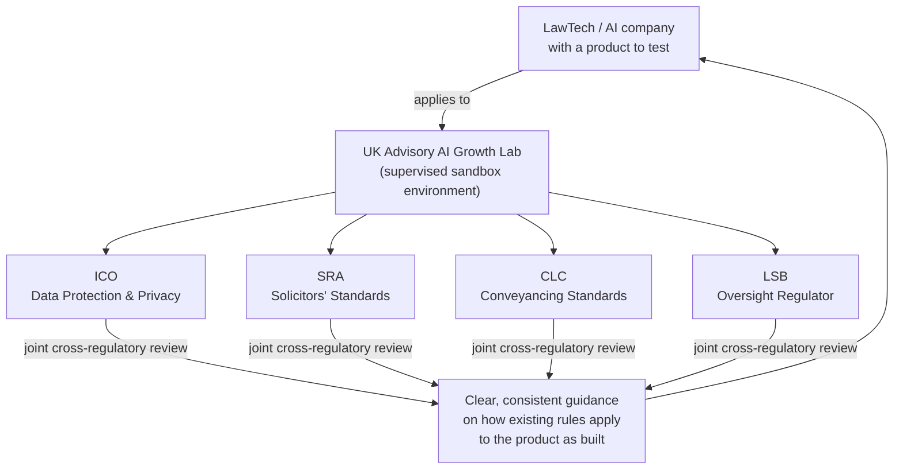
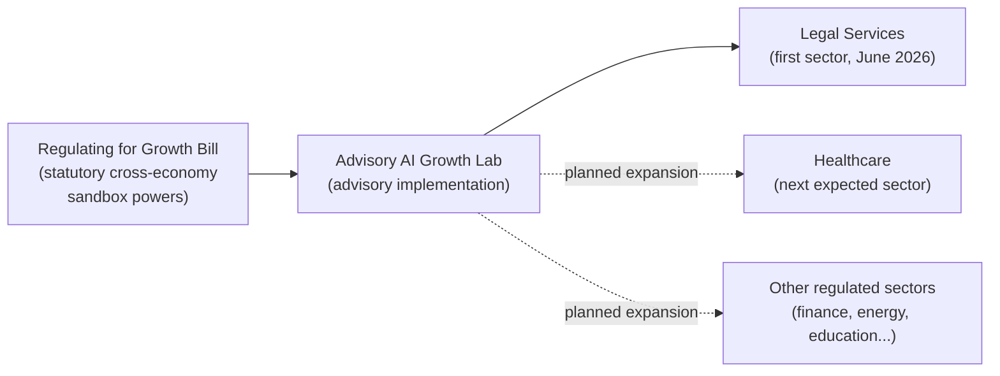
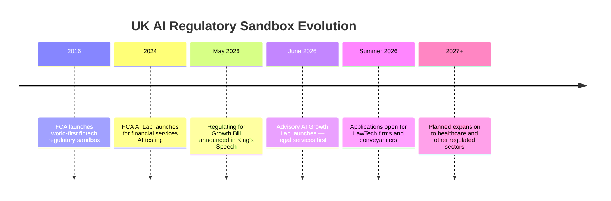

## The Problem with Deploying AI in Regulated Industries

Legal services, healthcare, financial advice — these are exactly the sectors where AI could make the biggest difference to ordinary people's lives. They're also the sectors where AI deployment most often dies in regulatory limbo.

A LawTech startup builds a tool that helps flag potential issues in a property conveyancing pack within minutes rather than hours. The product works. But does it constitute "legal advice" under the Solicitors Regulation Authority's rules? Does storing the data in the cloud comply with the ICO's data protection standards? Does it need authorisation from the Legal Services Board? The founders email all three regulators. They get three different answers. The product sits in a drawer for two years while the legal team figures it out.

This is the regulatory limbo problem. It doesn't reflect malice from regulators — most of the existing rules predate AI by decades and simply weren't written with this technology in mind. But "unclear" rules have the same practical effect as "prohibitive" ones when you're trying to raise a funding round.

On June 8, 2026, the UK government launched its answer: the **Advisory AI Growth Lab**.

---

## What the AI Growth Lab Is (and Isn't)

The AI Growth Lab is a multi-regulator advisory sandbox. It's a supervised space where AI companies can bring real products to real regulators and get real guidance on which rules apply, where the grey areas are, and how to navigate them responsibly.

The important word is *advisory*. The lab doesn't grant licences. It doesn't approve products. Participating in the lab is explicitly **not** regulatory endorsement — an important safeguard that prevents the sandbox from becoming a backdoor around genuine compliance. Companies still have to meet every applicable standard. What they gain is clarity about what those standards actually require *before* investing years in a product that might need to be redesigned at the finish line.

Think of it like learning to drive on a closed track with an instructor in the passenger seat. The rules of the road are exactly the same. But the structured environment makes it much easier to learn where the edges are without causing a pile-up.

---

## Why Legal Services First

The launch named legal services — specifically lawtech and property conveyancing — as the first sector to enter the lab. The choice is revealing.

Conveyancing is one of the most complaints-prone, delay-prone processes in UK property law. A property sale pack contains title deeds, local authority searches, leasehold information, flood risk assessments, and environmental reports. An experienced solicitor reads all of it and flags the issues. An AI tool could do the same screening in minutes, surfacing potential problems for the solicitor to review rather than starting the review from scratch. Faster and cheaper — and the Ministry of Justice has claimed that AI tools applied across legal processes could collectively save justice system workers **over 50,000 working days per year**.

But lawtech sits at the intersection of at least four regulatory bodies simultaneously. That's precisely why it was chosen first.

The lab brings together:

- **ICO** (Information Commissioner's Office) — data protection and privacy compliance
- **SRA** (Solicitors Regulation Authority) — professional standards for solicitors
- **CLC** (Council for Licensed Conveyancers) — standards for licensed conveyancers
- **LSB** (Legal Services Board) — the oversight regulator for the entire sector

Having all four in the same room means an AI company gets answers that don't contradict each other. That has historically been one of the biggest problems stalling innovation in this space.

What companies walk away with isn't a green light — it's a **map**: which rules apply where, what changes the product may need, and where the existing rules turn out to be far more permissive than the founders feared.

---

## The Legislative Backstory: Regulating for Growth Bill

The AI Growth Lab didn't appear out of nowhere. It was announced three weeks after the **Regulating for Growth Bill** featured in the King's Speech on 13 May 2026.

The Bill creates statutory powers for **cross-economy AI sandboxes** — formal legal authority for regulators to temporarily relax specific rules in controlled conditions to enable real-world AI testing. This is the foundation the Growth Lab sits on: rather than each regulator deciding unilaterally how flexible they can be, the Bill provides the power to do this consistently, across sectors, with proper parliamentary backing.

Critically, the Bill includes **"red-line protections"** — categories of rules that cannot be relaxed under any circumstances:

- Consumer protection rights
- Health and safety requirements
- Intellectual property protections
- Worker rights
- Core human rights obligations

The sandbox model provides flexibility within a defined perimeter. It's designed to resolve ambiguity, not dissolve the safeguards that protect people.

---

## Britain's Sandbox Heritage

The UK isn't improvising here — it's extending a track record. In 2016, the Financial Conduct Authority launched the **world's first financial services regulatory sandbox**, a model that was subsequently adopted by regulators in the EU, the US, Japan, Estonia, Singapore, and dozens of other jurisdictions.

The FCA built on this in October 2024 with a dedicated **AI Lab**, offering live testing environments, access to synthetic datasets, and structured engagement with financial services firms deploying AI. The first cohort ran through 2025; a second was expected in April 2026.

The AI Growth Lab extends this proven architecture beyond financial services. Rather than every industry sector running its own bespoke process, the government is building a **cross-economy sandbox infrastructure** that can be pointed at whichever sector is most ready for it.

---

## What It Means for AI Companies

Applications for the lab open later in summer 2026. The target is companies with **real products at a testable stage** — not white papers, but working AI tools that founders want to walk through with regulators before committing to a final architecture.

Eligible applicants include LawTech firms, legal service providers, and conveyancing companies. In practical terms, that means:

- AI contract review tools
- Legal research assistants
- Automated document generation for conveyancing
- Tools that help non-lawyers access legal information
- AI-driven compliance checking for legal documents

The lab will work with participants to identify which rules apply to their specific use case, surface any unintended barriers in existing regulations, and build a shared understanding of what "good" regulatory oversight of AI looks like in practice.

Beyond legal services, healthcare has already been flagged as a pressing candidate: the government cited nearly 750,000 unread patient imaging cases per year and evidence that AI outperforms the majority of radiologists on specific diagnostic tasks. The Regulating for Growth Bill's powers are broad enough to cover any regulated sector where existing rules create AI deployment barriers.

---

## A Third Path in Global AI Governance

Two models dominate AI regulation globally. The EU's AI Act takes a compliance-first approach: categorise AI systems by risk level, mandate technical requirements, enforce through penalties. The US approach has been largely market-led, with sector-specific agencies acting independently and federal legislation still fragmentary.

The UK's AI Growth Lab represents something different: **engagement before legislation**. Instead of publishing a rule book and waiting for companies to comply, regulators sit alongside innovators early and build shared understanding in real time. The rules don't change — but the interpretation of how they apply becomes documented, consistent, and practically useful rather than theoretically correct.

For AI companies building in regulated industries, the shift is structural. The regulatory ambiguity that has historically been a reason *not* to build in these sectors is becoming, deliberately, something that can be resolved *before* you build. That's not a small change. In sectors like legal services, where access to justice is distributed almost entirely by price, making it possible to deploy AI tools without years of regulatory guesswork could open up entirely new categories of product. A cheap, supervised tool that helps ordinary people understand their tenancy rights or navigate a property purchase — exactly the kind of product that historically dies in regulatory limbo — gets a path to market.

The sandbox is not a shortcut. But it's a map. And for a lot of founders building in regulated AI, that's the thing that's been missing.

---

## Sources

- [Advisory AI Growth Lab to support responsible AI adoption in legal services — GOV.UK](https://www.gov.uk/government/news/advisory-ai-growth-lab-to-support-responsible-ai-adoption-in-legal-services)
- [Legal innovation to be supercharged by new AI Growth project — GOV.UK](https://www.gov.uk/government/news/legal-innovation-to-be-supercharged-by-new-ai-growth-project)
- [ICO statement on the Government's new advisory AI Growth Lab — ICO](https://ico.org.uk/about-the-ico/media-centre/news-and-blogs/2026/06/ico-statement-on-the-government-s-new-advisory-ai-growth-lab/)
- [SRA joins Advisory AI Growth Lab — Solicitors Regulation Authority](https://www.sra.org.uk/news/news/press/ai-growth-lab/)
- [UK Government launches AI Growth Lab with legal as its first focus area — Legal IT Insider](https://legaltechnology.com/uk-government-launches-ai-growth-lab-with-legal-as-its-first-focus-area/)
- [Legal services lead way as government's first AI Growth Lab — Legal Futures](https://www.legalfutures.co.uk/latest-news/legal-services-lead-way-as-governments-first-ai-growth-lab)
- [The UK's AI Growth Lab: A regulatory experiment begins — Howard Kennedy](https://disputeresolution.howardkennedy.com/post/102n7jw/the-uks-ai-growth-lab-a-regulatory-experiment-begins)
- [New AI tech could save justice system workers over 50,000 days each year — PublicTechnology](https://www.publictechnology.net/2026/06/15/public-order-justice-and-rights/new-ai-tech-could-save-justice-system-workers-over-50000-days-each-year-minister-claims/)
- [AI in the King's Speech 2026: "Regulating for Growth Bill" announced — Bird & Bird](https://www.twobirds.com/en/insights/2026/ai-in-the-kings-speech-2026-regulating-for-growth-bill-announced)
- [UK sets out Bill to speed AI regulation & sandboxes — IT Brief](https://itbrief.co.uk/story/uk-sets-out-bill-to-speed-ai-regulation-sandboxes)
- [AI Growth Labs could accelerate AI innovation and deployment — techUK](https://www.techuk.org/resource/ai-growth-labs-could-accelerate-ai-innovation-and-deployment.html)
- [UK Financial Services Regulators' Approach to Artificial Intelligence in 2026 — Global Policy Watch](https://www.globalpolicywatch.com/2026/04/uk-financial-services-regulators-approach-to-artificial-intelligence-in-2026/)
