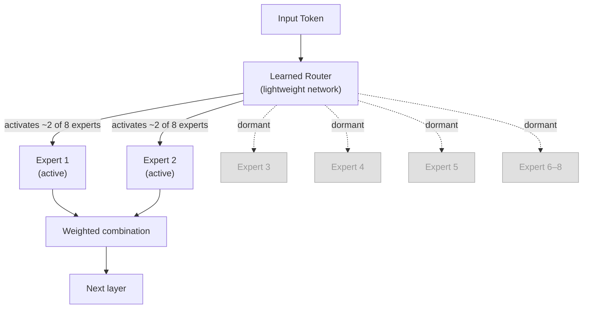
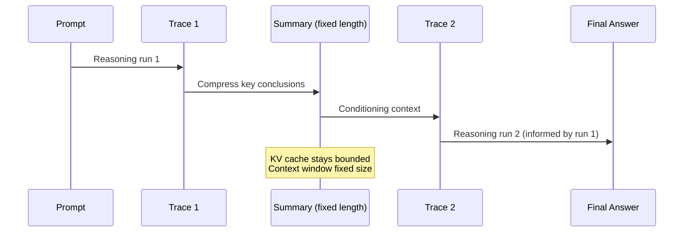

## The NVIDIA Assumption

Ask anyone who's been involved in training a serious AI model in the last five years and they'll tell you the same thing: you use NVIDIA. The H100, the A100 before it, the H200 and Blackwell after — CUDA's decade-long head start made NVIDIA hardware the default everywhere from research labs to hyperscalers. AMD had competitive silicon on paper, but the software ecosystem around ROCm lagged far enough behind that most teams simply didn't bother.

Zyphra, a San Francisco AI research company, decided to find out what would happen if they actually bothered.

On May 6, 2026, they released **ZAYA1-8B**: a mixture-of-experts reasoning model with 8.4 billion total parameters and only **760 million active per token**, trained end-to-end on a cluster of 1,024 AMD Instinct MI300X GPUs. No NVIDIA hardware involved at any stage — not pretraining, not mid-training, not fine-tuning. The model ships under the Apache 2.0 license, scores **91.9% on the AIME 2025 math competition**, and competes on benchmarks with closed-source models from Anthropic, Google, and OpenAI.

That combination — AMD-trained, open, efficient, frontier-competitive — is unusual enough to warrant examining how they did it.

---

## What Is a Mixture-of-Experts Model?

Before diving into ZAYA1-8B's specifics, it helps to understand the MoE architecture at a conceptual level.

A standard dense language model activates all of its parameters for every single token it processes. If you have a 70-billion-parameter model, every token costs 70 billion parameters worth of computation. That's expensive.

A mixture-of-experts model works differently. The feed-forward layers — which make up the majority of a large model's parameters — are split into many independent sub-networks called "experts." For each token, a learned routing network selects only a small subset of these experts to activate. The rest sit idle, holding the model's broader knowledge in reserve.

The analogy is a hospital with dozens of specialist physicians. When a patient arrives, a triage nurse (the router) reads the symptoms and sends them to the two or three most relevant specialists. The cardiologist and the pulmonologist see this patient; the dermatologist and the orthopedic surgeon don't. The hospital has all the expertise in the building, but any given patient only consumes the time of the relevant specialists.

ZAYA1-8B takes this further with a custom architecture called **MoE++**, which adds additional routing refinements. The result: **8.4 billion parameters on disk, 760 million active at inference time** — roughly as expensive to run as a 760-million-parameter dense model, while accessing the breadth of knowledge encoded across the full 8.4 billion.

---

## The Architecture Innovations

ZAYA1-8B isn't just a standard MoE model dropped onto AMD hardware. Zyphra introduced three notable architectural ideas to push efficiency further.

### Compressed Convolutional Attention (CCA)

Standard transformer attention has a memory problem: the KV cache. As a model processes a long conversation or document, it caches the "key" and "value" representations for every previous token so it can reference them in future steps. For long contexts, that cache balloons in size. A conversation that might normally require 8 GB of KV cache memory — previously considered normal — becomes a hard constraint on where you can run the model.

CCA addresses this by performing sequence mixing in a compressed latent space rather than in the full residual dimension. The result is roughly an **8x reduction in KV cache size**: that same 8 GB footprint drops to around 1 GB. This isn't a quality-free compression — Zyphra designed CCA to preserve the long-range dependencies that matter for multi-step reasoning — but the memory saving is substantial and enables running ZAYA1-8B on consumer hardware that couldn't handle comparably-capable models.

### Learned Residual Scaling

Each transformer layer has a residual connection — a skip path that carries the original input forward and adds it to the layer's output. Standard transformers apply this uniformly. ZAYA1-8B adds one learned scalar per layer that multiplies the residual contribution before the addition.

This sounds small but has a meaningful effect on training stability. At depth, poorly scaled residuals cause gradient flow problems that require careful learning rate tuning and warmup schedules to manage. The per-layer scalar gives the optimizer explicit control over how much each layer "matters," keeping gradients better behaved from the start. It's the kind of detail that doesn't show up in benchmark tables but matters when you're training on non-NVIDIA hardware where debugging tool support is thinner.

### Markovian RSA: Smarter Test-Time Compute

Perhaps the most interesting innovation is how ZAYA1-8B uses additional compute at inference time. The approach is called **Markovian RSA** (Randomized Sequential Aggregation), and it solves a problem with naïve "generate many answers and pick the best one" approaches.

The standard "best-of-N" trick — generate N solutions, vote on the answer — works but has a fundamental flaw: it's embarrassingly parallel but stateless. Each trace doesn't learn from the others. Markovian RSA takes a different approach: generate multiple reasoning traces sequentially, but after each chunk of reasoning, pass a fixed-length **summary** of prior traces into the next one's context. The model can revise, learn from its own earlier mistakes, and compound insights across passes — while the fixed-length summary cap prevents the context window from growing unboundedly.

Think of it as a researcher who writes a draft, reads it back at high speed to extract the key points, then writes a second draft with those key points in mind. The second draft knows what the first draft concluded, without having to re-read every word.

At the 40K/4K Markovian RSA configuration, ZAYA1-8B achieves **91.9% on AIME 2025** and **89.6% on HMMT 2025** — results that compete with Claude 4.5 Sonnet's 88.3% on HMMT and exceed GPT-5 at similar reasoning depths.

---

## The AMD Training Story

The headline that ZAYA1-8B was trained on AMD hardware is easy to mention and easy to underestimate. Training a production-quality reasoning model on non-NVIDIA infrastructure required Zyphra to solve problems that NVIDIA's ecosystem simply doesn't present.

The training cluster was **1,024 AMD Instinct MI300X GPUs** connected via **AMD Pensando Pollara** 400Gb/s networking, hosted on IBM Cloud. Zyphra co-designed the cluster configuration with IBM. The MI300X is AMD's integrated GPU+CPU chip with 192 GB of HBM3 memory per chip — more on-chip memory than any NVIDIA H100. That memory capacity is genuinely useful for large MoE models where holding all experts in memory matters.

The software challenge was ROCm — AMD's GPU computing platform equivalent to NVIDIA CUDA. ROCm has historically lagged in tooling, library coverage, and community debugging resources. Zyphra's team had to spend time profiling MI300X behavior, reshaping model dimensions to fit AMD's preferred compute patterns, and validating numerics in ways that CUDA-trained teams rarely need to consider.

The fact that they shipped a competitive model at the end of this process is the point. It shows that AMD hardware is sufficient for frontier-class training, even if the software journey takes more work. For the AI ecosystem, this matters: a world where only one hardware vendor can train state-of-the-art models is a world with a significant supply-chain and pricing constraint.

---

## Benchmark Results at a Glance

| Benchmark | ZAYA1-8B (Markovian RSA) | Claude 4.5 Sonnet | DeepSeek-R1 | GPT-5 |
|-----------|--------------------------|-------------------|-------------|-------|
| AIME 2025 | **91.9%** | ~88% | ~90% | ~91% |
| HMMT 2025 | **89.6%** | 88.3% | ~86% | ~89% |
| GPQA-Diamond | Competitive | — | — | — |
| APEX-shortlist | Exceeds DeepSeek-V3.2 | — | — | — |

*Active parameters: ZAYA1-8B uses 760M per token vs. ~100B+ for comparable frontier models*

The efficiency story is the point of this table. ZAYA1-8B isn't the single best model at any one benchmark — it's competitive while consuming a fraction of the compute. On a per-active-parameter basis, these are some of the strongest math and reasoning numbers any model has ever posted.

---

## The ZAYA1 Family Keeps Growing

Zyphra hasn't stopped at the base model. Within two weeks of ZAYA1-8B's release, they shipped two follow-on models built on the same foundation.

**ZAYA1-8B-Diffusion-Preview** (May 15, 2026) converts the autoregressive model into a diffusion-style language model — the first time a production MoE model has been converted this way. Instead of generating one token at a time, it diffuses blocks of 16 tokens simultaneously. The result is a **4.6x speedup** with the lossless sampler and **7.7x speedup** with the new logit-mixing sampler. Diffusion language models have been an area of active research for faster inference; ZAYA1's version is the first MoE application of the technique.

**ZAYA1-VL-8B** is a vision-language model built on the same ZAYA1-8B base, adding visual understanding, document grounding, and OCR capabilities while maintaining the same 700M active parameter efficiency at inference time. It extends the model from reasoning-only to genuine multimodal use cases without the heavyweight compute footprint of dedicated vision models.

---

## Why This Matters Beyond the Benchmarks

Three things about ZAYA1-8B are worth holding onto separately, because they point in different directions:

**Hardware diversity is now demonstrably possible.** Zyphra proved that AMD's MI300X stack can train a frontier-class reasoning model, not just run one. This is meaningful for the AI ecosystem even if AMD's software tooling still requires extra effort. It means the training compute market isn't permanently locked to a single vendor.

**Intelligence density per parameter is still improving fast.** 760 million active parameters matching or exceeding models with tens of billions of active parameters was not a reasonable expectation even 18 months ago. Architectural advances — MoE routing, CCA, better training curricula — are compressing more capability into less compute at each generation.

**Open weights plus Apache 2.0 means anyone can build on this.** The full ZAYA1-8B weights are on Hugging Face under Apache 2.0: no user caps, no commercial restrictions, no royalties. A startup, a university research group, or an individual developer can take the model, fine-tune it, modify the architecture, and ship a product. The combination of frontier-competitive performance with fully permissive licensing is still not the norm in this industry.

ZAYA1-8B is a compact model in the literal sense — but the questions it raises about hardware monopolies, efficiency limits, and what "open" really means are anything but small.

---

## Sources

- [ZAYA1-8B Technical Report — arXiv 2605.05365](https://arxiv.org/abs/2605.05365)
- [Zyphra Releases ZAYA1-8B — Official Press Release (PRNewswire)](https://www.prnewswire.com/news-releases/zyphra-releases-zaya1-8b-a-reasoning-model-trained-on-amd-and-optimized-for-maximum-intelligence-density-per-parameter-302764700.html)
- [ZAYA1-8B: Frontier Intelligence Density, Trained on AMD — Zyphra Blog](https://www.zyphra.com/post/zaya1-8b)
- [Meet ZAYA1-8B, a Super Efficient Open Reasoning Model Trained on AMD Instinct MI300 GPUs — VentureBeat](https://venturebeat.com/technology/meet-zaya1-8b-a-super-efficient-open-reasoning-model-trained-on-amd-instinct-mi300-gpus)
- [Zyphra Releases ZAYA1-8B Reasoning Model — HPCwire AIwire](https://www.hpcwire.com/aiwire/2026/05/07/zyphra-releases-zaya1-8b-reasoning-model/)
- [Zyphra Releases ZAYA1-8B: A Reasoning MoE Trained on AMD Hardware — MarkTechPost](https://www.marktechpost.com/2026/05/06/zyphra-releases-zaya1-8b-a-reasoning-moe-trained-on-amd-hardware-that-punches-far-above-its-weight-class/)
- [Zyphra Releases ZAYA1-8B-Diffusion-Preview: The First MoE Diffusion Model Converted From an Autoregressive LLM — MarkTechPost](https://www.marktechpost.com/2026/05/15/zyphra-releases-zaya1-8b-diffusion-preview-the-first-moe-diffusion-model-converted-from-an-autoregressive-llm-with-up-to-7-7x-speedup/)
- [Zyphra/ZAYA1-8B — Hugging Face Model Card](https://huggingface.co/Zyphra/ZAYA1-8B)
- [AMD's AI S-Curve at Risk: Zyphra's ZAYA1-8B Proves Hardware, But ROCm Software Gap Threatens NVIDIA Dominance — AInvest](https://www.ainvest.com/news/amd-ai-curve-risk-zyphra-zaya1-8b-proves-hardware-rocm-software-gap-threatens-nvidia-dominance-2605/)
- [ZAYA1-VL-8B — Zyphra](https://www.zyphra.com/post/zaya1-vl-8b)
